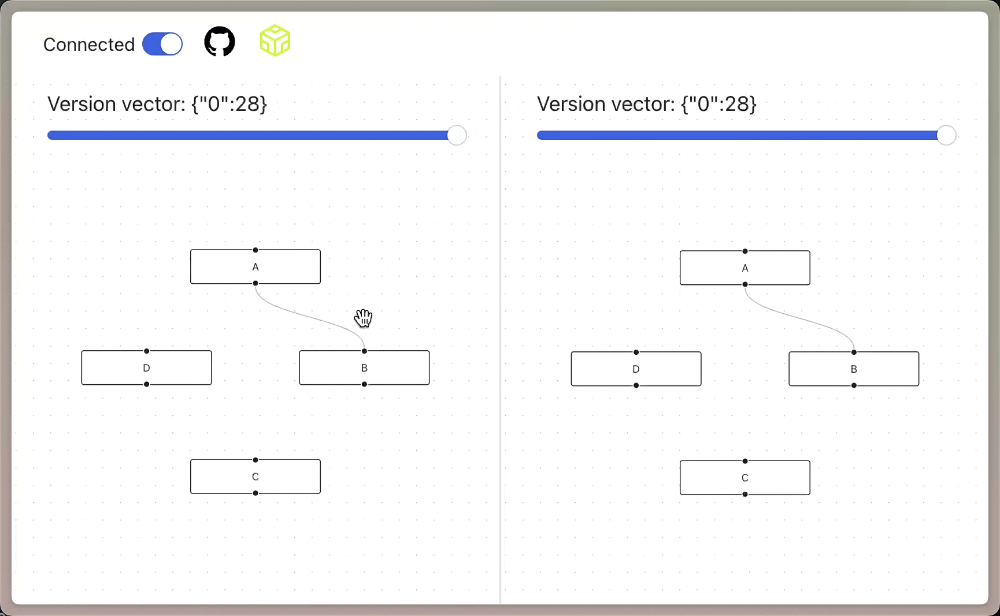
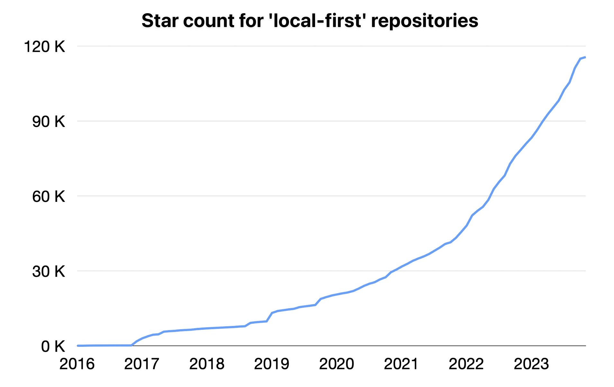
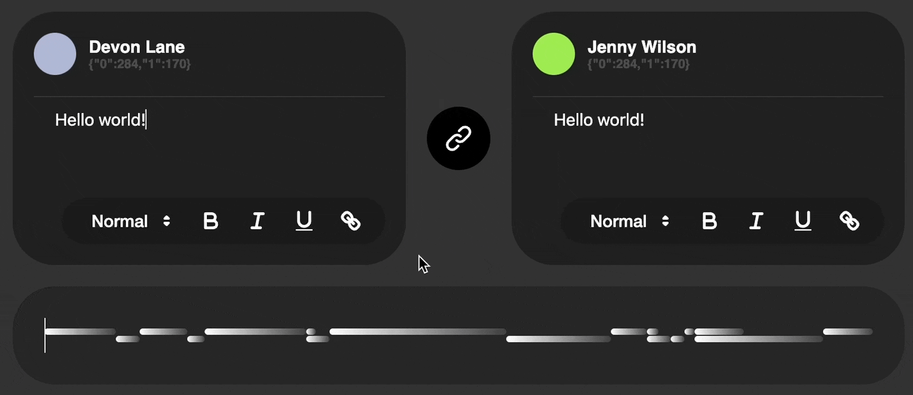

# Loro: Reimagine State Management with CRDTs

import Caption from "../../components/caption";
import GitHub from "../../components/github";
import Authors, { Author } from "../../components/authors";

<Authors date="2023-11-13">
  <Author name="Zixuan Chen" link="https://twitter.com/zxch3n" />
  <Author name="Liang Zhao" link="https://github.com/leeeon233" />
</Authors>

<div>
  <div style={{ display: "inline" }}>
    Loro, our high-performance CRDTs library, is now open source
  </div>
  <GitHub user="loro-dev" repo="loro" />
  <div style={{ display: "inline" }}>.</div>
</div>

In this article, we share our vision for the local-first software development
paradigm, explain why we're excited about it, and discuss the current status of
Loro.

With better DevTools, documentation, and a friendly ecosystem, everyone can
easily build local-first software.



<Caption>
  You can build collaborative apps with time travel features easily using Loro.
  [Play the example online](https://loro-react-flow-example.vercel.app/).
</Caption>

## Envisioning the Local-First Development Paradigm

Distributed states are commonly found in numerous scenarios, such as multiplayer
games, multi-device document synchronization, and edge networks. These scenarios
require synchronization to achieve consistency, usually entailing elaborate
design and coding. For instance, considerations for network issues or concurrent
write operations are necessary. However, for a wide range of applications CRDTs
can simplify the code significantly:

- CRDTs can automatically merge concurrent writes without conflicts.
- Fewer abstractions. There's no need to design specific backend database
  schemas, manually execute expected conflict merges, or implement interfaces to
  memory and memory to persistent structure conversions.
- Offline supports are right out of the box

<details>
<summary>What are CRDTs</summary>

### What are Conflict-Free Replicated Data Types (CRDTs)?

CRDTs are data structures used in distributed systems that allow updates to be
merged across multiple replicas without conflicts. In this context, "replicas"
refer to different independent data instances within the system, such as the
same collaborative document on various user devices.

CRDTs enable users to operate independently on their replicas, like editing a
document, without needing real-time communication with other replicas. The CRDTs
merge these operations, ensuring all replicas achieve "strong eventual
consistency". As long as all nodes receive the same set of updates, regardless
of the order, their data states will eventually be consistent.

> For more details, visit
> [What are CRDTs](https://www.loro.dev/docs/concepts/crdt)

</details>

<details>
<summary>When you can't use CRDTs</summary>
### When you can't use CRDTs

CRDTs only guarantee _Strong Eventual Consistency_. You have to make sure it's
suitable for your application.

"Strong Eventual Consistency": As long as all nodes receive the same set of
updates, their data states will ultimately become consistent regardless of their
sequence.

Strong eventual consistency may not be acceptable in scenarios requiring
immediate consistency or transactional integrity, such as financial
transactions, exclusive resource access, or allocation.

</details>

Since the data resides locally, client applications can directly access and
manipulate local data, offering both speed and availability. Additionally, due
to CRDTs' nature, synchronization / real-time collaboration can be achieved
without relying on centralized servers (similar to Git, allowing migration to
other platforms without data loss). With performance improvements, CRDTs
increasingly replace traditional real-time collaboration solutions in various
contexts.

This represents a new paradigm. Local-first not only empowers users with control
over their data, but also makes developers' lives easier.



<Caption>
  The annual growth rate of the *"local-first"* star count in GitHub has reached
  40%+.
</Caption>

### Integrating CRDTs with UI State Management



<Caption>Loro's rich text collaboration example</Caption>

Since CRDTs enable conflict-free automatic merging, the challenge of managing
distributed states shifts to "how to express operations and states on CRDTs".

Front-end state management libraries typically require developers to define how
to retrieve State and specify Actions, as illustrated by this example from Vue's
state management tool, Pinia:

```ts no-run
export const useCartStore = defineStore({
  id: "cart",
  state: () => ({
    rawItems: [] as string[],
  }),
  getters: {
    items: (state): Array<{ name: string; amount: number }> =>
      state.rawItems.reduce((items, item) => {
        const existingItem = items.find((it) => it.name === item);

        if (!existingItem) {
          items.push({ name: item, amount: 1 });
        } else {
          existingItem.amount++;
        }

        return items;
      }, [] as Array<{ name: string; amount: number }>),
  },
  actions: {
    addItem(name: string) {
      this.rawItems.push(name);
    },

    removeItem(name: string) {
      const i = this.rawItems.lastIndexOf(name);
      if (i > -1) this.rawItems.splice(i, 1);
    },

    async purchaseItems() {
      const user = useUserStore();
      if (!user.name) return;

      console.log("Purchasing", this.items);
      const n = this.items.length;
      this.rawItems = [];

      return n;
    },
  },
});
```

This paradigm and CRDTs are easily compatible: The state in the state management
libraries corresponds to CRDT types, and Action corresponds to a set of CRDT
operations.

Thus, implementing UI state management through CRDTs does not require users to
change their habits. It also has many advanced features:

- Make states automatically synchronizable / support real-time collaboration.
- Like Git, maintain a complete distributed editing history.
- It can store an extensively large editing history with a low memory footprint
  and a compact encoding size. Below is an example.

With this, you can effortlessly implement products with real-time / async
collaboration and time machine features.


<Caption>
  <div style={{ display: "inline" }}>
    Time travel a document with 360,000+ operations using Loro. To load the
    whole history and playback, it only takes 8.4MB in memory. And the entire
    history only takes 361KB in storage. The editing trace is from{" "}
  </div>
  <GitHub user="josephg" repo="editing-traces" />
  <div style={{ display: "inline" }}>.</div>
</Caption>

## Introduction to Loro

Loro is our CRDTs library, now open-sourced under a permissive license. We
believe a cooperative and friendly open-source community is key to creating
outstanding developer experiences.

We aim to make Loro simple to use, extensible, and maintain high performance.
The following is the latest status of Loro.

### CRDTs

We have explored extensively, supporting a range of CRDT algorithms that have
yet to be widely used.

#### OT-like CRDTs

> Update: This algorithm is now called Event Graph Walker (Eg-Walker)

Our CRDTs library is built on the brilliant concept of OT-like CRDTs from Seph
Gentle's [Diamond-types](https://github.com/josephg/diamond-types). Joseph Gentle
is currently writing a paper on it, which is worth looking forward to. Its
notable features include reducing the cost of local operations, easier
historical data reclamation, and sometimes lower storage and memory overhead.
However, it relies on high-performance algorithms to apply remote operations.
This design has great potential and we are excited about its future.

<details>
<summary>Brief Introduction to OT-like CRDT algorithms</summary>

To briefly introduce the concept of OT-like CRDTs, this part is complex and
requires some prior knowledge. I might not encapsulate it well.

The general idea of OT-like CRDTs is that they do not retain the CRDTs' data
structure (e.g., originLeft originRight information). When merging remote
operations, they return to the lowest common ancestor in the directed acyclic
graph history of local and remote, and from there, reapply each operation. This
process reconstructs the CRDTs structure, resolving conflicts arising from
parallel editing. Its advantage is that, since it doesn't need to retain these
CRDTs Meta information, local operations are virtually cost-free, like OT, where
only the index at which insertions and deletions occur needs to be saved. The
trade-off is a longer time for merging remote operations, but this issue can be
significantly mitigated with well-designed data structures and algorithms.
Moreover, since most parallel edits last only a short time, the lowest common
ancestor is not far, making the merging process quick.

The image below shows an example of merging versions 2@1 and 1@2 using this
algorithm on a DAG. The algorithm needs to revert to the lowest common ancestor
version 0@1 and apply all subsequent operations from there (a total of four
operations). For a better understanding of this image, refer to
[https://www.loro.dev/docs/advanced/version_deep_dive](https://www.loro.dev/docs/advanced/version_deep_dive)


</details>

#### Rich Text CRDTs

In May of this year, we open-sourced the
[crdt-richtext](https://github.com/loro-dev/crdt-richtext) project, integrating
the algorithms of [the rich text CRDT](https://loro.dev/blog/loro-richtext) and the
sequence CRDT [Fugue by Matthew Weidner](https://arxiv.org/abs/2305.00583). A
brief introduction to these two algorithms can be found in
[our blog at the time](https://www.notion.so/crdt-richtext-Rust-implementation-of-Peritext-and-Fugue-c49ef2a411c0404196170ac8daf066c0?pvs=21).

Based on our experience from previous projects, we have integrated a rich text
CRDT and Fugue into our framework in the current Loro. However, the biggest
challenge was that
[Peritext did not integrate well with OT-like CRDTs](https://github.com/inkandswitch/peritext/issues/31).
We have recently overcome this issue. We developed a new rich text CRDT
algorithm that can run on OT-like CRDTs and has passed the capabilities listed
in the Peritext paper's Criteria for rich text CRDTs, with no new issues
revealed in our current million fuzzing tests. We will write an article in the
future specifically to introduce this algorithm.

#### Movable Tree

We have also supported a movable tree CRDT. Synchronizing tree movements is
often complex due to the potential for circular references. Addressing this
issue in the distributed environment is even more challenging.

We implemented Martin Kleppmann's paper,
[_A Highly-Available Move Operation for Replicated Trees_](https://ieeexplore.ieee.org/document/9563274/).
The idea of this algorithm is to sort all move operations, ensuring the ordering
is consistent across the replicas. Then, each operation is applied sequentially.
If an operation would cause a circular reference, it has no effect.

We found it to be elegant in design and also performant. The time complexity of
local operations is O(k) (k being the average tree depth, as circular reference
detection is required). For applying remote operations, which entails inserting
new operations into the sorted list, we must undo operations that are subsequent
in the ordering, apply the remote operation, and then redo the undone
operations, with a cost of O(km) (m being the number of operations to undo).


<Caption>Visualization of applying a remote op</Caption>

Our tests show that local operations involving ten thousand random movements
among a thousand nodes take less than 10ms (tested on an M2 MAX chip). Moreover,
the cost of merging remote operations in this algorithm is similar to applying
remote operations in OT-like CRDTs, making it adoptable. We've also experimented
with [log-spaced snapshots](https://madebyevan.com/algos/log-spaced-snapshots/)
and immutable data structure approaches in our
[movable-tree project](https://github.com/loro-dev/movable-tree), concluding
that the undo + redo method is the fastest and the most memory-efficient.

### Data Structures

Designing and experimenting with data structures is routine in Loro's
development process.

We previously open-sourced
[generic-btree](https://github.com/loro-dev/generic-btree) and have redesigned
its structure for a more compact memory layout and cache-friendliness. Besides
its remarkable performance, its flexibility enables us to support various
information types required for Text, like utf16/Unicode code points/utf8, with
minimal code. We also extensively reuse it to fulfill various requirements,
highlighting Rust's impressive type expression capabilities.

Internally, we've
[separated the document's state from its history](https://www.loro.dev/docs/advanced/doc_state_and_oplog).
The state represents the current form of the document, akin to Git's HEAD
pointer, while the document's history resembles the complete operation history
behind Git. Hence, multiple document states can correspond to the same history.
This structure simplifies our code and facilitates future support for version
control.

Most of our optimizations thus far have focused on text manipulations,
historically one of the thorniest problems in CRDTs. In the future, we plan
optimizations for a wider range of real-world scenarios.

### The Future


We aim to reach version 1.0 by mid-next year, with much work to complete.

Given our limited workforce, we will first provide a WASM interface for web
developers to experiment with. Optimizing the WASM size is one of our goals for
this phase. Much of our design work is still ongoing, and we plan to stabilize
it in the next quarter, aiming for a simple yet powerful and flexible API. We
welcome ideas and suggestions in our
[community discussions](https://discord.gg/tUsBSVfqzf).

There's also extensive documentation work to make working with Loro enjoyable. A
potential indicator of success would be GPT generating sufficiently good code
based on our documentation.

Developing tools for developers is a challenging and exciting task. Many
developer tools and visualization methods in front-end development are
exceptionally good, and we hope to bring such experiences into the world of
CRDTs and local-first development. DevTools will reveal CRDTs' hidden states and
simplify control, making state maintenance and debugging a breeze.

We also plan to support richer CRDT semantics, including Movable Lists and
global undo/redo operations to support more diverse application scenarios.

## Seeking Collaborative Project Opportunities

Our design and optimization efforts need feedback from real-world applications.
If you are excited about a local-first future and think Loro can help you,
please contact us directly at [zx@loro.dev](mailto:zx@loro.dev). We're open to
collaboration and ready to help.
