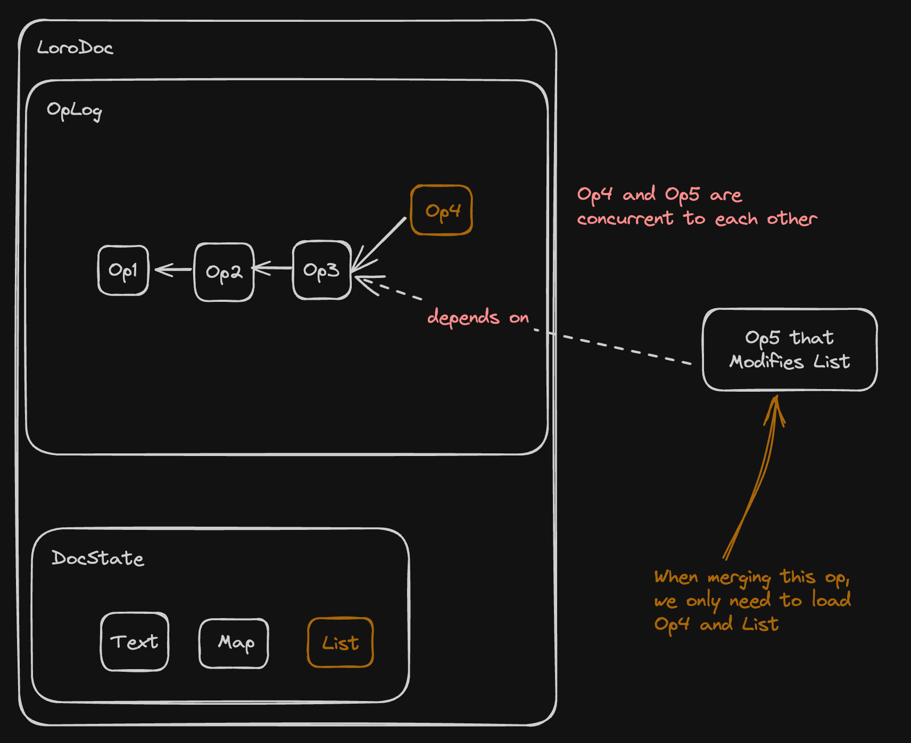

# Loro 1.0

import Authors, { Author } from "../../components/authors";

  <Author name="Zixuan Chen" link="https://twitter.com/zxch3n" />
  <Author name="Liang Zhao" link="https://github.com/Leeeon233" />

import Image from "next/image";

Loro is a [Conflict-free Replicated Data Type (CRDT)](https://crdt.tech/)
library that developers can use to implement real-time collaboration and version
control in their applications. You can use Loro to create
[local-first software](https://www.inkandswitch.com/local-first/). Loro 1.0 has
a stable data format, excellent performance, and rich features. You can use it
in Rust, JS (via WASM), and Swift.

<details>
<summary>What is CRDT? What is it used for?</summary>

Distributed states are now ubiquitous in multi-user collaborative applications
and applications that need multi-device synchronization. You need to ensure 
consistency across devices. CRDTs provide a decentralized way to automatically 
solve this problem.

> CRDTs automatically resolve conflicts and ensure the consistency of the data. 
> Some CRDT algorithms provide extra properties for merge results, which should align with user expectations as much as possible.

CRDT provides a decentralized way to solve this problem. The decentralization here not only means that it can synchronize through P2P methods, but it also means:

- It allows applications to naturally support offline editing
- It allows users to store and implement two-way synchronization of data in
  multiple different locations
- It makes it easier for the backend to implement horizontal scaling
- It can easily support end-to-end encryption

CRDTs were once considered unable to be used in serious and complex scenarios,
such as rich text, but optimizations in recent years have greatly expanded its
application scenarios, making it a practical and easy-to-use technology.

Based on CRDT, we can create applications that
allow users to fully control data ownership. These applications can be like
Git-managed repositories, not relying on specific software service providers.
Users can switch between GitHub, GitLab, self-hosted Git servers, and the data
is always available locally. This is the vision of
[local-first software](https://www.inkandswitch.com/local-first/).

<aside>
❓ **What's the difference between sync via CRDT and sync via Git?**

Git's protocol doesn't support real-time collaboration. When there are concurrent
edits, Git needs to resolve conflicts manually; while CRDT can support real-time
collaboration, can be extended to support rich text, and supports data with
JSON-like schemas.
</aside>

CRDTs often also provides a simpler and easier-to-use sync method,
because for Op-based CRDTs like Loro, as long as the sets of CRDT operations
received by two peers are consistent, the CRDT document states of these two
peers are consistent. You don't have to worry about idempotency, the order of
operation application, and network exception handling. For Loro's CRDT document, 
just two rounds of data exchange can transmit the missing operations between two
documents to achieve final consistency:

> You can find all the code samples in this blog [here](https://github.com/zxch3n/loro-blog-examples)

```jsx
import { LoroDoc, VersionVector } from "npm:loro-crdt@1.0.0-beta.3";

const docA = new LoroDoc();
const docB = new LoroDoc();
docA.setPeerId(0);
docA.setPeerId(1);

docA.getText("text").insert(0, "Hello!");
docB.getText("text").insert(0, "Hi!");
const versionA: Uint8Array = docA.version().encode();
const versionB: Uint8Array = docB.version().encode();

// Exchange versionA and versionB Info
const bytesA: Uint8Array = docA.export({
    mode: "update",
    from: VersionVector.decode(versionB),
});
const bytesB: Uint8Array = docB.export({
    mode: "update",
    from: VersionVector.decode(versionA),
});

// Exchange bytesA and bytesB
docB.import(bytesA);
docA.import(bytesB);

console.log(docA.getText("text").toString()); // Hello!Hi!
console.log(docB.getText("text").toString()); // Hello!Hi!
```

<details>
<summary>
A minimum of one round of data exchange can ensure consistency
</summary>

```jsx
import { LoroDoc } from "npm:loro-crdt@1.0.0-beta.2";

const docA = new LoroDoc();
const docB = new LoroDoc();
docA.setPeerId(0);
docA.setPeerId(1);
docA.getText("text").insert(0, "Hello!");
docB.getText("text").insert(0, "Hi!");

// Exchange versionA and versionB Info
const bytesA: Uint8Array = docA.export({
    mode: "update",
});
const bytesB: Uint8Array = docB.export({
    mode: "update",
});

// Exchange bytesA and bytesB
docB.import(bytesA);
docA.import(bytesB);

console.log(docA.getText("text").toString()); // Hello!Hi!
console.log(docB.getText("text").toString()); // Hello!Hi!
```
</details>
</details>


## Features of Loro 1.0

### High-performance CRDTs

High-performance, general-purpose CRDTs can significantly reduce data synchronization 
complexity and are crucial for local-first development. 

However, large CRDT documents may face challenges with loading speed and memory consumption, 
especially when dealing with those with extensive editing histories. 
Loro 1.0 addresses this challenge through a new storage format, achieving a 10x improvement in 
loading speed. In [benchmarks using Loro with real-world editing data](#document-import-speed-benchmarks), 
we've reduced the loading time for a document with millions of operations from 16ms to 1ms. When utilizing the 
shallow snapshot format (discussed later), the time can be further reduced to 0.37ms. 
As a result, Loro will not become a bottleneck for applications dealing with such large documents.
It expands the potential use cases for CRDTs, making them viable for a wider range of applications.

### Rich CRDT types

Loro now supports
[rich text CRDT](https://loro.dev/blog/loro-richtext), 
which enhances the merge result of rich text (text with formatting and styling) to better align with user expectations.
Our text/list CRDT is based on the [Fugue](https://arxiv.org/abs/2305.00583) algorithm. 
It prevents interleaving issues when merging concurrent edits. For example, 
it can avoid unintended merges like "1H2i3" when "123" and "Hi" are inserted concurrently.

We also support:

- Movable List: Supports set, insert, delete, and move operations. The algorithm ensures that after 
  merging concurrent moves, each element occupies only one position.
- Map: Similar to a JavaScript object.
- [Movable Tree](https://loro.dev/blog/movable-tree): Used to model file directories, outliners, and 
  other hierarchical structures that may need moving. It ensures no cyclic dependencies exist in the 
  tree after merging concurrent move operations.

Loro also supports nesting between types, so you can model edits on JSON documents through them:

> You can find all the code samples in this blog [here](https://github.com/zxch3n/loro-blog-examples)

```tsx
import {
  LoroDoc,
  LoroList,
  LoroMap,
  LoroText,
} from "npm:loro-crdt@1.0.0-beta.2";

// Create a JSON structure of
interface JsonStructure {
  users: LoroList<
    LoroMap<{
      name: string;
      age: number;
    }>
  >;
  notes: LoroList<LoroText>;
}

const doc = new LoroDoc<JsonStructure>();
const users = doc.getList("users");
const user = users.insertContainer(0, new LoroMap());
user.set("name", "Alice");
user.set("age", 20);
const notes = doc.getList("notes");
const firstNote = notes.insertContainer(0, new LoroText());
firstNote.insert(0, "Hello, world!");

// { users: [ { age: 20, name: "Alice" } ], notes: [ "Hello, world!" ] }
console.log(doc.toJSON());
```

### Version control

Like Git, Loro saves a complete directed acyclic graph (DAG) of edit history. In Loro, the DAG is used to represent the dependencies between edits, similar to how Git represents commit history. 

Loro supports primitives that allow users to switch between different versions, fork new branches, edit on new branches, and merge branches.

Based on this operation primitive, applications can build various Git-like capabilities:

- You can merge multiple versions without needing to manually resolve conflicts
- You can rebase/squash updates from the current branch to the target branch (WIP)

```jsx
import { LoroDoc } from "npm:loro-crdt@1.0.0-beta.2";

const doc = new LoroDoc();
doc.setPeerId("0");
doc.getText("text").insert(0, "Hello, world!");
doc.checkout([{ peer: "0", counter: 1 }]);
console.log(doc.getText("text").toString()); // "He"
doc.checkout([{ peer: "0", counter: 5 }]);
console.log(doc.getText("text").toString()); // "Hello,"
doc.checkoutToLatest();
console.log(doc.getText("text").toString()); // "Hello, world!"

// Simulate a concurrent edit
doc.checkout([{ peer: "0", counter: 5 }]);
doc.setDetachedEditing(true);
doc.setPeerId("1");
doc.getText("text").insert(6, " Alice!");
// ┌───────────────┐     ┌───────────────┐
// │    Hello,     │◀─┬──│     world!    │
// └───────────────┘  │  └───────────────┘
//                    │
//                    │  ┌───────────────┐
//                    └──│     Alice!    │
//                       └───────────────┘
doc.checkoutToLatest();
console.log(doc.getText("text").toString()); // "Hello, world! Alice!"
```

You can also use `doc.fork()` to create a separate doc at the current version. It is independent of the current doc, and works like a fork:

```tsx
import { LoroDoc } from "npm:loro-crdt@1.0.0-beta.4";

const doc = new LoroDoc();
doc.setPeerId("0");
doc.getText("text").insert(0, "Hello, world!");
doc.checkout([{ peer: "0", counter: 5 }]);
const newDoc = doc.fork();
newDoc.setPeerId("1");
newDoc.getText("text").insert(6, " Alice!");
// ┌───────────────┐     ┌───────────────┐
// │    Hello,     │◀─┬──│     world!    │
// └───────────────┘  │  └───────────────┘
//                    │
//                    │  ┌───────────────┐
//                    └──│     Alice!    │
//                       └───────────────┘
doc.import(newDoc.export({ mode: "update" }));
doc.checkoutToLatest();
console.log(doc.getText("text").toString()); // "Hello, world! Alice!"
```

<aside>
**Current limitations of version control in Loro**

The application layer still needs a lot of code to provide users with more
complete version control capabilities, such as:

- Storing and synchronizing version tags and branches
- Presenting diff view
- Handling rebase and merge interactions
- ...

These problems are not suitable to be solved in the current Loro CRDTs Lib, as
too many assumptions about the schema and environment would make it difficult to
use in other scenarios, so we won't build these parts in. But they all can be
solved through additional libraries.

</aside>

### Leveraging the potential of the [Eg-walker](https://arxiv.org/abs/2409.14252)

import { ReactPlayer } from "../../components/video";
import Caption from "../../components/caption";

<ReactPlayer
  url="/static/REG.mp4"
  style={{maxWidth: "calc(100vw - 40px)"}}
  width={512}
  height={512}
  muted={true}
  loop={true}
  controls={true}
  playing={true}
/>


[Event Graph Walker (Eg-walker)](/docs/advanced/event_graph_walker) is a pioneering collaboration algorithm that combines the strengths of
Operational Transformation (OT) and CRDT, two widely used algorithms for real-time collaboration. 

While OT is centralized and CRDT is decentralized, OT traditionally had an advantage 
in terms of lower document overhead. CRDTs initially had higher overhead, but recent 
optimizations have significantly reduced this gap, making CRDTs increasingly competitive.
Eg-walker leverages the best aspects of both approaches.

Not only have we use the idea of Eg-walker for Text and List CRDTs in Loro, but
Loro's overall architecture has also been greatly inspired by Eg-walker. As a
result, Loro closely resembles Eg-walker in terms of algorithmic properties.

<aside>
In terms of implementation details, Loro differs from the Eg-walker described 
in the paper. So it might be controversial to say Loro implements Eg-walker.

For example, Loro supports types other than text, and in Loro we store the ID 
of each character in the document state (but do not store tombstones), and so on.

But it implements the idea of Eg-walker that travels the graph to 
construct temporary CRDTs for conflict resolution. And, like 
Eg-walker, Loro doesn't need to keep the CRDT structures in memory to edit
a document.
</aside>

[The Eg-walker paper](https://arxiv.org/abs/2409.14252) was released in
September 2023. Prior to its official publication, Joseph Gentle shared an
initial version of the algorithm in the Diamond-Type repository. Excited by 
the design, I implemented a similar algorithm in Loro two years ago. A brief 
introduction to this algorithm can be found
[here](https://loro.dev/docs/advanced/event_graph_walker).

The properties of Eg-walker includes:

- It itself conforms to the definition of CRDT, so it has the strong eventual
  consistency property of CRDT, thus can be used in distributed environments
- Fast local operation speed: compared to previous CRDTs, it processes
  operations extremely fast because it doesn't need to generate corresponding
  Operations based on CRDT data structures
- Fast merging of remote operations: The complexity of OT merging remote
  operations is O(n^2), while Eg-walker, like mainstream CRDTs, is O(nlogn),
  only reaching O(n^2) in extremely rare worst-case scenarios. This means that
  when the number of concurrent operations reaches 10,000, OT will start to show
  noticeable lag to users, while CRDTs can handle it easily. And in most
  real-world scenario benchmarks, it's faster than other CRDTs.
- Lower memory usage: Because it doesn't need to persistently store CRDT
  structures in memory, its memory usage is lower than general CRDTs
- Faster import speed: CRDT documents often take a long time to load because 
  they need to parse the corresponding CRDT structures or operations to build the CRDT
  data structures. Without these structures, they cannot continue subsequent
  editing, resulting in long import times. Eg-walker, like OT algorithms, only
  needs the current document state and does not need to build these additional
  structures to allow users to start editing the document directly, thus
  achieving much faster import speed

<aside>
💡 **Differences between Loro and Eg-walker**

Although Loro is inspired by Eg-walker, overall, Loro's features differ
from those of Eg-walker as described in the paper. The following are the
specific differences:

- In terms of performance characteristics of local operations and importing
  updates, Loro and Eg-walker are similar.
- Loro supports multiple data types besides text, such as Map, List, Movable
  List, Tree, Counter, etc. Some CRDT types are not easily combined with
  Eg-walker directly, so we need to make additional adaptations and adjustments
  in Loro.
- Loro's document state has additional metadata, including the ID of each
  character. This metadata is used to support cursor synchronization and other
  features. The IDs on the text can provide a stable position information
  expression for functions like commenting.
- In the algorithm described in the Eg-walker paper, users A and B can
  initialize a CRDT document from the same plain text document and begin
  collaboration without any historical information. Moreover, the histories that
  formed these two plain text documents can be different. In Loro, however, it
  is necessary to ensure that the histories of the documents on which A and B
  collaborate are the same.
- Our text supports not only plain text but also rich text, which includes formatting 
  attributes like bold, italic, and font styles. This makes our text data format different 
  from plain text and cannot be described directly using plain text description methods.
- Loro's design supports not only real-time collaboration but also version
  control. Therefore, we have additional data structures and information for
  each op to make it faster to switch versions.

</aside>

In the past quarter, we have made significant architectural adjustments to allow
Loro to further leverage the advantages of the Eg-walker algorithm. Here are our
achievements

#### Shallow Snapshot

By default, Loro stores the complete editing history of the document like Git,
because
[the Eg-walker algorithm needs to load edits that are parallel to them and to the least common ancestor when merging remote edits](https://loro.dev/docs/advanced/event_graph_walker).
Shallow Snapshot is like Git's Shallow Clone, which can remove old historical
operations that users don't need, greatly reducing document size and improving
document import and export speed. This allows you to cold store document history
that is too old and mainly use shallow doc for collaboration. Here's
an example usage:

```jsx
import { LoroDoc } from "npm:loro-crdt@1.0.0-beta.2";

const doc = new LoroDoc();
for (let i = 0; i < 10_000; i++) {
    doc.getText("text").insert(0, "Hello, world!");
}
const snapshotBytes = doc.export({ mode: "snapshot" });
const shallowSnapshotBytes = doc.export({
    mode: "shallow-snapshot",
    frontiers: doc.frontiers(),
});

console.log(snapshotBytes.length); // 5421
console.log(shallowSnapshotBytes.length); // 869
```

For details on the implementation principle, see
[Shallow Snapshot](/docs/advanced/shallow_snapshot).

#### Optimized Document Format

Loro version 1.0 has achieved a 10x to 100x improvement in document import speed 
compared to version 0.16, which already has a fast import speed. 
It makes it possible to load a large text document with several million operations 
in under a frame time. 

This is because we introduced a new snapshot format. 
When a LoroDoc is initialized through this snapshot format, we don't 
parse the corresponding document state and historical information until the user 
actually needs that information.

<aside>
💡 **Loro performs integrity checks before importing updates/snapshots**

We append a 4-byte xxhash32 checksum to each export to prevent data corruption. 
While this doesn't protect against malicious tampering, it's fast and effective 
at detecting issues caused by transmission errors or storage failures.

Our main motivation for including integrity checks is to avoid bugs caused by
data errors at a relatively low cost. Because Loro uses its own binary encoding
format, which is different from user-understandable document formats like JSON,
it would be extremely difficult to troubleshoot if data errors occur.
</aside>

In Loro 1.0's snapshot format, without compression algorithms, its document size
is twice that of the old version (and other mainstream CRDTs). This additional
size mainly comes from encoding historical operations + document state in the
1.0 snapshot format, without reusing stored data between the two, while in the
old version we used the order of historical operations to encode the current
state of the document (the old version's encoding learned from
[Automerge encoding's Value Column](https://automerge.org/automerge-binary-format-spec/#_value_column)).

Trading twice the document size for ten times the import speed is worthwhile
because import speed affects the performance of many aspects, and the import
speed of CRDT documents
[is often noticeable to users on large documents](https://loro.dev/docs/performance)
(> 16ms). It also leaves possibilities for more optimizations in the future. 

<aside>
❓ **Does this affect the efficiency of data transmission?**

It depends on the scenario:

1. For real-time collaboration:
   - We don't need to continuously transmit the entire snapshot.
   - We only need document updates (operations that are missing from other peers).
   - The snapshot format mentioned above isn't used, so the transmission volume remains unchanged.

2. When a document needs to be loaded from remote:
   - If using the complete snapshot, it would be twice as large as before.
   - However, you have options:
     1. Use the shallow snapshot format.
     2. Export a complete set of updates for other peers, allowing them to calculate the latest document state.

3. For local storage:
   - Users are generally less sensitive to local storage costs.
   - The snapshot format can be used for local persistence without significant impact.
</aside>

Inspired by the design of Key-Value Databases, we have also divided the storage
of document state and history into blocks, with each block roughly 4KB in size,
so that when users really need a piece of history, we only need to decompress
and read this 4KB of content, without parsing the entire document. This has led
to a qualitative improvement in import speed, and because the serialization
format can better compress history and state, memory usage is also lower than
before.

The lazy loading optimization takes advantage of Eg-walker's property that "it
doesn't need to keep the complete CRDT data structure in memory at all times,
and only needs to access historical operations when parallel edits occur".

<details>
<summary>How we implemented lazy loading</summary>

In Loro 1.0, we implemented a simple [LSM (Log-structured merge-tree)](https://en.wikipedia.org/wiki/Log-structured_merge-tree) engine internally. LSM is a data structure often used to
implement Key-Value Databases, and Loro 1.0 is heavily inspired by its design.
Currently, Loro's storage implementation uses get, set, and range operations of
Key-Value Database as primitives. For example, Loro stores history as a series of
ChangeBlocks, with each ChangeBlock serialized to about 4KB. Each ChangeBlock
uses its first Op Id as the Key, and the serialized binary data of the
ChangeBlock as the Value, stored in the internal LSM engine.

In our simple LSM Engine implementation, each Block is compressed during
serialization, and decompression only occurs when the corresponding Value is
actually retrieved. This allows the import speed of the new data format to be up
to a hundred times faster than before, with even lower memory usage. So in Loro
1.0:

1. Data integrity is checked during import
2. Loro internally stores history (History/OpLog) and state (DocState) in
   blocks, loading the corresponding blocks as needed
3. The Eg-walker algorithm that Loro is based on allows documents to start
   editing without complete CRDTs meta information, thus easily working with
   lazy loading behavior

Why is lazy loading valuable? Because in many use cases, we don't need to fully
load the document's history and state:

- For example, when we receive a set of remote updates, but the Loro document
  data is still in the database, and we want to know the latest state of the
  document, we need to load the LoroDoc snapshot from the database, then import
  the remote update set, and then get the latest document state. At this point,
  most of the historical information won't be accessed.
- Sometimes in data synchronization scenarios, peer A needs to send historical
  data that peer B doesn't have. It needs to import the snapshot and then
  extract the historical information that B doesn't have. In this case, the
  document's state doesn't need to be parsed, and the unused part of the history
  doesn't need to be parsed either.
- Users don't need document history when initializing a document; only parsing
  the State is necessary at this point

  

  When merging remote operations, only the modified containers and some of the
  related historical operations need to be visited

What happens during import and export in the new version? Let's take a common
scenario as an example:

In real-time collaboration sessions or local storage, we recommend developers
first store the operations from users, and then periodically perform compaction.
This compaction involves importing the old snapshot and all scattered updates
into the same LoroDoc, then exporting uniformly through the Snapshot format. In
the new version, this will involve the following:

- First, the old version of the snapshot is imported
- The received updates may contain parallel edits, so a part of the related
  parallel edit history from the old version needs to be loaded to construct the
  CRDT and complete the diff calculation
  - Loro internally loads and parses the data of the corresponding block to get
    the corresponding history; at this point, complete document parsing does not
    occur
- After the diff calculation is complete, it needs to be applied to the
  corresponding States
  - Loro will internally load and parse the corresponding state, and at this
    point, complete document parsing does not occur either
- Export
  - Unaffected history blocks or state blocks are exported as they are
  - Affected blocks will be serialized to overwrite the original block, then
    exported
  - During export, we use a method similar to SSTable internally for the final
    export

The only data that needs to be parsed in this entire process are:

- Meta information for each stored block
- Blocks that need to be read will be decompressed
- History Blocks / state Blocks that will be affected by Updates

<aside>
❓ Do we still need to load the entire document blob with these optimizations?

We still need to load the entire document blob into memory. However, our current architecture has implemented internal block-based loading and storage, making it easier for us to implement true block-based retrieval and saving from disk in the future. This could make Loro function more like a database. While theoretically feasible, we'll assess if there are practical scenarios that require this capability. For most documents, Loro's current performance is already quite sufficient.
</aside>

</details>

#### Benchmarks

> All benchmarks results below were performed on a MacBook Pro M1 2020

Below is a comparison of Snapshot import and export speeds between Loro versions
1.0.0-beta.1 and 0.16.12. The benchmark is based on document editing history
from the real world. Thanks to [latch.bio](http://latch.bio) for sharing the
document data. The benchmark code is available [here](https://github.com/loro-dev/latch-bench). 
The document contains 1,659,541 operations.

> In Loro, a Snapshot stores the document history along with its current state.
> The Shallow Snapshot format, similar to Git's Shallow Clone, can exclude
> history. In the benchmark below, the Shallow Snapshot has a depth=1 (only the
> most recent operation history is retained, other historical operations are
> removed)

| task | Old Snapshot Format on 0.16.12 | New Snapshot Format | Shallow Snapshot Format |
| ---- | ----------------------------- | ---------------------------------- | -------------------------------------- |
| Import | 17.3ms +- 0.0298ms | 1.15ms +- 0.0101ms (15x) | 375µs +- 8.47µs (47x) |
| Import+GetAllValues | 17.4ms +- 0.0437ms | 1.19ms +- 0.0122ms (14.5x) | 375µs +- 1.60µs (46x) |
| Import+GetAllValues+Edit | 17.5ms +- 0.0263ms | 1.21ms +- 0.0120ms (14.5x) | 375µs +- 1.40µs (46.5x) |
| Import+GetAllValues+Edit+Export | 32.4ms +- 0.0560ms | 5.46ms +- 0.0772ms (6x) | 844µs +- 5.12µs (38.5x) |

Here are the key points of this benchmark:

- The Shallow Snapshot has a depth of 1, meaning it only contains the document
  state and a single historical operation, which is why it's significantly
  faster
- *GetAllValue* refers to calling `doc.get_deep_value()` (in JS, it's
  `doc.toJSON()` ). It loads the complete state of the document and
  obtains the corresponding JSON-like structure. This represents the time spent
  on CRDT parsing before a user loads a document.
- *Edit* refers to making a local modification. As you can see, it has little
  impact on the time taken because Loro doesn't need to load the complete CRDT
  data structure for local operations.
- _Export_ refers to exporting the complete document data again. We expect to
  further reduce the time spent here in the future, as we can continue to reuse
  the encoding of unmodified Blocks from the import.

The following shows the performance on a document after applying the editing
history from the
[Automerge Paper](https://github.com/automerge/automerge-perf/tree/master/edit-by-index)
**100 times**. You can reproduce the results [here](https://github.com/zxch3n/automerge-paper-bench). 
The document contains:

- 18,231,500 single-character insertion operations
- 7,746,300 single-character deletion operations
- 25,977,800 operations totally
- 10,485,200 characters in the final document

| Snapshot Type    | Size (bytes) |
| ---------------- | ------------ |
| Old snapshot     | 27,347,374   |
| New snapshot     | 23,433,380   |
| Shallow Snapshot | 4,388,215    |

- The New snapshot data is smaller because it performs additional simple
  compression on each Block during encoding internally

| task | Old Snapshot | New Snapshot | Shallow Snapshot |
| ---------------- | -------------------------- | -------------------------- | -------------------------- |
| Parse | 538ms +- 3.23ms | 17.9ms +- 48.5µs (30x) | 14.4ms +- 114µs (37x) |
| Parse+ToString | 568ms +- 1.78ms | 20.2ms +- 57.2µs (28x) | 16.8ms +- 81.4µs (34x) |
| Parse+ToString+Edit | 561ms +- 940µs | 119ms +- 180µs (4.5x) | 113ms +- 185µs (5x) |
| Parse+ToString+Edit+Export | 1460ms +- 22.9ms | 251ms +- 1.60ms (6x) | 206ms +- 360µs (7x) |

## Next Steps for Loro

### Loro Version Controller

<ReactPlayer
  url="/static/loro-cli-import-repo.mp4"
  style={{maxWidth: "calc(100vw - 40px)"}}
  muted={true}
  loop={true}
  controls={true}
/>

<Caption>Importing Loro Git Repo into Loro Version Controller</Caption>

Loro's performance on a single document is now sufficient to cover the real-time
collaboration and version management needs of most documents. So our next step
will be to explore real-time collaboration and version control across a
collection of documents.

We believe that CRDTs can create a Git for Everyone and Everything:

- It's for Everyone because by leveraging the power of CRDTs, we can make version 
  control much easier to reason about and use for the average person.
- It's (nearly) for Everything because Loro provides a rich set of data
  synchronization types. We're no longer limited to synchronizing plain text
  data, but can solve semantic automatic merging of JSON-like schema, which can meet
  most needs of creative tools and collaborative tools.

We've created a demo of the Loro version controller, which is based on our
sub-document implementation (implemented in the application layer)  with Version information.
It can import the entire React repository (about 20,000 commits, thousands of
collaborators), and it supports real-time collaboration on such
repositories. However, how to better manage versions and seamlessly integrate with Git still needs to be explored.

<aside>
When merging extensive concurrent edits, CRDTs can automatically merge changes,
but the result may not always meet expectations. Fortunately, Loro stores the
complete editing history. This allows us to offer Git-like manual conflict
resolution at the application layer when needed.
</aside>

Loro CRDTs still have significant room for optimization in these scenarios.
Currently, the Loro CRDTs library doesn't involve network or disk I/O, which
enhances its ease of use but also constrains its capabilities and potential
optimizations.  
For example, while we've implemented block-level storage, documents are still 
imported and exported as whole units. Adding I/O capabilities to selectively 
load/save blocks would enable significant performance optimizations.

## Conclusion

Loro 1.0 features great performance improvements, rich CRDT types, and advanced 
version control features. Our optimized document format has yielded promising 
results on the import speed and the memory usage.

Now that Loro CRDTs are stable, we are able to develop a better ecosystem. 
We're excited to see it being applied in various scenarios. 
If you're interested in using Loro, welcome to join our 
[Discord community](https://discord.gg/tUsBSVfqzf) for discussions.

<aside>
🚀 **Want early access to our upcoming local-first apps built with Loro?**  
[Sign up here](https://noteforms.com/forms/request-early-access-for-loro-apps-vkbt9p) to be among the first to try them out!
</aside>

