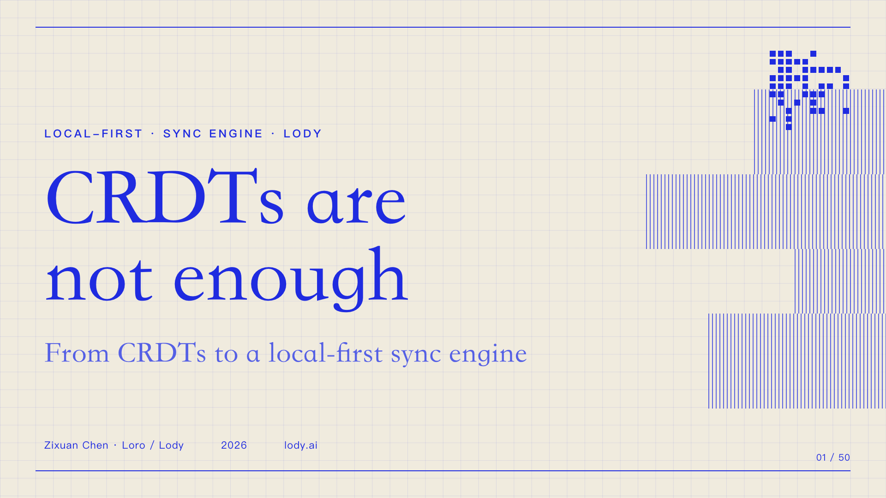
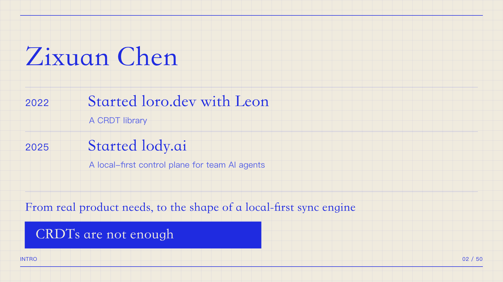
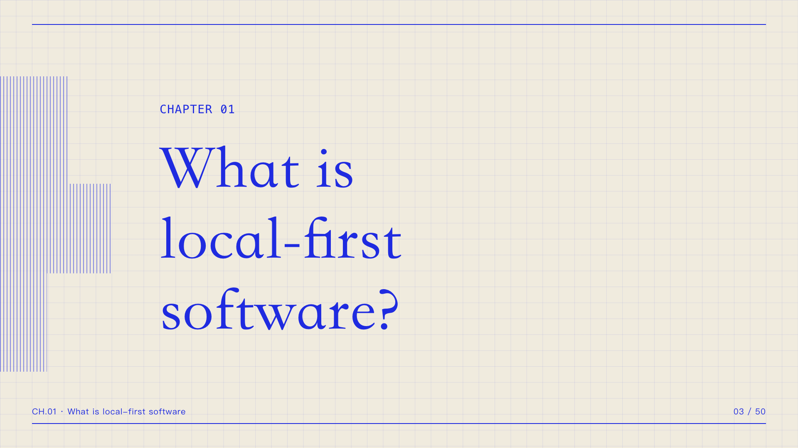
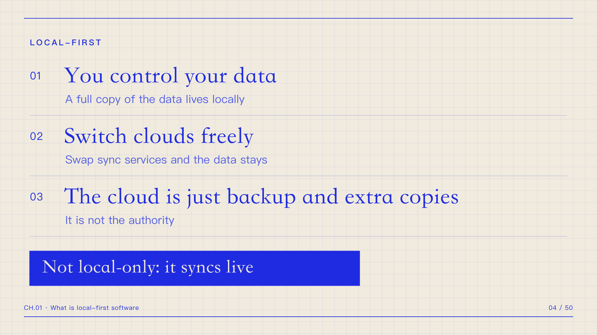
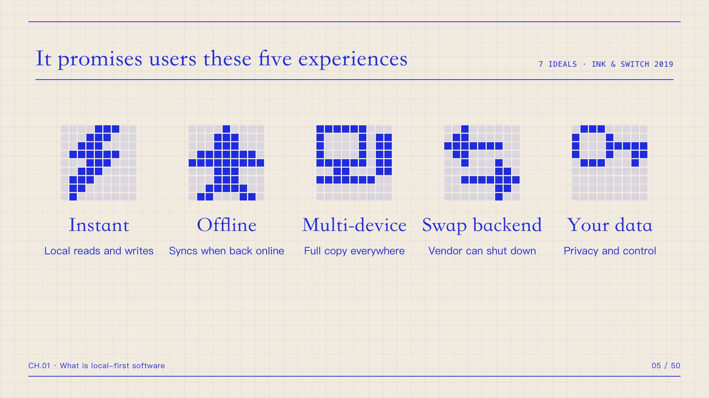
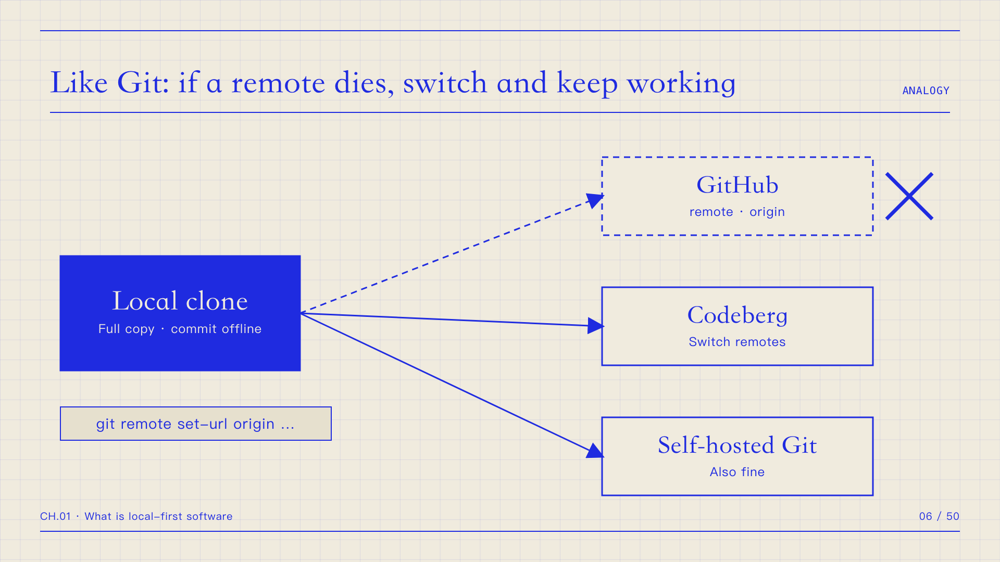

import Authors, { Author } from "../../components/authors";

<Authors date="2026-09-21">
  <Author name="Zixuan Chen" link="https://github.com/zxch3n/" />
</Authors>

Today I want to talk about "CRDTs are not enough" — that is, what's still missing if you want to build a local-first sync engine.

Let me introduce myself quickly. My name is Zixuan Chen. I've been working on loro.dev since 2022. It's a CRDT library together with Leon. Then, toward the end of 2025, we started building [lody.ai](https://lody.ai) on top of Loro. Lody is a local-first control plane for team AI agents. Through Lody, we started from real product needs and from polishing the UI/UX, and worked backwards to figure out what a local-first sync engine should actually look like these days. Along the way, we found a lot of things that are still missing. So today I want to share what we've learned.

First: what even is local-first software?

A few quick points. Users control their data, and they can freely switch between different clouds as a backup. The cloud is a backup and a helper, not the authoritative owner. In this architecture, the cloud is just a backup and an extra replica. Local-first is not the same as local-only: local-only means you can only do these things locally, whereas local-first still wants to keep the convenience of syncing across multiple devices.

It promises users five things. Instant open, because reads and writes all happen locally. It works offline. Multi-device collaboration. You can swap out the backend, so a vendor going out of business doesn't take your software down with it. And your data is yours. That last one really has two sides. One is that the software provider can't lock me out of my own software. The other is privacy — my data can't be read by the provider whenever they feel like it.

The classic example is Git. Git hasn't done the privacy part yet, but it's already very close to the ideal shape of local-first software. It defines, as a protocol, how the local side and the remote side exchange data. And you can switch to a different backend: if GitHub goes down, or you just don't want to use GitHub anymore, you can change the origin, switch to GitLab, or self-host it yourself.

Local-first and local-only are not the same thing. I've seen a lot of people in the community lump them together. But right now we're actually missing a mass-market application that delivers this kind of local-first experience end to end. A lot of apps lack the convenience of the cloud — they're really local-only, but they call themselves local-first. In practice they don't give you cloud convenience, and they don't give you P2P sync or anything like that either.

So what do we, and the local-first community, imagine a sync engine should be?

I can quote Martin Kleppmann's talk at this year's Local-first Conference. For developers, it means you no longer have to worry about failed requests, timeouts, whether your data actually reached the server, or how to tell the user about it. All of those messy problems should just be the sync engine's job. But in reality, we don't have a sync engine like that yet.

What people want is one unified, general-purpose sync engine that absorbs all of this: how to handle failed requests, what to do when data doesn't reach the server, how the frontend tells the user, and how permissions are managed so that whether a user can edit something is intuitive and obvious. And also how the local side and the backend persist data, and how you switch between providers.

From the end user's point of view, local-first delivers two very direct benefits: it's fast, and it's secure. A sync engine like this can give end users both.

But in theory, it can never be a silver bullet. There's a whole category of problems it can't solve — anything that needs strong consistency. Ticket sales, inventory management, payments, first-come-first-served meeting room booking — these are all things a local-first sync engine fundamentally can't handle. Because that whole class of problems needs strong consistency, whereas local-first sync is good at eventually consistent scenarios.

And a lot of those scenarios are creative work: code, documents, video editing, music, all kinds of artistic creation. That's the big category a sync engine like this can handle in a unified way.

The essential complexity behind all of it has to move from the application developer to the sync engine.

That's how you store things locally, what to do about timeouts, how you tell the user, what events you expose, how you express the permissions underneath, how you switch backends, how you provide P2P, and how you provide end-to-end encryption at the same time. All of that becomes the sync engine's responsibility.

Today, CRDT libraries already give you these capabilities. Loro, Yjs, and Automerge can all model structured documents like JSON and give you eventual consistency. As long as every replica ends up with the same set of updates, the final state is guaranteed to be the same. They also give you incremental sync; and for text, rich text, lists, and so on, the merge results come out as intuitive as possible. There's a lot of research behind this, and the results have been folded into these CRDT libraries. Out-of-order and duplicate updates during sync are covered too. You don't have to care when an update arrives; you can safely resend an update, and it won't be applied twice. But none of this solves all the problems I just mentioned. These libraries are essentially pure computation — they don't cover the network layer or the persistence layer, anything that involves I/O. And those are exactly the things a sync engine has to get right.

For example, how should you actually do P2P? There's still a lot missing there, and there are no answers yet. How should the sync protocol be designed? Right now it's a bit of a free-for-all. How do you design and deliver the UX, especially in a decentralized environment, so it feels intuitive to users? And how do you do authentication in a decentralized setting — and how do you present that in the UI/UX?

We worked backwards, step by step, while building Lody, and we've accumulated some experience. So let me share a bit of it, just to get the conversation going.

The https://github.com/LodyAI/Lody project should have seven thousand-something commits by now, and a lot of them are sync-related upgrades and rework.

lody.ai is an agent control plane. It needs to sync all kinds of conversation information, and in the future there'll be more document information too. That's thousands of documents whose data we need to sync. How do we do lazy loading? How do we sync the whole repo? That was the first problem we ran into. You can't load the full content of every document the moment someone opens the app. But Loro, Yjs, and Automerge — all three CRDT libraries — only give you document-level sync. To sync a whole repo, you usually have to combine them with something else.

So we built a new CRDT called Flock, and we'll open-source it in the future. It syncs a directory, essentially. Like when you open Notion, the first thing you see is which documents exist. Or when you open a Notion database, you first see all the rows and their metadata. Only after you click into a specific document do you pull its content. Flock is the CRDT responsible for syncing that directory behind the scenes. We use it to sync the titles of all the conversations in Lody — the information you need to see first.

Flock has gone through many iterations. At the very beginning we used a fairly simple JSON format, and it quickly couldn't keep up. Then we switched to a V1 binary format, but it was over-engineered and error-prone. After that we moved to a columnar V2 data format. V1 was somewhat inspired by SQLite's in-place update storage; V2 became a different file format, inspired by database design. Its performance and stability are much better than before, and users never noticed the whole switch.

Then storing data locally and deciding where to query it both became new problems. At first we tried to hook up SQLite on the web. There are practices around OPFS now, and Notion does the same thing. But we quickly found that path complicated and hard to pull off. Every browser tab is independent, and SQLite itself can only have one writer. If you have multiple tabs, it's as if every tab is fighting over the writer role. So the architecture has to become: the browser elects a leader, the leader holds SQLite, and it handles all the writes. That whole setup is very complex. We looked around at the time and couldn't find an open-source solution we could just pick up and use. That was February of this year — I don't know if anything's changed since. Later we switched to IndexedDB. But that's only a small part of the problem. Then there's full-text search: in a pure cloud architecture, that's actually an easy problem — just use Elastic, or give Postgres some full-text search extension. But doing this locally, how do you design the UX? Especially in the browser, where you don't load all the data up front. On top of that, we try to wrap as much of the cloud data as possible in end-to-end encryption. How to do that part is still unsolved, and we're still experimenting. I think in the future we might be able to use semantic search and combine it with some encryption techniques. That's another new problem.

Metadata-first — syncing on demand, syncing the metadata first, like I said. And how to prefetch: we've iterated on that several times, because you can't hog all the frontend's network and performance, but you still have to take care of the user experience. Lody syncs a lot of conversations, and if every time a conversation updates, you have to wait again after clicking in, the experience gets much worse. There's a lot of fine-tuning to do there.

CRDTs move the computational complexity from the cloud to the local device, so there's a real local performance cost. Right now we've moved some of the computation onto a worker.

The next problem is one we haven't solved either, but it's something you have to solve if you want to offer a local-first sync engine. In the sync engine we've built for Lody so far, there are no cross-stream transactions. For example, when you send a message, on one hand you have to update the meta I mentioned — the Flock document. The data in that document gets updated. Once the metadata is updated, I tell the user there's a new message, but actually writing the new message is a separate action. So one send turns into two actions, and there's no transactionality between them. That means in the UI/UX you can end up with this: the user gets an update, gets notified there's a new message, clicks into the conversation — and sees nothing. Because there's no transactionality, that really can happen. Maybe a stream dropped while sending, or a stream dropped while receiving. It can't bundle the updates from two streams into a single commit. This is also a place where we add a lot of complexity for the application.

And this problem isn't something another CRDT can fix. It has to be solved from the sync engine's point of view.

To work around this kind of problem, both the modeling and the sync ordering pick up a lot of extra complexity. When modeling, you first try as hard as you can to avoid conflicts, and for the parts CRDTs can't cover, you build a conflict UI.

Now let's talk about how to do the cloud.

Why talk about the cloud at all? It comes back to the Git and GitHub example. These days basically every developer has a GitHub account, and GitHub is a very successful hosting service. Git itself is a local-first protocol, but most users still want a hosted product that works out of the box. That doesn't go against the local-first ideal. In the future there'll be different hosting backends under the same protocol, plus a self-host option. That way users don't have to worry about a lot of details. Things like organizations, permissions, and CI hooks on GitHub just work out of the box.

At first we tried Cloudflare's Durable Objects. We tried to let one Durable Object manage the entire repo directly: one user or one org maps to one repo, and we forward everything through that Durable Object, syncing data in that shape. Inside the Durable Object we'd load the CRDT document, compute the version diff, and do incremental sync. But we quickly found it couldn't really carry that usage pattern or that volume. To compare versions, you either pull the relevant updates, load them into the CRDT document, and then compare — which is very expensive: high memory cost, and a lot of data to read and load. Or you store the version and other info in the SQLite inside the Durable Object, but that also has fairly high read/write costs, and you have to update the version vector on every update. And a repo also has different permissions: some people are read-only, some can write; some rooms are open to some people and not to others.

With that usage pattern, either the read/write cost is very high, or the long-connection cost is high, because Durable Objects bill by connection time. However long a WebSocket connection stays alive, that's the duration cost. To avoid that cost, you can evict all memory and go into hibernation. In that state the WebSocket connection stays open, but you're not billed for that time. At the same time, the Durable Object's other in-memory state gets evicted too, so all state has to live in its built-in SQLite. So all those state updates turn back into SQLite read/write cost. At the time, we found that cost was still a bit high.

One counterintuitive thing: a CRDT itself requires the server to know very little. Especially once you add end-to-end encryption, the server just needs to be a relay. CRDTs let smart clients resolve conflicts and do the computation directly — unlike algorithms like OT, which need the server to do that computation. So it's very counterintuitive that the server still has to do a lot of complex computation and pay a memory cost.

Later we switched to a different model: we adopted the Durable Streams protocol from the ElectricSQL team and implemented our own backend. Durable Streams is roughly this: each stream maps to a URL, and a stream is like an append-only file. Every appended update can be broadcast out, and you can also get an offset on that stream and fetch everything after it, which is how CRDT catch-up works. Because the property of a CRDT is: as long as every replica gets the same set of updates, they all reach a consistent state. So essentially, we just need every replica to get the same set of updates. A concept like an offset is the most direct and simple thing, and it needs the least state. The server just needs to provide that kind of streaming log.

For a remote cursor, locally you just need to store an offset.

On top of this dumb log, we made some extensions to Durable Streams. Clients can publish snapshots. There's a bootstrap protocol, so you can start from a snapshot and then catch up with the tail. If a CRDT only keeps updates, some metadata is hard to compress; but if you turn all the updates before a certain point into a snapshot, the snapshot can be compressed very small. So we gave clients the ability to send snapshots. Then we added an ephemeral channel for syncing cursors and presence. And on top of that, a primitive like append-CAS, which is what end-to-end encryption depends on.

If you add end-to-end encryption, the server doesn't need to change much at all — it's mainly the client that embeds the capability. And that gives you a nice property: even if the sync backend is compromised, the attacker can't get the data and can't forge data.

But our limitation right now is that the authentication we designed is still centralized — we haven't gotten it to a decentralized state. We need to be pragmatic here, because this problem isn't solved well yet, and there's no stable, ready-to-use protocol. For the end-to-end encryption protocol, we also chose a server-based linear log — the stream I just described. That's because we haven't found a really good way to do authentication in a decentralized environment. There's Keyhive and projects like that, but they're still pretty alpha. So we went with the linear log.

Like I said, the cloud only handles bytes, so it's very efficient.

The overall cloud architecture is roughly: client to gateway; the gateway does authentication; behind it is Raft. Each stream lands in a Raft group; hot data lives on the machines in that Raft group, and cold data goes to object storage.

So what user experience does this give you?

One is fast loading, because data is always local, so it can load right away. Another is fast syncing, because CRDTs already handle incremental sync automatically. And end-to-end encryption, which is something Lody is working on — we'll probably ship it next month.

The difference users can feel — here are two comments from X: Lody's sync feels smooth. Buttery smooth.

I also want to make one more point: the most overlooked hard part of a local-first sync engine is the business model.

Over the past few years, several teams building local-first — or at least using the local-first label — got acquired through acqui-hires, and their services shut down afterward. Electric got acquired recently, InstantDB got acquired, and their services are all sunsetting.

The hard part behind it is that this model is still too new, with too many of the open problems I mentioned and no complete solution yet. Even if a team sells something like this, it's too expensive for the buyer and eats too much of their innovation budget: they have to spend a lot of effort adapting to it, so a big, heavy purchase is hard to pull off. But if you only sell a single module, you can only sell it to a fairly small group of enthusiasts, and you can't land big deals.

Infrastructure businesses often have to wait until some client-side demand explodes, which drags infrastructure demand along with it, and the volume shows up before the business really works. Local-first hasn't hit that moment yet. The next opportunity might be local AI: once large language models can run inference locally, individuals, families, and small organizations will have a lot more demand in this direction, and that could make local-first adoption much bigger than before.

To sum up, here's what a local-first sync engine is still missing: how to do authentication, how to do end-to-end encryption well, cross-document transactions, decentralized UI/UX, and the business model.