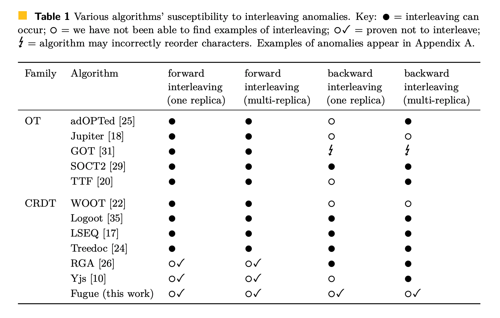
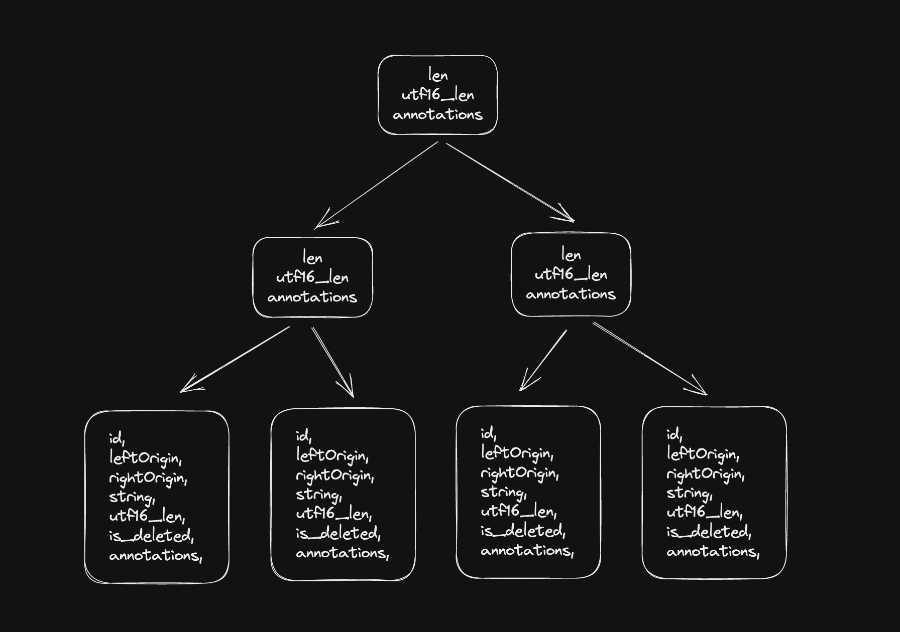
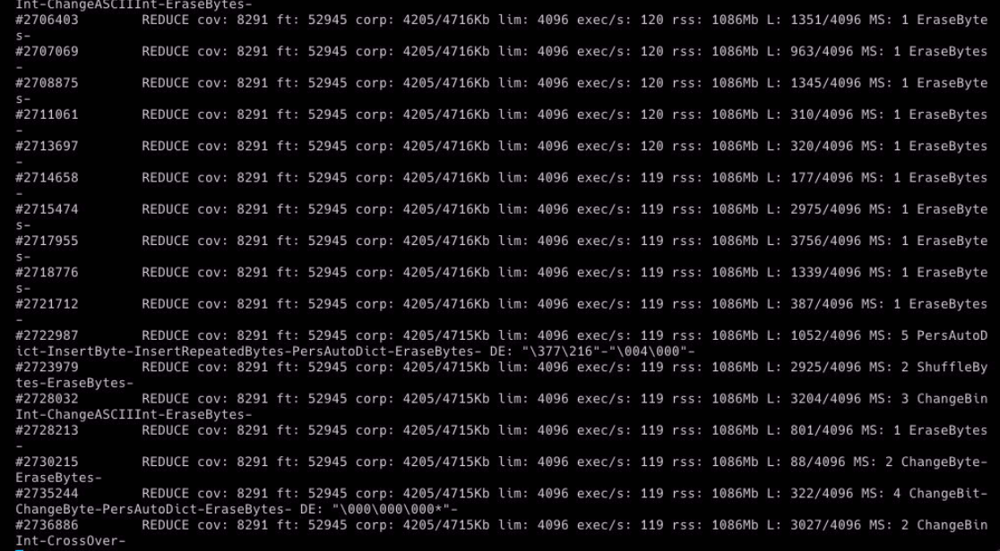

# [crdt-richtext](https://github.com/loro-dev/crdt-richtext): Rust implementation of Peritext and Fugue

import Authors, { Author } from "components/authors";

<Authors date="2023-04-20">
  <Author name="Zixuan Chen" link="https://twitter.com/zxch3n" />
</Authors>

Presenting a new Rust crate that combines [Peritext](https://inkandswitch.com/peritext) and [Fugue](https://arxiv.org/abs/2305.00583)'s power with impressive performance, tailored specifically for rich text. This crate's functionality is set to be incorporated into **[Loro](https://www.loro.dev/)**, a general-purpose CRDT library currently under development.

# What’s Peritext

[Peritext: A CRDT for Rich-Text Collaboration](https://inkandswitch.com/peritext)

Peritext is a novel rich-text CRDT (Conflict-free Replicated Data Type) algorithm. It is capable of merging concurrent edits in rich text format while [preserving users' intent as much as possible](https://www.inkandswitch.com/peritext/#preserving-the-authors-intent). Its primary focus is on merging the formats and annotations of rich text content, such as bold, italic, and comments.

> 💡 The specific definition of user intent in the context of concurrent rich text editing can't be clearly explained in a few words. it's best understood through specific examples.

Peritext is designed to solve a couple of significant challenges:

Firstly, it addresses the anticipated problems arising from conflicting style edits. For instance, consider a text example, "The quick fox jumped." If User A highlights "The quick" in bold and User B highlights "quick fox jumped," the ideal merge should result in the entire sentence, "The quick fox jumped," being bold. However, existing algorithms might not meet this expectation, resulting in either "The quick fox" or "The" and "jumped" being bold instead.

| Original Text                                | The quick fox jumped         |
| -------------------------------------------- | ---------------------------- |
| Concurrent Edit from A                       | **The quick** fox jumped     |
| Concurrent Edit from B                       | The **quick fox jumped**     |
| Expected Merged Result                       | **The quick fox jumped**     |
| Bad case from merging Markdown text directly | **The** quick **fox jumped** |
| Bad case from Yjs                            | **The quick** fox jumped     |

Additionally, Peritext manages conflicts between style and text edits. In the same example, if User A highlights "The quick" in bold, but User B changes the text to "The fast fox jumped," the ideal merge should result in "The fast" being bold.

| Original Text          | The quick fox jumped     |
| ---------------------- | ------------------------ |
| Concurrent Edit from A | **The quick** fox jumped |
| Concurrent Edit from B | The fast fox jumped      |
| Expected Merged Result | **The fast** fox jumped  |

What’s more, Peritext takes into account different expectations for expanding styles. For example, if you type after a bold text, you would typically want the new text to continue being bold. However, if you're typing after a hyperlink or a comment, you likely wouldn't want the new input to become part of the hyperlink or comment.

# What’s Fugue

Fugue is a new CRDT text algorithm, presented in _[The Art of the Fugue: Minimizing Interleaving in Collaborative Text Editing](https://arxiv.org/abs/2305.00583)_ by [Matthew Weidner](https://arxiv.org/search/cs?searchtype=author&query=Weidner%2C+M) et al., nicely solves **the interleaving problem**.

## The interleaving problem

The interleaving problem was proposed in the paper _[Interleaving anomalies in collaborative text editors](https://martin.kleppmann.com/2019/03/25/papoc-interleaving-anomalies.html)_ by Martin Kleppmann et al.

An example of interleaving:

- A type "Hello " from left to right/right to left
- B type "Hi " from left to right/right to left
- The expected result: "Hello Hi " or "Hi Hello "
- The interleaving result may look like: "HHeil lo"
  - This happens when typing from right to left in RGA.

 CRDT on text content.
Source: **Martin Kleppmann, Victor B. F. Gomes, Dominic P. Mulligan, and Alastair R. Beresford. 2019. Interleaving anomalies in collaborative text editors. [https://doi.org/10.1145/3301419.3323972](https://doi.org/10.1145/3301419.3323972)](./images/richtext0.png)

An example of an interleaving anomaly when using [fractional indexing](https://madebyevan.com/algos/crdt-fractional-indexing/) CRDT on text content.
Source: \*\*Martin Kleppmann, Victor B. F. Gomes, Dominic P. Mulligan, and Alastair R. Beresford. 2019. Interleaving anomalies in collaborative text editors. [https://doi.org/10.1145/3301419.3323972](https://doi.org/10.1145/3301419.3323972)

The [Fugue paper](https://arxiv.org/abs/2305.00583) summarizes the current state of the interleaving problems in the table.



Source: Weidner, M., Gentle, J., & Kleppmann, M. (2023). The Art of the Fugue: Minimizing Interleaving in Collaborative Text Editing. _ArXiv_. /abs/2305.00583

The interleaving problem sometimes are unsolvable when there are more than 2 sites. See [Fugue](https://arxiv.org/abs/2305.00583) paper Appendix B, Proof of Theorem 5 for detailed explanation.


The case where the interleaving problem is unsolvable
Source: Weidner, M., Gentle, J., & Kleppmann, M. (2023). The Art of the Fugue: Minimizing Interleaving in Collaborative Text Editing. _ArXiv_. /abs/2305.00583

However, we can still minimize the chance of interleaving. Fugue introduces the concept of **maximal non-interleaving** and solves it with an elegant algorithm that is easy to optimize. The definition of _maximal non-interleaving_ makes a lot of sense to me and leaves little room for ambiguity. I won't reiterate the definition here. But the basic idea is first to solve forward interleaving by leftOrigin. If there is still ambiguity, then solve the backward interleaving by rightOrigin. (The leftOrigin and rightOrigin refer to the ids of the original neighbors when the character is inserted, just like Yjs)

# CRDT-Richtext

Based on the algorithms of Peritext and Fugue, we made `crdt-richtext`, a lib written in Rust that provides a wasm interface. It’s available on [crates.io](http://crates.io) and npm now.

## Example

```tsx
import { RichText } from "crdt-richtext-wasm";

const text = new RichText(BigInt(1));
text.insert(0, "你好，世界！");
text.insert(2, "呀");
expect(text.toString()).toBe("你好呀，世界！");
text.annotate(0, 3, "bold", AnnotateType.BoldLike);
const spans = text.getAnnSpans();
expect(spans.length).toBe(2);
expect(spans[0].text).toBe("你好呀");
expect(spans[0].annotations.size).toBe(1);
expect(spans[0].annotations.has("bold")).toBeTruthy();
expect(spans[1].text.length).toBe(4);

const b = new RichText(BigInt(2));
b.import(text.export(new Uint8Array()));
expect(b.toString()).toBe("你好呀，世界！");
```

## Data structure

We heavily use B-Trees to optimize our algorithm. We made a library called [generic-btree](https://github.com/loro-dev/generic-btree), which is written in safe Rust code, which provides a flexible foundation for our optimization efforts.

[https://github.com/loro-dev/generic-btree](https://github.com/loro-dev/generic-btree)



The cached content inside B-Tree

There are several common tasks we need to address in Text CRDT, including:

- Finding, inserting, or deleting content at a given index:
  - We use a BTree to look up and update the content
  - The time complexity is O(logN), where N is the length of the content
- Finding content with a given op ID:
  - We use a combination of HashMap and BTree
  - The time complexity if O(logN), where N is the number of operations
- Compressing content in memory:
  - To reduce the amount of memory used by storing every operation in raw format, we compress the content using the RLE tricks from Yjs and DiamondTypes.
    - The insight behind this compression is that neighboring inserts and deletions tend to be continuous, so we can merge them and store less metadata.
  - Commonly, every leaf node in the diagram contains a dozen of characters
- Converting index between UTF-16 and UTF-8:
  - In JS, the default encoding of a string is utf16, but in Rust, the default one is utf8. Although the WASM interface can help us convert the encoding of the string, we still need to convert the _index_ of the operation.
  - To solve this, `crdt-richtext` also store the UTF-16 length of the content in B-Tree. So we can query the B-Tree with either the utf8 index or the utf16 index.
- Storing the boundary of style/format/comments:
  - We use the same B-Tree to store the boundary, with each subtree corresponding to a span of text or tombstones. For each node in the tree, we store which annotations start before it, start after it, end before it, or end after it.
    ```rust
    #[derive(Debug, PartialEq, Eq, Default, Clone)]
    pub struct ElemAnchorSet {
        start_before: FxHashSet<AnnIdx>,
        end_before: FxHashSet<AnnIdx>,
        start_after: FxHashSet<AnnIdx>,
        end_after: FxHashSet<AnnIdx>,
    }
    ```
  - This is basically the same optimization as Peritext, except we do it on the tree.

## Encoding

We use columnar encoding, which was first adopted to CRDTs by Martin Kelppmann [in automerge](https://github.com/automerge/automerge-classic/pull/253). To make it easier in Rust, we created the lib [Serde Columnar: Ergonomic columnar storage encoding crate](https://www.notion.so/Serde-Columnar-Ergonomic-columnar-storage-encoding-crate-7b0c86d6f8d24e4da45a1e2ebd86741c?pvs=21).

## Heavily tested by libFuzzer

Test-Driven Development (TDD) provides an amazing development experience. If possible, I always write unit tests for a standalone module before moving forward. However, for algorithms like CRDTs, it is infeasible to list all possible cases manually but is easy to generate test cases automatically. This is where fuzzing tests come into play.

Some fuzzers can track coverage information and generate mutations on the input data to maximize code coverage. LibFuzzer can also identify memory leaks and UAF problems.

`[cargo-fuzz`](https://www.notion.so/crdt-richtext-Rust-implementation-of-Peritext-and-Fugue-c49ef2a411c0404196170ac8daf066c0?pvs=21) provides a user-friendly API for writing fuzzing tests, and it supports two fuzzers: libFuzzer and AFL. It makes the unstructured libFuzzer feel structured. So we’re able to write fuzzing tests in this way

```rust
use arbitrary::Arbitrary;

#[derive(Arbitrary, Clone, Debug, Copy)]
pub enum Action {
    Insert {
        actor: u8,
        pos: u8,
        content: u16,
    },
    Delete {
        actor: u8,
        pos: u8,
        len: u8,
    },
    Annotate {
        actor: u8,
        pos: u8,
        len: u8,
        annotation: AnnotationType,
    },
    Sync(u8, u8),
}

pub fn fuzzing(actions: Vec<Action>) {
	// run tests based on actions
	...
}

#![no_main]
use libfuzzer_sys::fuzz_target;

fuzz_target!(|actions: [Action; 100]| { fuzzing(actions.to_vec()) });
```



We will run millions of Fuzzing Tests after making big changes. The fuzzer can help us extract the most useful thousands of tests to be included into the corpus. The minor changes can be verified by running the corpus.

We use fuzzing tests in Loro's CRDTs too. This test suite is like our safety net when we're making big tweaks to the code. It's great at spotting all our little slip-ups.

# Performance

## Benchmark

- Benchmark setup
  ### **B4: Real-world editing dataset**
  Replay a real-world editing dataset. This dataset contains the character-by-character editing trace of a large-ish text document, the LaTeX source of this paper: [https://arxiv.org/abs/1608.03960(opens in a new tab)](https://arxiv.org/abs/1608.03960)
  Source: [https://github.com/automerge/automerge-perf/tree/master/edit-by-index(opens in a new tab)](https://github.com/automerge/automerge-perf/tree/master/edit-by-index)
  - 182,315 single-character insertion operations
  - 77,463 single-character deletion operations
  - 259,778 operations totally
  - 104,852 characters in the final document
  We simulate one client replaying all changes and storing each update. We measure the time to replay the changes and the size of all update messages (`updateSize`), the size of the encoded document after the task is performed (`docSize`), the time to encode the document (`encodeTime`), the time to parse the encoded document (`parseTime`), and the memory used to hold the decoded document in memory (`memUsed`).
  ### **[B4 x 100] Real-world editing dataset 100 times**
  Replay the [B4] dataset one hundred times. The final document has a size of over 10 million characters. As comparison, the book "Game of Thrones: A Song of Ice and Fire" is only 1.6 million characters long (including whitespace).
  - 18,231,500 single-character insertion operations
  - 7,746,300 single-character deletion operations
  - 25,977,800 operations totally
  - 10,485,200 characters in the final document

The benchmark was conducted on a 2020 M1 MacBook Pro 13-inch on 2023-05-11.

| N=6000                                                           | crdt-richtext-wasm     | loro-wasm               | automerge-wasm      | tree-fugue                  | yjs                          | ywasm               |
| ---------------------------------------------------------------- | ---------------------- | ----------------------- | ------------------- | --------------------------- | ---------------------------- | ------------------- |
| [B4] Apply real-world editing dataset (time)                     | 176 +/- 10 ms          | 141 +/- 15 ms           | 821 +/- 7 ms        | 721 +/- 15 ms               | 1,114 +/- 33 ms              | 23,419 +/- 102 ms   |
| [B4] Apply real-world editing dataset (memUsed)                  | skipped                | skipped                 | skipped             | 2,373,909 +/- 13725 bytes   | 3,480,708 +/- 168887 bytes   | skipped             |
| [B4] Apply real-world editing dataset (encodeTime)               | 8 +/- 1 ms             | 8 +/- 1 ms              | 115 +/- 2 ms        | 12 +/- 0 ms                 | 12 +/- 1 ms                  | 6 +/- 1 ms          |
| [B4] Apply real-world editing dataset (docSize)                  | 127,639 +/- 0 bytes    | 255,603 +/- 8 bytes     | 129,093 +/- 0 bytes | 167,873 +/- 0 bytes         | 159,929 +/- 0 bytes          | 159,929 +/- 0 bytes |
| [B4] Apply real-world editing dataset (parseTime)                | 11 +/- 0 ms            | 2 +/- 0 ms              | 620 +/- 5 ms        | 8 +/- 0 ms                  | 43 +/- 3 ms                  | 40 +/- 3 ms         |
| [B4x100] Apply real-world editing dataset 100 times (time)       | 15,324 +/- 3188 ms     | 12,436 +/- 444 ms       | skipped             | 91,902 +/- 863 ms           | 112,563 +/- 3861 ms          | skipped             |
| [B4x100] Apply real-world editing dataset 100 times (memUsed)    | skipped                | skipped                 | skipped             | 224076566 +/- 2812359 bytes | 318807378 +/- 15737245 bytes | skipped             |
| [B4x100] Apply real-world editing dataset 100 times (encodeTime) | 769 +/- 37 ms          | 780 +/- 32 ms           | skipped             | 943 +/- 52 ms               | 297 +/- 16 ms                | skipped             |
| [B4x100] Apply real-world editing dataset 100 times (docSize)    | 12,667,753 +/- 0 bytes | 26,634,606 +/- 80 bytes | skipped             | 17,844,936 +/- 0 bytes      | 15,989,245 +/- 0 bytes       | skipped             |
| [B4x100] Apply real-world editing dataset 100 times (parseTime)  | 1,252 +/- 14 ms        | 170 +/- 15 ms           | skipped             | 368 +/- 13 ms               | 1,335 +/- 238 ms             | skipped             |

The complete benchmark result and code is available at https://github.com/zxch3n/fugue-bench.

It is worth noting that:

- The benchmark for Automerge is based on `automerge-wasm`, which is not the latest version of Automerge 2.0.
- `crdt-richtext` and `fugue` are special-purpose CRDTs that tend to be faster and have a smaller encoding size.
- The encoding of `yjs`, `ywasm`, and `loro-wasm` still contains redundancy that can be compressed significantly. For more details, see [the full report](https://loro.dev/docs/performance/docsize).
- loro-wasm and fugue only support plain text for now

# Discussion

[CRDT-richtext: Rust implementation of Peritext and Fugue | Hacker News](https://news.ycombinator.com/item?id=35988046)
