# Introduction to Loro's Rich Text CRDT

import Authors, { Author } from "../../components/authors";

<Authors date="2024-01-22">
  <Author name="Zixuan Chen" link="https://twitter.com/zxch3n" />
</Authors>

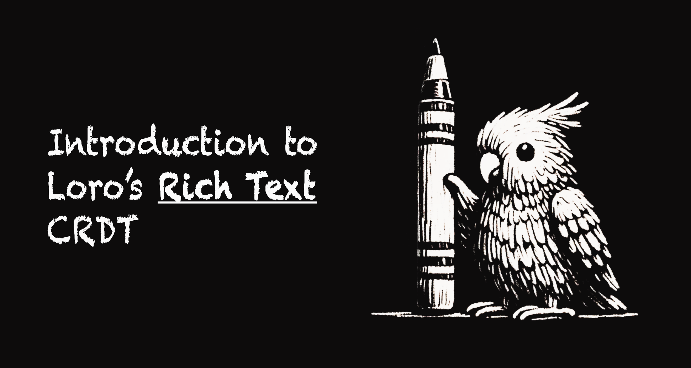

import Caption from "../../components/caption";
import Demo from "@components/richtextDemo";

This article presents the rich text CRDT algorithm implemented in Loro,
complying with [Peritext]'s criteria for seamless rich text collaboration.
Furthermore, it can be built on top of any List CRDT algorithms and turn them
into rich text CRDTs.

<div className="mt-6" />
<Demo />
<Caption>
  Above is an online demo of Loro's rich text CRDT, built with Quill. After the
  replay, you can simulate real-time collaboration and concurrent editing while
  offline. You can also drag on the history view to replay the editing history.
</Caption>

If CRDTs are new to you, our article [What are CRDTs](/docs/concepts/crdt)
provides a brief introduction.

## Background

Loro is based on the
[Event Graph Walker (Eg-walker)](/docs/advanced/replayable_event_graph) algorithm
proposed by Joseph Gentle, but this algorithm cannot integrate the original
version of Peritext. This motivates us to create a new rich text algorithm. It
is independent of the specific List CRDTs, thus working nicely with Eg-walker, and is
developed on top of them to establish a rich text CRDT.

Before diving into the algorithm of Loro's rich text CRDT, I'd like to briefly
introduce Eg-walker and Peritext, and why Peritext cannot be used on Eg-walker.

<details>
<summary>Recap on List CRDTs</summary>

### Recap on List CRDTs

Unlike OT, most List-oriented CRDTs assign a unique ID to each item or
character, often corresponding to the operation ID of its insertion. With unique
IDs for each character, we can reliably reference a character or position
through its ID.

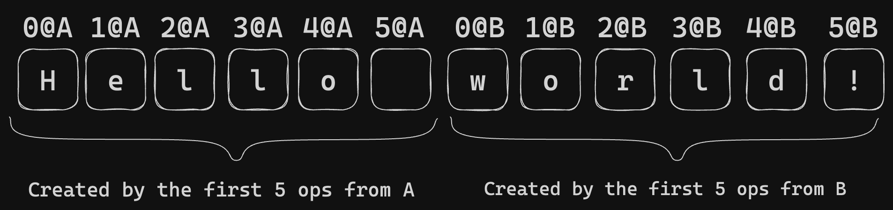

The unique ID eliminates concerns about consistent position descriptions during
synchronization. For instance, deletions are straightforward by specifying the
deleted character's ID, and insertions are described using the IDs of adjacent
characters. In cases of concurrent insertions at the same location, List CRDT
algorithms resolve the consistency issues.

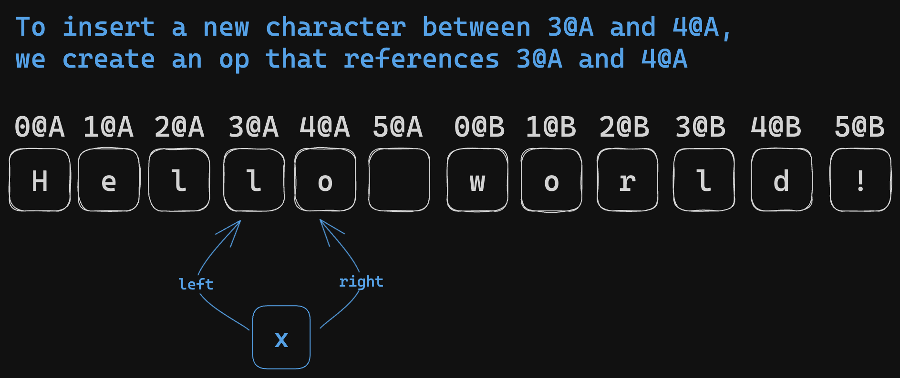

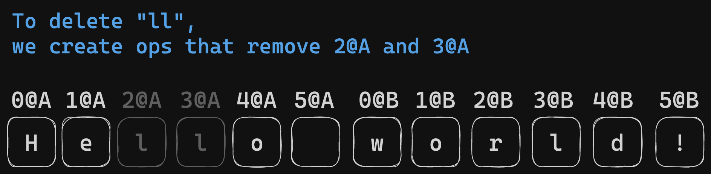

However, a notable limitation of List CRDTs is the use of 'tombstones'. Upon
deletion of a character, it is not fully removed but replaced with a tombstone,
maintaining the ID's position. Depending on the algorithm, this tombstone may be
removed once all participating nodes acknowledge the deletion. However, it can
be challenging to determine if all peers have received the corresponding
deletion operation. This information often means additional overhead for many
CRDTs. Thus, the simplest solution is not to perform any tombstone collection.

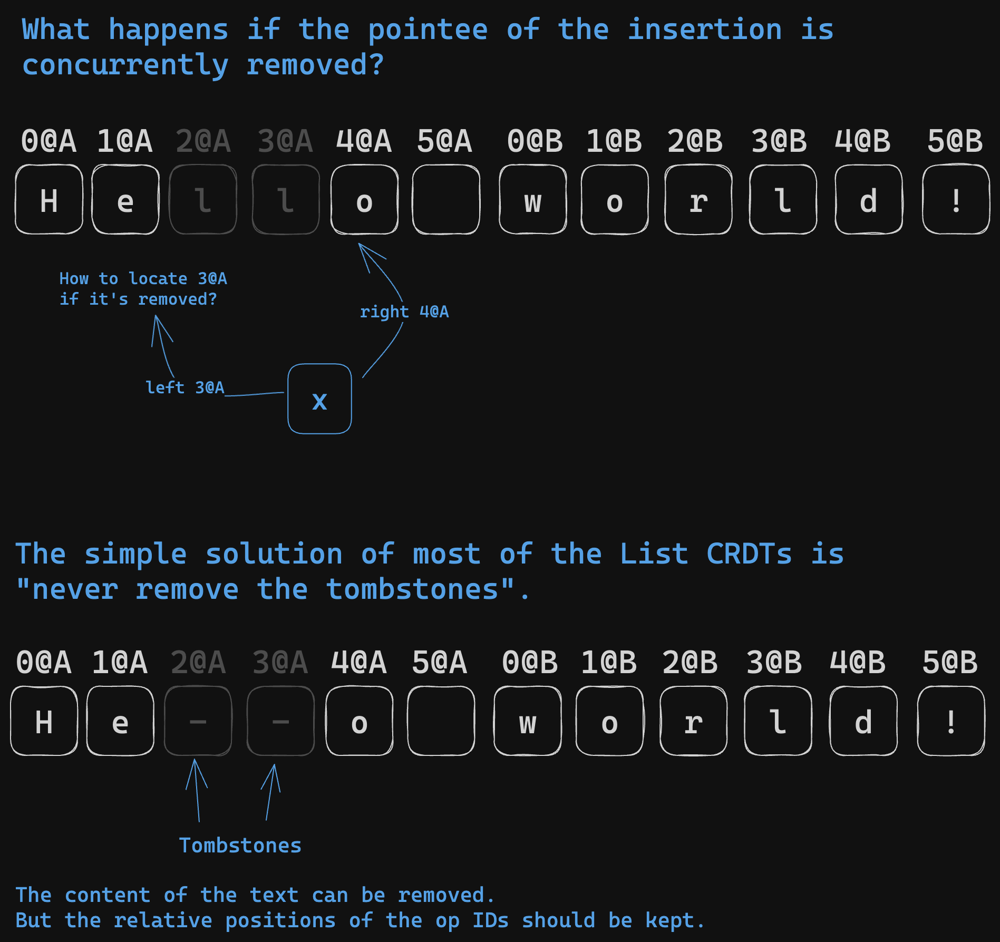

</details>

### Brief Introduction to Event Graph Walker

Eg-walker is a novel CRDT algorithm introduced in:

> [Collaborative Text Editing with Eg-walker: Better, Faster, Smaller](https://arxiv.org/abs/2409.14252)  
> By: Joseph Gentle, Martin Kleppmann

Eg-walker is a novel CRDT algorithm that combines the strengths of both OT and CRDTs.
It has the distributed nature of CRDT that enables P2P collaboration and data
ownership. Moreover, it achieves minimal overhead in scenarios devoid of
concurrent edits, similar to OT.

import { ReactPlayer } from "../../components/video";

<ReactPlayer
  url="/static/REG.mp4"
  width={"100%"}
  muted={true}
  loop={true}
  controls={true}
  playing={true}
/>

Whether in real-time collaboration or multi-end synchronization, a directed
acyclic graph (DAG) forms over the history of these parallel edits, similar to
Git's history. The Eg-walker algorithm records the history of user edits on the DAG.

Unlike conventional CRDTs, Eg-walker can record just the original description of
operations, not the metadata of CRDTs. For instance, in text editing scenarios,
the [RGA algorithm] needs the op ID and [Lamport timestamp][Lamport] of the
character to the left to determine the insertion point. [Yjs]/Fugue, however,
requires the op ID of both the left and right characters at insertion. In
contrast, Eg-walker simplifies this by only recording the index at the time of
insertion. Loro, which uses [Fugue] upon Eg-walker, inherits these advantages.

An index is not a stable position descriptor, as the index of an operation can
be affected by other operations. For example, if you highlight content from
`index=x` to `index=y`, and concurrently someone inserts n characters at
`index=n` where `n<x`, then your highlighted range should shift to cover from
`x+n` to `y+n`. But Eg-walker can determine the exact position of this index by
replaying history. Thus, it can reconstruct the corresponding CRDT structure by
replaying history.

Reconstructing history might seem time-consuming, but Eg-walker can backtrack only
some. When merging updates from remote sources, it only needs to replay
operations parallel to the remote update, reconstructing the local CRDTs to
calculate the diff after applying remote operations to the current document.

The Eg-walker algorithm excels with its fast local update speeds and eliminate
concerns about tombstone collection in CRDTs.For instance, if an operation has
been synchronized across all endpoints, no new operations will occur
concurrently with it, allowing it to be safely removed from the history.

<details>
<summary>What is Fugue</summary>

Fugue is a new CRDT text algorithm, presented in
_[The Art of the Fugue: Minimizing Interleaving in Collaborative Text Editing](https://arxiv.org/abs/2305.00583)_
by
[Matthew Weidner](https://arxiv.org/search/cs?searchtype=author&query=Weidner%2C+M)
et al., nicely solves **the interleaving problem**.

The interleaving problem was proposed in the paper
_[Interleaving anomalies in collaborative text editors](https://martin.kleppmann.com/2019/03/25/papoc-interleaving-anomalies.html)_
by Martin Kleppmann et al.

An example of interleaving:

- A type "Hello " from left to right/right to left
- B type "Hi " from left to right/right to left
- The expected result: "Hello Hi " or "Hi Hello "
- The interleaving result may look like: "HHeil lo"
  - This happens when typing from right to left in RGA.

 CRDT on text content.
Source: **Martin Kleppmann, Victor B. F. Gomes, Dominic P. Mulligan, and Alastair R. Beresford. 2019. Interleaving anomalies in collaborative text editors. [https://doi.org/10.1145/3301419.3323972](https://doi.org/10.1145/3301419.3323972)](./images/richtext0.png)

An example of an interleaving anomaly when using
[fractional indexing](https://madebyevan.com/algos/crdt-fractional-indexing/)
CRDT on text content. Source: \*\*Martin Kleppmann, Victor B. F. Gomes, Dominic
P. Mulligan, and Alastair R. Beresford. 2019. Interleaving anomalies in
collaborative text editors.
[https://doi.org/10.1145/3301419.3323972](https://doi.org/10.1145/3301419.3323972)

The [Fugue paper](https://arxiv.org/abs/2305.00583) summarizes the current state
of the interleaving problems in the table.


Source: Weidner, M., Gentle, J., & Kleppmann, M. (2023). The Art of the Fugue:
Minimizing Interleaving in Collaborative Text Editing. _ArXiv_. /abs/2305.00583

The interleaving problem sometimes are unsolvable when there are more than 2
sites. See [Fugue](https://arxiv.org/abs/2305.00583) paper Appendix B, Proof of
Theorem 5 for detailed explanation.


The case where the interleaving problem is unsolvable Source: Weidner, M.,
Gentle, J., & Kleppmann, M. (2023). The Art of the Fugue: Minimizing
Interleaving in Collaborative Text Editing. _ArXiv_. /abs/2305.00583

However, we can still minimize the chance of interleaving. Fugue introduces the
concept of **maximal non-interleaving** and solves it with an elegant algorithm
that is easy to optimize. The definition of _maximal non-interleaving_ makes a
lot of sense to me and leaves little room for ambiguity. I won't reiterate the
definition here. But the basic idea is first to solve forward interleaving by
leftOrigin. If there is still ambiguity, then solve the backward interleaving by
rightOrigin. (The leftOrigin and rightOrigin refer to the ids of the original
neighbors when the character is inserted, just like Yjs)

</details>

### Brief Introduction to Peritext

[Peritext] was proposed by _Geoffrey Litt et al._ It's the first paper to
discuss rich text CRDTs. It can merge concurrent edits in rich text format while
[preserving users' intent as much as possible](https://www.inkandswitch.com/peritext/#preserving-the-authors-intent).
Its primary focus is merging the formats and annotations of rich text content,
such as bold, italic, and comments. It was implemented in [Automerge] and
[crdt-richtext].

> 💡 The specific definition of user intent in the context of concurrent rich
> text editing can't be clearly explained in a few words. It's best understood
> through particular examples.

Peritext is designed to solve a couple of significant challenges:

Firstly, it addresses the anticipated problems arising from conflicting style
edits. For instance, consider a text example, "The quick fox jumped." If User A
highlights "The quick" in bold and User B highlights "quick fox jumped," the
ideal merge should result in the entire sentence, "The quick fox jumped," being
bold. However, existing algorithms might not meet this expectation, resulting in
either "The quick fox" or "The" and "jumped" being bold instead.

| Original Text                                | The quick fox jumped         |
| -------------------------------------------- | ---------------------------- |
| Concurrent Edit from A                       | **The quick** fox jumped     |
| Concurrent Edit from B                       | The **quick fox jumped**     |
| Expected Merged Result                       | **The quick fox jumped**     |
| Bad case from merging Markdown text directly | **The** quick **fox jumped** |
| Bad case from Yjs                            | **The quick** fox jumped     |

Additionally, Peritext manages conflicts between style and text edits. In the
same example, if User A highlights "The quick" in bold, but User B changes the
text to "The fast fox jumped," the ideal merge should result in "The fast" being
bold.

| Original Text          | The quick fox jumped     |
| ---------------------- | ------------------------ |
| Concurrent Edit from A | **The quick** fox jumped |
| Concurrent Edit from B | The fast fox jumped      |
| Expected Merged Result | **The fast** fox jumped  |

What’s more, Peritext takes into account different expectations for expanding
styles. For example, if you type after a bold text, you would typically want the
new text to continue being bold. However, if you're typing after a hyperlink or
a comment, you likely wouldn't want the new input to become part of the
hyperlink or comment.

<div style={{filter: "invert(1) hue-rotate(180deg)"}}>

</div>
<Caption>
Illustration of Peritext's internal state. It uses the IDs of the character's ops to record the style ranges. In the example, the bold mark has the range of `{ start: { type: "before", opId: "9@B" }, end: { type: "before", opId: "10@B" }}`
</Caption>

### Why Original Peritext Can't Be Directly Used with Eg-walker

On the one hand, Peritext's algorithm expresses style ranges
[through character OpIDs](https://www.inkandswitch.com/peritext/#generating-inline-formatting-operations).
Without replaying history, CRDTs based on Eg-walker cannot determine the specific
positions corresponding to these OpIDs.

On the other hand, it's not feasible to model Peritext on Eg-walker through replaying.
This is because Eg-walker's "local backtracking suffices" relies on the algorithm
satisfying "the same operation will produce the same effect, regardless of the
current state," which Peritext does not adhere to. For example, when inserting
the character "x" at position `p`, whether "x" is bold depends on "whether `p`
is surrounded by bold" and
"[whether the tombstones at `p` contain boundaries of bold and other styles](https://arc.net/l/quote/ifxpaand)."

## Loro's Rich Text CRDT

### Algorithm

Loro implements rich text using special control characters called 'style
anchors'. Each matching pair of start anchor and end anchor contains the
following information:

- The op ID of the style operation
- The style's key-value pair
- The style's [Lamport timestamp][Lamport]
- Style expansion behavior: Determines whether newly inserted text before or
  after the style boundaries should inherit the style.

The method to determine a character's style is as follows:

- Find all style anchor pairs that include the character, where each pair is
  created by the same style operation
- Aggregate pairs according to the key. There may be multiple style pairs with
  the same key but different values. In such cases, the value with the greatest
  Lamport timestamp is chosen (if Lamport timestamps are equal, then use the
  peer ID to break the tie)

Contrary to
[Yjs's method of using control characters](https://www.inkandswitch.com/peritext/#adding-control-characters-to-plain-text)
for rich text, our algorithm pairs start and end anchors when they originate
from the same style operation. This approach accurately handles the following
scenarios:

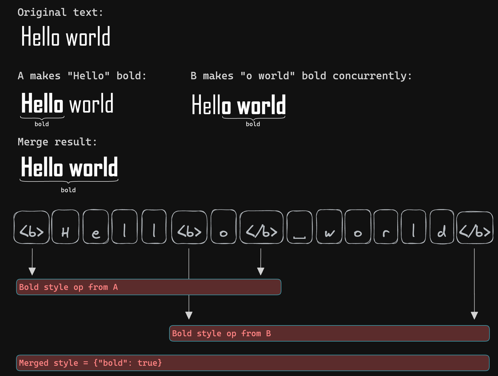

These special control characters are not exposed to the user; each control
character is effectively of zero length from the user's perspective. Our data
structure supports various methods of measuring text length for indexing text
content. Besides Unicode, UTF-16, and UTF-8, we also measure our rich text
length in `Entity length`. It treats each style anchor as an entity with a
length of 1 and measures plain text in Unicode length.

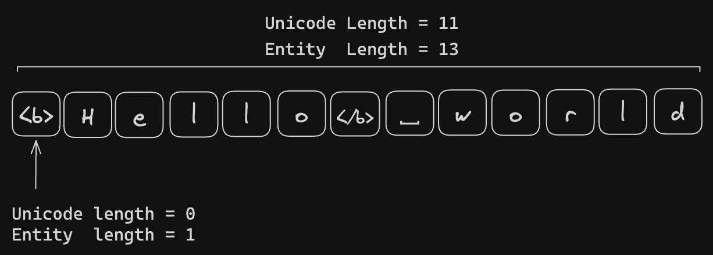

| Concept           | Definition                                                                                                                                                                     |
| ----------------- | ------------------------------------------------------------------------------------------------------------------------------------------------------------------------------ |
| Style Anchors     | Control characters used in Loro denote style boundaries' start and end. They are differentiated into start and end anchors, representing a style's beginning and end.          |
| Rich Text Element | A rich text element is either a span of text or a style anchor. A list of rich text elements represents the internal state of Loro's rich text.                                |
| Unicode Index     | A method of indexing text positions in rich text. In this method, the length of the text is measured in Unicode char length, and the length of style anchors is considered 0.  |
| Entity Index      | A method of indexing text positions in rich text. In this method, the length of the text is measured in Unicode char length, and the length of a style anchor is considered 1. |

#### Local Behavior

Multiple valid insertion points can exist when users insert text at a specific
Unicode index. It occurs due to style anchors, which are zero-length elements
from the user's perspective.

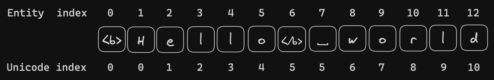

For example, in the case of `<b>Hello</b> world`, when a user inserts content at
Unicode `index=5`, they face the choice of inserting to the left or right of
`</b>`. If the user sets the expand behavior of bold to expand forward, the new
character will be inserted to the left of `</b>`, making the inserted text bold
as well.

When users delete text, Loro uses an additional mapping layer to avoid deleting
style anchors within the text range.

To model the deletion of a style, a new style anchor pair with a null value is
added.

We can implement the following optimizations to remove redundant style anchors:

- The style anchors that include no text can be removed.
- When styles completely negate each other, like a span of bold is canceled by a
  span of unbold, we can remove their style anchors.

All these behaviors happen locally, and the algorithm is independent of the
specific List CRDT.

##### Behavior When Inserting Text at Style Boundaries

Most modern rich text editors (Google Doc, Microsoft Word, Notion) behave as
follows: when new text is entered right after bold text, the new text should
inherit the bold style; when entered after a hyperlink, the new content should
not inherit the hyperlink style. Different styles have varying preferences for
text insertion positions, leading to potential conflicts. This is reflected in
the degree of freedom we have when inserting new text.

Users interact with rich text based on text-based indexes, like the Unicode
index. Since style anchors have a Unicode Length of 0, a Unicode index with n
style anchors presents n + 1 potential insertion positions.

We select the insertion position based on the following rules:

1. Insertions occur before a start anchor of a style that should not expand
   backward.
2. Insertions occur before style anchors that signify the end of bold-like marks
   (expand = "after" or expand = "both").
3. Insertions occur after style anchors that signify the end of link-like marks
   (expand = "none" or expand = "before").

Rule 1 should be prioritized over rules 2 and 3 to prevent
[the accidental creation of a new style](https://github.com/inkandswitch/peritext/issues/32).

The current method first scans forward to find the last position satisfying
rules 1 and 2.

Then, it scans backward to find the first position satisfying rule 3.

#### Merging Remote Updates

Loro treats style anchors as a special element and handles them using the same
List CRDT for resolving concurrent conflicts. The logic related to rich text is
independent of the particular List CRDT. Therefore, this algorithm can rely on
any List CRDT algorithm for merging remote operations. Loro utilizes the [Fugue]
List CRDT algorithm.

When new style anchors are inserted by remote updates, new styles are added; if
old style anchors are deleted, the corresponding old styles are removed.

#### Strong Eventual Consistency

The internal state of this algorithm consists of a list of elements, each either
a text segment or a style anchor. The rich text document is derived from this
internal state.

The internal state achieves strong eventual consistency through the upstream
List CRDT.

Identical internal states result in identical rich text documents. Hence, the
same set of updates will produce the same rich text documents, evidencing the
strong eventual consistency of this algorithm.

### Criteria in Peritext

[The Peritext paper](https://www.inkandswitch.com/peritext/static/cscw-publication.pdf)
specifies the intent-preserving merge behavior for rich text inline format.
Loro's rich text algorithm successfully passes all test cases outlined therein.

#### 1. Concurrent Formatting and Insertion

| Name            | Text                |
| :-------------- | :------------------ |
| Origin          | Hello World         |
| Concurrent A    | **Hello World**     |
| Concurrent B    | Hello New World     |
| Expected Result | **Hello New World** |

Loro easily supports this case by treating style anchors as special elements
alongside text.

#### 2. Overlapping Formatting

| Name            | Text            |
| :-------------- | :-------------- |
| Origin          | Hello World     |
| Concurrent A    | **Hello** World |
| Concurrent B    | Hel**lo World** |
| Expected Result | **Hello World** |

This case has been analyzed earlier. Since our style anchors contain style op ID
information, we know there are two bold segments: one from 0 to 5 and another
from 3 to 11, allowing us to merge them.

| Name            | Text                |
| :-------------- | :------------------ |
| Origin          | Hello World         |
| Concurrent A    | **Hello** World     |
| Concurrent B    | Hel*lo World*       |
| Expected Result | **Hel*lo*** _World_ |

Multiple style types are easily supported.

| Name            | Text                                                 | Note                |
| :-------------- | :--------------------------------------------------- | :------------------ |
| Origin          | Hello World                                          |                     |
| Concurrent A    | **Hello World** <br /> Then <br /> **Hello** World   | Bold, then unbold   |
| Concurrent B    | Hello Wor**ld**                                      |                     |
| Expected Result | **Hello** Wor**ld** <br /> Or <br /> **Hello** World | Both are acceptable |

Like Peritext, we model unbolding by adding a new style with the key `bold` and
the value `null`. The final value of each style key on each character is
determined by the style with the greatest [Lamport] timestamp that includes the
character. Thus, it easily supports this case.

#### 3. Text Insertion at Span Boundaries

Insertion right after a bold style should result in the newly inserted text also
being bold.

<div style={{ filter: "invert(1) hue-rotate(180deg)" }}>
  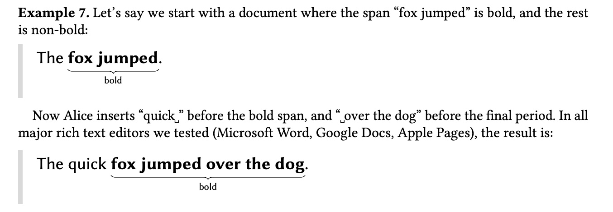
</div>

However, insertion right after a link style should result in the newly inserted
text not having the hyperlink style.

<div style={{ filter: "invert(1) hue-rotate(180deg)" }}>
  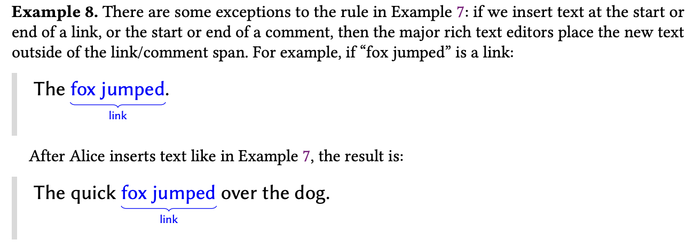
</div>

#### 4. Styles that Support Overlapping

<div style={{ filter: "invert(1)" }}>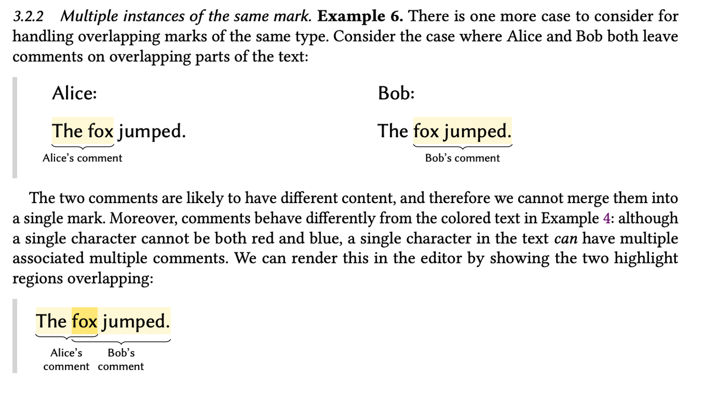</div>

The problem of overlapping styles is related to how we represent them.

We represent the rich text using
[Quill's Delta](https://quilljs.com/docs/delta/) format.

```ts
[
  { insert: "Gandalf", attributes: { bold: true } },
  { insert: " the " },
  { insert: "Grey", attributes: { color: "#cccccc" } },
];
```

<Caption>An example of Quill's Delta format</Caption>

However, it cannot handle cases with multiple values assigned to the same key.
So, it's a headache to handle the styles that support overlapping.

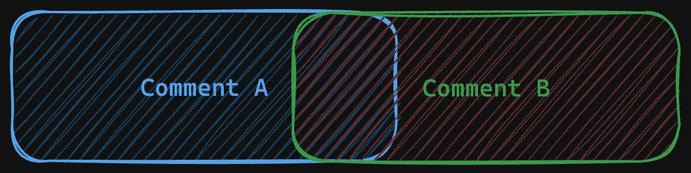

For example, in the above case, the text "fox" is commented on by both Alice and
Bob. We can't represent it with Quill's Delta format directly. So the possible
workaround includes:

**Turn the attribute value into a list**

```ts no-run
[
  { insert: "The ", attributes: { comment: [{ ...commentA }] } },
  {
    insert: "fox",
    attributes: { comment: [{ ...commentA }, { ...commentB }] },
  },
  { insert: " jumped", attributes: { comment: [{ ...commentB }] } },
];
```

**Use op ID that creates the op as the key of the attribute**

```ts no-run
[
  { insert: "The ", attributes: { "id:0@A": { key: "comment", ...commentA } } },
  {
    insert: "fox",
    attributes: {
      "id:0@A": { key: "comment", ...commentA },
      "id:0@B": { key: "comment", ...commentB },
    },
  },
  {
    insert: " jumped",
    attributes: { "id:0@B": { key: "comment", ...commentA } },
  },
];
```

But both require special behaviors for both CRDT lib and for application code,
which are painful to work with.

Finally, we found that the optimal approach to represent an overlappable style
was to use `<key>:` as a prefix and allow users to assign a unique suffix to
create a distinct style key. This method simplifies the CRDTs library code, as
it doesn't require handling special cases. It effectively addresses scenarios
where multiple comments overlap and is also user-friendly for application
coding.

```ts
[
  { insert: "The ", attributes: { "comment:alice": "Hi" } },
  {
    insert: "fox",
    attributes: { "comment:alice": "Hi", "comment:bob": "Jump" },
  },
  { insert: " jumped", attributes: { "comment:bob": "Jump" } },
];
```

Following is the example code in Loro:

```ts
const doc = new Loro();
doc.configTextStyle({
  comment: { expand: "none" },
});
const text = doc.getText("text");
text.insert(0, "The fox jumped.");
text.mark({ start: 0, end: 7 }, "comment:alice", "Hi");
text.mark({ start: 4, end: 14 }, "comment:bob", "Jump");
expect(text.toDelta()).toStrictEqual([
  {
    insert: "The ",
    attributes: { "comment:alice": "Hi" },
  },
  {
    insert: "fox",
    attributes: {
      "comment:alice": "Hi",
      "comment:bob": "Jump",
    },
  },
  {
    insert: " jumped",
    attributes: { "comment:bob": "Jump" },
  },
  {
    insert: ".",
  },
]);
```

## Implementation of Loro's Rich Text Algorithm

The following is an overview of Loro's implementation as of January, 2024.

### Architecture of Loro

In line with the properties of Event Graph Walker, Loro uses `OpLog` and
`DocState` as the internal state.

`OpLog` is dedicated to recording history, while `DocState` only records the
current document state and does not include historical operation information.
When applying updates from remote sources, Loro uses the relevant operations
from `OpLog` and computes the diff through a `DiffCalculator`. This diff is then
applied to `DocState`. This architecture also makes time travel easier to
implement.

For more details, see the documentation on
[DocState and OpLog](https://loro.dev/docs/advanced/doc_state_and_oplog).

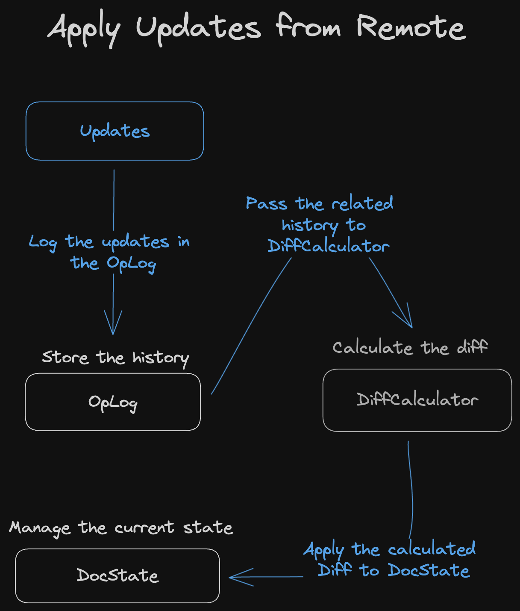

### Implementation of Loro's Rich Text CRDT

For rich text, Loro reuses the same `DiffCalculator` as Loro List, based on the
[Fugue] algorithm. As a result, the primary logic related to rich text is
concentrated in `DocState`. This includes expressing styles, inserting new
characters, and representing multiple index formats.

In the representation of rich text state, we distinguish between the data
structure `ContentTree`, which expresses the text (including style anchors), and
`StyleRangeMap`, which expresses styles.

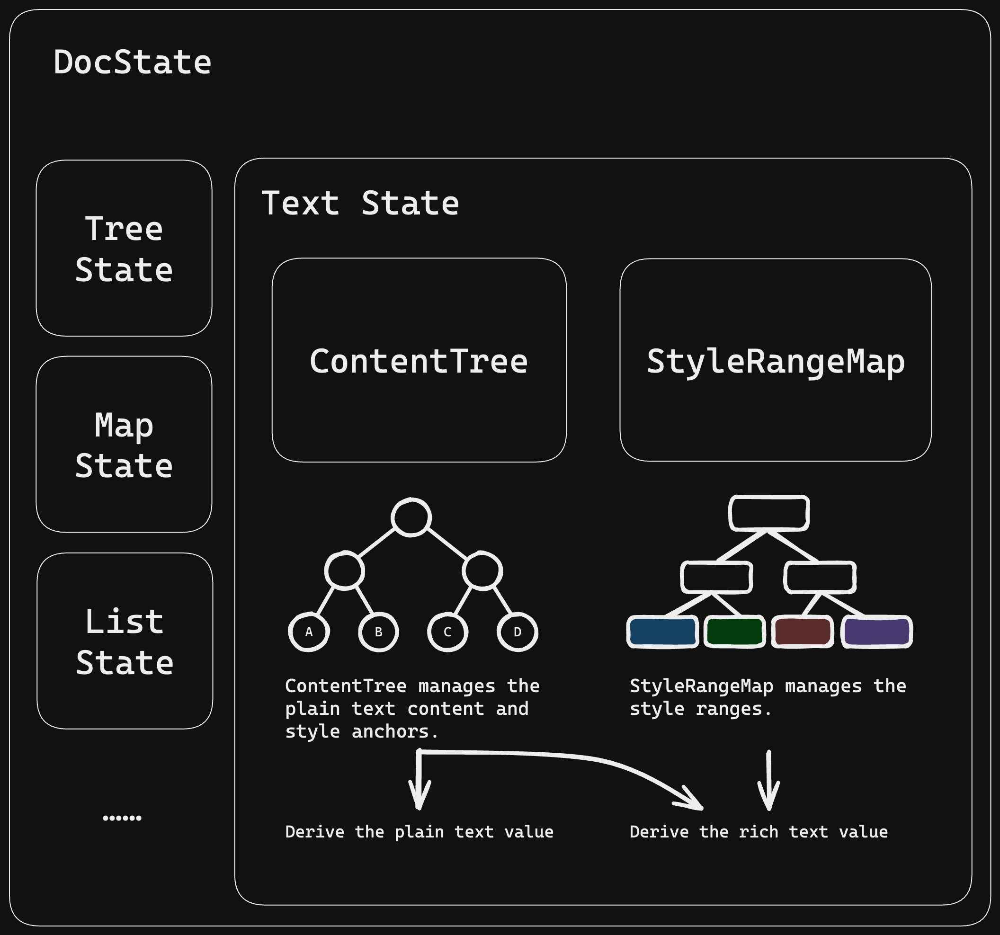

Both structures are built on B+Trees.

`ContentTree` is responsible for efficient text finding, insertion, and
deletion. It can index specific insertion/deletion positions using
Unicode/UTF-8/UTF-16/Entity index. It does not store what specific style each
text segment should have.

We built the following B+Tree structure based on our
[generic-btree library](https://github.com/loro-dev/generic-btree) to express
text in memory:

- Each internal node in the B+Tree stores the Unicode char length, UTF-16
  length, UTF-8 length, and Entity length of its subtree. The Entity length
  considers the length of style anchors as 1, otherwise 0.
- The leaf nodes of the B+Tree are text or style anchors.

`StyleRangeMap` is responsible for efficient updating/querying of style ranges.

In the `StyleRangeMap` B+Tree expressing styles:

- Each internal node stores the `entity length` of its subtree.
- Each leaf node stores the collection of style information for the
  corresponding range and its `entity length.

Separating the text `ContentTree` and style `StyleRangeMap` into two structures
aims for better performance optimization. On rich text, style information is
often not abundant and tends to have good continuity, such as several paragraphs
having the same format, which can be expressed with a single leaf node. However,
our structure for storing text is unsuitable for leaf nodes with large content,
as conversion time between different encoding formats would become excessively
long.

When a user inserts a new character at `Unicode index` = i, the following
occurs:

- Find the position at `Unicode index` = i in `ContentTree`.
- Check if there are any adjacent style anchors at this position. If not,
  directly insert.
- If there are, decide whether to insert to the left or right of the
  corresponding style anchor based on its type and properties. If there are
  multiple such style anchors, insert them according to the previous section on
  ["Behavior When Inserting Text at Style Boundaries"](#behavior-when-inserting-text-at-style-boundaries).

### Testing

We have written tests for the criteria proposed by Peritext and passed all of
them.

To ensure the correctness of our CRDTs, we have added numerous fuzzing tests to
simulate different collaborative behaviors, synchronization behaviors, and
time-travel behaviors. These tests check for the strong eventual consistency and
the correctness of internal invariants. We run these fuzzing tests continuously
for several days after every critical modification to avoid oversights.

## How to Use

Before using the Loro's rich text module, it is necessary to define the
configuration for rich text styles, specifying the expand behavior for different
keys and whether overlap is allowed.

Here is an example of using Loro's rich text in JavaScript:

```typescript
const doc = new Loro();
doc.configTextStyle({
  bold: {
    expand: "after",
  },
  comment: {
    expand: "none",
    overlap: true,
  },
  link: {
    expand: "none",
  },
});

const text = doc.getText("text");
text.insert(0, "Hello world!");
text.mark({ start: 0, end: 5 }, "bold", true);
expect(text.toDelta()).toStrictEqual([
  {
    insert: "Hello",
    attributes: { bold: true },
  },
  {
    insert: " world!",
  },
] as Delta<string>[]);

text.insert(5, "!");
expect(text.toDelta()).toStrictEqual([
  {
    insert: "Hello!",
    attributes: { bold: true },
  },
  {
    insert: " world!",
  },
] as Delta<string>[]);
```

## Summary

This article presents Loro's rich text algorithm design and implementation. Its
correctness is readily demonstrable. It can be built upon any existing List CRDT
algorithm. It allows Loro to support rich text collaboration using
[Eg-walker](#brief-introduction-to-replayable-event-graph) and [Fugue], combining the
strengths of multiple CRDT algorithms.

We are continuously refining its design and actively seeking design partners. We
are open to all forms of feedback and constructive criticism. Should you have
any proposals for collaboration, please reach out to zx@loro.dev

[Peritext]: https://www.inkandswitch.com/peritext/
[Fugue]: https://arxiv.org/abs/2305.00583
[Lamport]: https://en.wikipedia.org/wiki/Lamport_timestamp
[RGA algorithm]: https://www.sciencedirect.com/science/article/abs/pii/S0743731510002716
[Yjs]: https://github.com/yjs/yjs
[Automerge]: https://github.com/automerge/automerge
[crdt-richtext]: https://github.com/loro-dev/crdt-richtext
