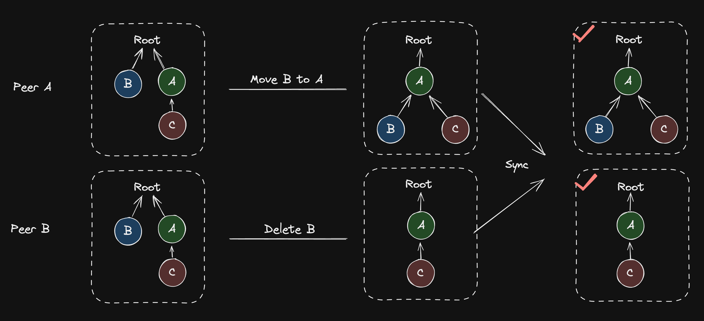
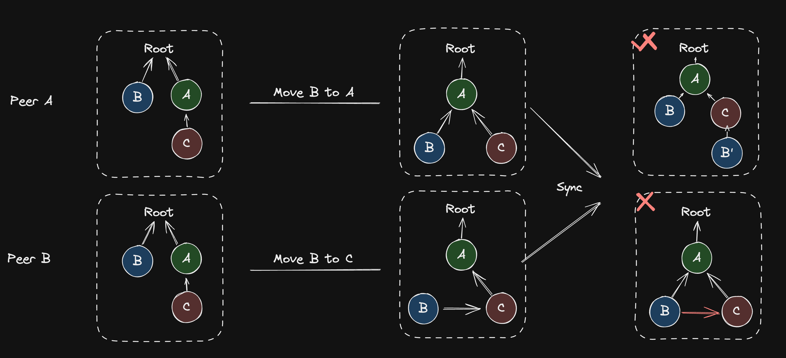
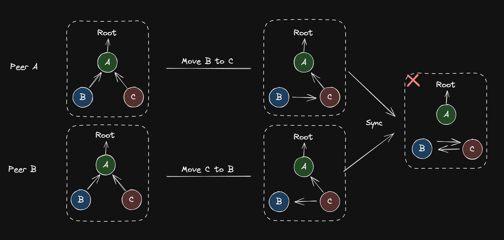
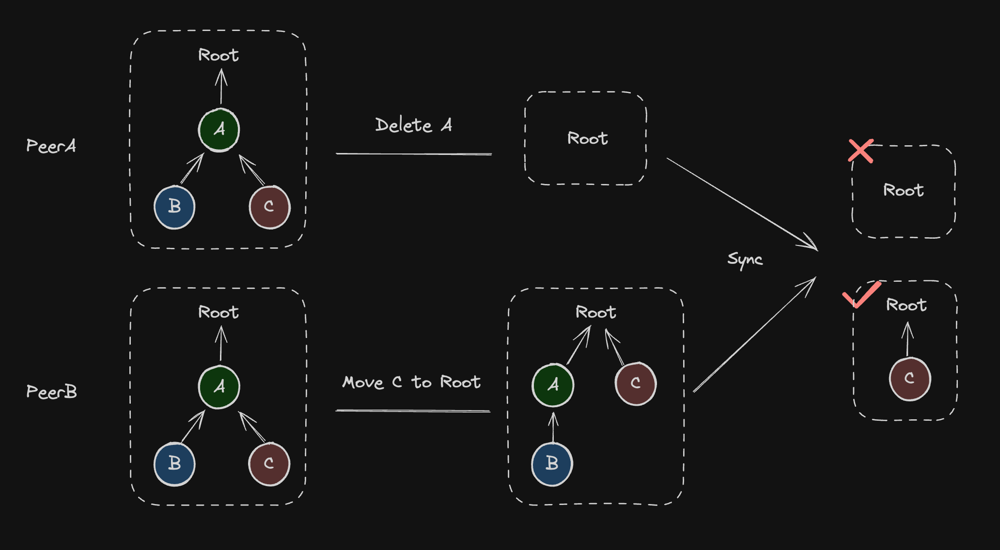
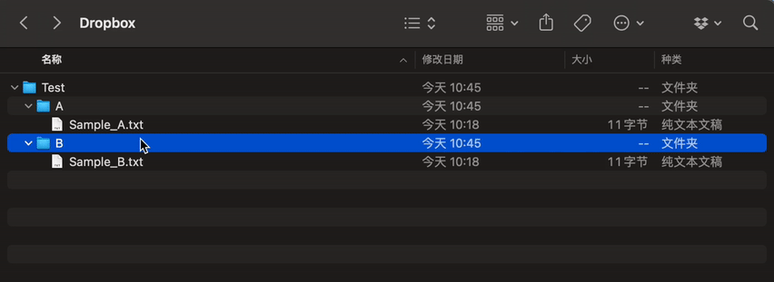
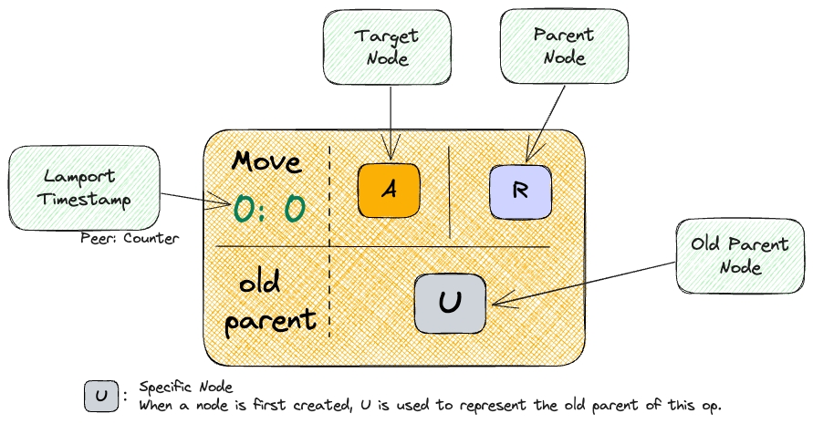
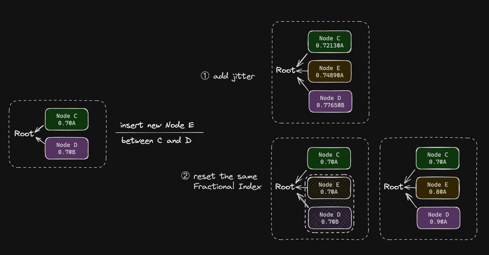

# Movable tree CRDTs and Loro's implementation

import Caption from "../../components/caption";
import Authors, { Author } from "../../components/authors";

<Authors date="2024-07-18">
  <Author name="Liang Zhao" link="https://github.com/Leeeon233" />
</Authors>


This article introduces the implementation difficulties and challenges of Movable Tree CRDTs when collaboration, and how Loro implements it and sorts child nodes. The algorithm has high performance and can be used in production.

## Background

In distributed systems and collaborative software, managing hierarchical relationships is difficult and complex. Challenges arise in resolving conflicts and meeting user expectations when working with the data structure that models movement by combining deletion and insertion. For instance, if a node is concurrently moved to different parents in replicas, it may lead to the unintended creation of duplicate nodes with the same content. Because the node is deleted twice and created under two parents.

Currently, many software solutions offer different levels of support and functionality for managing hierarchical data structures in distributed environments. The key variation among these solutions lies in their approaches to handling potential conflicts.

### Conflicts in Movable Trees

A movable tree has 3 primary operations: creation, deletion, and movement. Consider a scenario where two peers independently execute various operations on their respective replicas of the same movable tree. Synchronizing these operations can lead to potential conflicts, such as:

- The same node was deleted and moved
- The same node was moved under different nodes
- Different nodes were moved, resulting in a cycle
- The ancestor node is deleted while the descendant node is moved

#### Deletion and Movement of the Same Node



This situation is relatively easy to resolve. It can be addressed by applying one of the operations while ignoring the other based on the timestamp in the distributed system or the application's specific requirements. Either approach yields an acceptable outcome.

#### Moving the Same Node Under Different Parents



Merging concurrent movement operations of the same node is slightly more complex. Different approaches can be adopted depending on the application:

- Delete the node and create copies of nodes under different parent nodes. Subsequent operations then treat these nodes independently. This approach is acceptable when node uniqueness is not critical.
- Allow the node have two edges pointing to different parents. However, this approach breaks the fundamental tree structure and is generally not considered acceptable.
- Sort all operations, then apply them one by one. The order can be determined by timestamps in a distributed system. Providing the system maintains a consistent operation sequence, it ensures uniform results across all peers.

#### Movement of Different Nodes Resulting in a Cycle



Concurrent movement operations that cause cycles make the conflict resolution of movable trees complex. Matthew Weidner listed several solutions to resolve cycles in his [blog](https://mattweidner.com/2023/09/26/crdt-survey-2.html#forests-and-trees).

> 1. Error. Some desktop file sync apps do this in practice ([Martin Kleppmann et al. (2022)](https://doi.org/10.1109/TPDS.2021.3118603) give an example).
> 2. Render the cycle nodes (and their descendants) in a special “time-out” zone. They will stay there until some user manually fixes the cycle.
> 3. Use a server to process move ops. When the server receives an op, if it would create a cycle in the server’s own state, the server rejects it and tells users to do likewise. This is [what Figma does](https://www.figma.com/blog/how-figmas-multiplayer-technology-works/#syncing-trees-of-objects). Users can still process move ops optimistically, but they are tentative until confirmed by the server. (Optimistic updates can cause temporary cycles for users; in that case, Figma uses strategy (2): it hides the cycle nodes.)
> 4. Similar, but use a [topological sort](https://mattweidner.com/2023/09/26/crdt-survey-2.html#topological-sort) (below) instead of a server’s receipt order. When processing ops in the sort order, if an op would create a cycle, skip it [(Martin Kleppmann et al. 2022)](https://doi.org/10.1109/TPDS.2021.3118603).
> 5. For forests: Within each cycle, let `B.parent = A` be the edge whose `set` operation has the largest LWW timestamp. At render time, “hide” that edge, instead rendering `B.parent = "none"`, but don’t change the actual CRDT state. This hides one of the concurrent edges that created the cycle.
>    • To prevent future surprises, users’ apps should follow the rule: before performing any operation that would create or destroy a cycle involving a hidden edge, first “affirm” that hidden edge, by performing an op that sets `B.parent = "none"`.
> 6. For trees: Similar, except instead of rendering `B.parent = "none"`, render the previous parent for `B` - as if the bad operation never happened. More generally, you might have to backtrack several operations. Both [Hall et al. (2018)](http://dx.doi.org/10.1145/3209280.3229110) and [Nair et al. (2022)](https://arxiv.org/abs/2103.04828) describe strategies along these lines.

#### Ancestor Node Deletion and Descendant Node Movement



The most easily overlooked scenario is moving descendant nodes when deleting an ancestor node. If all descendant nodes of the ancestor are deleted directly, users may easily misunderstand that their data has been lost.

### How Popular Applications Handle Conflicts

Dropbox is a file data synchronization software. Initially, Dropbox treated file movement as a two-step process: deletion from the original location followed by creation at a new location. However, this method risked data loss, especially if a power outage or system crash occurred between the delete and create operations.

Today, when multiple people move the same file concurrently and attempt to save their changes, Dropbox detects a conflict. In this scenario, it typically saves one version of the original file and creates a new ["conflicted copy"](https://help.dropbox.com/organize/conflicted-copy) for the changes made by one of the users.



<Caption>
  The image shows the conflict that occurs when A is moved to the B folder and B
  is moved to the A folder concurrently.
</Caption>

Figma is a real-time collaborative prototyping tool. They consider tree structures as the most complex part of the collaborative system, as detailed in their [blog post about multiplayer technology](https://www.figma.com/blog/how-figmas-multiplayer-technology-works/#syncing-trees-of-objects). To maintain consistency, each element in Figma has a "parent" attribute. The centralized server plays a crucial role in ensuring the integrity of these structures. It monitors updates from various users and checks if any operation would result in a cycle. If a potential cycle is detected, the server rejects the operation.

However, due to network delays and similar issues, there can be instances where updates from users temporarily create a cycle before the server has the chance to reject them. Figma acknowledges that this situation is uncommon. Their [solution](https://www.figma.com/blog/how-figmas-multiplayer-technology-works/#syncing-trees-of-objects) is straightforward yet effective: they temporarily preserve this state and hide the elements involved in the cycle. This approach lasts until the server formally rejects the operation, ensuring both the stability of the system and a seamless user experience.

<div style={{ filter: "invert(1) hue-rotate(180deg)" }}>
  
</div>

<Caption>
  An animation that demonstrates how
  [Figma](https://www.figma.com/blog/how-figmas-multiplayer-technology-works/#syncing-trees-of-objects)
  resolves conflicts.
</Caption>

## Movable Tree CRDTs

The applications mentioned above use movable trees and resolve conflicts based on centralized solutions. Another alternative approach to collaborative tree structures is using Conflict-free Replicated Data Types (CRDTs). While initial CRDT-based algorithms were challenging to implement and incurred significant storage overhead as noted in prior research, such as [Abstract unordered and
ordered trees CRDT](https://arxiv.org/pdf/1201.1784.pdf) or [File system on CRDT](https://arxiv.org/pdf/1207.5990.pdf), but continual optimization and improvement have made several CRDT-based tree synchronization algorithms suitable for certain production environments. This article highlights two innovative CRDT-based approaches for movable trees. The first is presented by Martin Kleppmann et al. in their work **_[A highly-available move operation for replicated trees](https://martin.kleppmann.com/2021/10/07/crdt-tree-move-operation.html)_** and the second by Evan Wallace in his **_[CRDT: Mutable Tree Hierarchy](https://madebyevan.com/algos/crdt-mutable-tree-hierarchy/)_**.

### A highly-available move operation for replicated trees

This paper unifies the three operations used in trees (creating, deleting, and moving nodes) into a move operation. The move operation is defined as a four-tuple `Move t p m c`, where `t` is the operation's unique and ordered timestamp such as [`Lamport timestamp`](https://en.wikipedia.org/wiki/Lamport_timestamp), `p` is the parent node ID, `m` is the metadata associated with the node, and `c` is the child node ID.

If all nodes of the tree do not contain `c`, this is a **creation** operation that creates a child node `c` under parent node `p`. Otherwise, it is a **move** operation that moves `c` from its original parent to the new parent `p`. Additionally, node deletion is elegantly handled by introducing a designated `TRASH` node; moving a node to `TRASH` implies its deletion, with all descendants of `TRASH` considered deleted. But they remain in memory to prevent concurrent editing from moving them to other nodes. In order to handle the previously mentioned situation of deleting ancestor nodes and moving descendant nodes concurrently.

In the three potential conflicts mentioned earlier, since deletion is also defined as a move operation, **deleting and moving the same node** is transformed into two move operations, leaving only two remaining problems:

- **Moving the same node under different parents**
- **Moving different nodes, creating a cycle**

Logical timestamps are added so that all operations can be linearly ordered, thus the first conflict can be avoided as they can be expressed as two operations in sequence rather than concurrently for the same node. Therefore, in modeling a Tree using only move operations, the only exceptional case in concurrent editing would be creating a cycle, and operations causing a cycle are termed **unsafe operations**.

This algorithm sorts all move operations according to their timestamps. It can then sequentially apply each operation. Before applying, the algorithm detects cycles to determine whether an operation is safe. If the operation creates a cycle, we ignore the unsafe operation to ensure the correct structure of the tree.


Based on the above approach, the consistency problem of movable trees becomes the following two questions:

1. How to introduce global order to operations
2. How to apply a remote operation that should be inserted in the middle of an existing sorted sequence of operations

#### Globally Ordered Logical Timestamps

[Lamport Timestamp](https://en.wikipedia.org/wiki/Lamport_timestamp) can determine the causal order of events in a distributed system. Here's how they work: each peer starts with a counter initialized to `0`. When a local event occurs, the counter is increased by `1`, and this value becomes the event's Lamport Timestamp. When peer `A` sends a message to peer `B`, `A` attaches its Lamport Timestamp to the message. Upon receiving the message, peer `B` compares its current logical clock value with the timestamp in the message and updates its logical clock to the larger value.

To globally sort events, we first look at the Lamport Timestamps: smaller numbers mean earlier events. If two events have the same timestamp, we use the unique ID of the peer serves as a tiebreaker.


#### Apply a Remote Operation

An op's safety depends on the tree's state when applied, avoiding cycles. Insertion requires evaluating the state formed by all preceding ops. For remote updates, we may need to:  

1. Undo recent ops
2. Insert the new op  
3. Reapply undone ops  

This ensures proper integration of new ops into the existing sequence.  

##### Undo Recent Ops

Since we've modeled all operations on the tree as move operations, undoing a move operation involves either moving the node back to its old parent or undoing the operation that created this node. To enable quick undoing, we cache and record the **old parent** of the node before applying each move operation.

##### Apply the Remote Op

Upon encountering an unsafe operation, disregarding its effects prevents the creation of a cycle. Nevertheless, it's essential to record the operation, as the safety of an operation is determined **dynamically**. For instance, if we receive and sort an update that deletes another node causing the cycle prior to this operation, the operation that was initially unsafe becomes safe. Additionally, we need to mark this unsafe operation as ineffective, since during undo operations, it's necessary to query the **old parent** node, which is the target parent of the last effective operation in the sequence targeting this node.

##### Reapply Undone Ops

Cycles only occur when receiving updates from other peers, so the undo-do-redo process is also needed at this time. When receiving a new op:

```jsx
function apply(newOp)
      // Compare the ID of the new operation with existing operations
      if largerThanExistingOpId(newOp.id, oplog)
          // If the new operation's ID is greater, apply it directly
          oplog.applyOp(newOp)
      else
          // If the new operation's ID is not the greatest, undo operations until it can be applied
          undoneOps = oplog.undoUtilCanBeApplied(newOp)
          oplog.applyOp(newOp)
          // After applying the new operation, redo the undone operations to maintain sequence order
          oplog.redoOps(undoneOps)
```

- If the new operation depends on an op that has not been encountered locally, indicating that some inter-version updates are still missing, it is necessary to temporarily cache the new op and wait to apply it until the missing updates are received.
- Compare the new operation with all existing operations. If the `opId` of the new operation is greater than that of all existing operations, it can be directly applied. If the new operation is safe, record the parent node of the target node as the old parent node, then apply the move operation to change the current state. If it is not safe, mark this operation as ineffective and ignore the operation's impact.
- If the new opId is sorted in the middle of the existing sequence, it is necessary to pop the operations that are sorted later from the sequence one by one, and undo the impact of this operation, which means moving back to the child of the old parent node, until the new operation can be applied. After applying the new operation, reapply the undone nodes in sequence order, ensuring that all operations are applied in order.

The following animated GIF demonstrates the process executed by `Peer1`:

1. Received `Peer0` creating node `A` with the `root` node as its parent.
2. Received `Peer0` creating node `B` with `A` as its parent.
3. Created node `C` with `A` as its parent and synchronized it with `Peer0`.
4. Moved `C` to have `B` as its parent.
5. Received `Peer0`'s moving `B` to have `C` as its parent.

<div style={{ filter: "invert(1) hue-rotate(180deg)" }}>
  
</div>

The queue at the top right of the animation represents the order of local operations and newly received updates. The interpretation of each element in each `Block` is as follows:

<div style={{ filter: "invert(1) hue-rotate(180deg)" }}>
  
</div>

A particular part of this process to note is the two operations with `lamport timestamps` of `0:3` and `1:3`. Initially, the `1:3` operation moving `C` to `B` was created and applied locally, followed by receiving `Peer0`'s `0:3` operation moving `B` to `C`. In `lamport timestamp` order, `0:3` is less than `1:3` but greater than `1:2` (with peer as the tiebreaker when counters are equal). To apply the new op, the `1:3` operation is undone first, moving `C` back to its old parent `A`, then `0:3` moving `B` to `C` is applied. After that, `1:3` is redone, attempting to move `C` to `B` again (the old parent remains `A`, omitted in the animation). However, a cycle is detected during this attempt, preventing the operation from taking effect, and the state of the tree remains unchanged. This completes an `undo-do-redo` process.

### CRDT: Mutable Tree Hierarchy

Evan Wallace has developed an innovative algorithm that enables each node to track all its historical parent nodes, attaching a counter to each recorded parent. The count value of a new parent node is 1 higher than that of all the node's historical parents, indicating the update sequence of the node's parents. The parent with the highest count is considered the current parent node.

During synchronization, this parent node information is also synced. If a cycle occurs, a heuristic algorithm reattaches the nodes causing the cycle back to the nearest historical parent node that won't cause a cycle and is connected to the root node, thus updating the parent node record. This process is repeated until all nodes causing cycles are reattached to the tree, achieving all replica synchronization of the tree structure. The demo in [Evan's blog](https://madebyevan.com/algos/crdt-mutable-tree-hierarchy/) clearly illustrates this process.

As Evan summarized at the end of the article, this algorithm does not require the expensive `undo-do-redo` process. However, each time a remote move is received, the algorithm needs to determine if all nodes are connected to the root node and reattach the nodes causing cycles back to the tree, which can perform poorly when there are too many nodes.

I established a [benchmark](https://github.com/Leeeon233/movable-tree-crdt) to compare the performance of the movable tree algorithms.

## Movable Tree CRDTs implementation in Loro

Loro implements the algorithm proposed by Martin Kleppmann et al., **_[A highly-available move operation for replicated trees](https://martin.kleppmann.com/2021/10/07/crdt-tree-move-operation.html)_**. On one hand, this algorithm has high performance in most real world scenarios. On the other hand, the core `undo-do-redo` process of the algorithm is highly similar to how Eg-walker (Event Graph Walker) applies remote updates in Loro. Introduction about **Eg-walker** can be found in our previous [blog](https://www.loro.dev/blog/loro-richtext#brief-introduction-to-replayable-event-graph).

Movable tree has been introduced in detail, but there is still another problem of tree structure that has not been solved. For movable tree, in some real use cases, we still need the capability to sort child nodes. This is necessary for outline notes or layer management in graphic design softwares. Users need to adjust node order and sync it to other collaborators or devices.

We integrated the `Fractional Index` algorithm into Loro and combined it with the movable tree, making the child nodes of the movable tree sortable.

There are many introductions to `Fractional Index` on the web, You can read more about `Fractional Index` in the [Figma blog](https://www.figma.com/blog/realtime-editing-of-ordered-sequences) or [Evan blog](https://madebyevan.com/algos/crdt-fractional-indexing/). In simple terms, `Fractional Index` assigns a sortable value to each object, and if a new insertion occurs between two objects, the `Fractional Index` of the new object will be between the left and right values. What we want to speak about more here is how to deal with potential conflicts brought by `Fractional Index` in CRDTs systems.

### Potential Conflicts in Child Node Sorting

As our applications are in a distributive condition, when multiple peers insert new nodes in the same position, the same `Fractional Index` would be assigned to these differing content but same position nodes. When updates from the remote are applied to local, conflicts arise as the same `Fractional Index` is encountered.

In Loro, we retain these identical `Fractional Index` and use `PeerID` (unique ID of every Peer) as the tie-breaker for the relative order judgment of the same `Fractional Index`.


Although this solved the sorting problem among the same `Fractional Index` nodes from different peers, it impacted the generation of new `Fractional Index` as we cannot generate a new `Fractional Index` between two same ones. We use two methods to solve this problem:

1. The first method, as stated in Evan's blog, we could add a certain amount of jitter to each generated `Fractional Index`, (for the ease of explanation, all examples below take decimal fraction as the `Fractional Index`) for example, when generating a new `Fractional Index` between 0 and 1, it should have been 0.5, but through random jitters, it could be `0.52712`, `0.58312`, `0.52834`, etc., thus significantly reducing the chance of same `Fractional Index` appearing.
2. If the situation arises where the same `Fractional Index` is present on both sides, we can handle this problem by resetting these `Fractional Index`. For example, if we need to insert a new node between `0.7@A` and `0.7@B` (which indicates `Fractional Index` @ `PeerID`), instead of generating a new `Fractional Index` between 0.7 and 0.7, we could assign two new `Fractional Index` respectively for the new node and the `0.7@B` node between 0.7 and 1, which could be understood as an extra move operations.



### Implementation and Encoding Size

Introducing `Fractional Index` brings the advantage of node sequence. What about encoding size?

Loro uses [drifting-in-space](https://github.com/drifting-in-space/fractional_index) `Fractional Index` implementation based on `Vec<u8>`, which is base 256. In other words, you need to continuously insert 128 values forward or backward from the default value to increase the byte size of the `Fractional Index` by 1. The worst storage overhead case, such as inserting new values alternately each time. For example, the initial sequence is `ab`, insert `c` between `a` and `b`, then insert `d` between `c` and `b`, then `e` between `c` and `d`, like:

```js no_run
ab    // [128] [129, 128]
acb   // [128] [129, 127, 128] [129, 128]
acdb  // [128] [129, 127, 128] [129, 127, 129, 128] [129, 128]
acedb // [128] [129, 127, 128] [129, 127, 129, 127, 128] [129, 127, 129, 128] [129, 128]
```
a new operation would cause an additional byte to be needed. But such a situation is very rare.

Considering that potential conflicts wouldn't appear frequently in most applications, Loro simply extended the implementation, the original implementation produced new `Fractional Index` in `Vec<u8>` by only increasing or decreasing 1 in certain index to achieve relative sorting. The simple jitter solution was added, by appending random bytes in length of jitter value to `Fractional Index`. To enable jitter in js, you can use `doc.setFractionalIndexJitter(number)` with a positive value. But this will increase the encoding size slightly, but each `Fractional Index` only adds `jitter` bytes. If you want to generate `Fractional Index` at the same position with 99% probability without conflict, the relationship between `jitter` settings and the maximum number of concurrent edits `n` will be:

<table style={{ margin: "0 auto" }}>
  <thead>
    <tr class="nx-m-0 nx-border-t nx-border-gray-300 nx-p-0 dark:nx-border-gray-600 even:nx-bg-gray-100 even:dark:nx-bg-gray-600/20">
      <th class="nx-m-0 nx-border nx-border-gray-300 nx-px-4 nx-py-2 nx-font-semibold dark:nx-border-gray-600">
        jitter
      </th>
      <th class="nx-m-0 nx-border nx-border-gray-300 nx-px-4 nx-py-2 nx-font-semibold dark:nx-border-gray-600">
        max num of concurrent edits
      </th>
    </tr>
  </thead>
  <tbody>
    <tr class="nx-m-0 nx-border-t nx-border-gray-300 nx-p-0 dark:nx-border-gray-600 even:nx-bg-gray-100 even:dark:nx-bg-gray-600/20">
      <td class="nx-m-0 nx-border nx-border-gray-300 nx-px-4 nx-py-2 dark:nx-border-gray-600">
        1
      </td>
      <td class="nx-m-0 nx-border nx-border-gray-300 nx-px-4 nx-py-2 dark:nx-border-gray-600">
        3
      </td>
    </tr>
    <tr class="nx-m-0 nx-border-t nx-border-gray-300 nx-p-0 dark:nx-border-gray-600 even:nx-bg-gray-100 even:dark:nx-bg-gray-600/20">
      <td class="nx-m-0 nx-border nx-border-gray-300 nx-px-4 nx-py-2 dark:nx-border-gray-600">
        2
      </td>
      <td class="nx-m-0 nx-border nx-border-gray-300 nx-px-4 nx-py-2 dark:nx-border-gray-600">
        37
      </td>
    </tr>
    <tr class="nx-m-0 nx-border-t nx-border-gray-300 nx-p-0 dark:nx-border-gray-600 even:nx-bg-gray-100 even:dark:nx-bg-gray-600/20">
      <td class="nx-m-0 nx-border nx-border-gray-300 nx-px-4 nx-py-2 dark:nx-border-gray-600">
        3
      </td>
      <td class="nx-m-0 nx-border nx-border-gray-300 nx-px-4 nx-py-2 dark:nx-border-gray-600">
        582
      </td>
    </tr>
  </tbody>
</table>

When there are numerous `Fractional Indexes`, there will be many common prefixes after being sorted, when Loro encodes these `Fractional Indexes`, prefix optimization would be implemented. Each `Fractional Index` only saves the amount of same prefix bits and remaining bytes with the previous one, which further downsizes the overall encoding size.

### Related work

Other than using Fractional Index, there are other movable list CRDT that can make sibling nodes of the tree in order. One of these algorithms is Martin Kleppmann's [Moving Elements in List CRDTs](https://martin.kleppmann.com/2020/04/27/papoc-list-move.html), which has been used in Loro's [Movable List](https://www.loro.dev/docs/tutorial/list).


In comparison, the implementation of `Fractional Index` solution is simpler, and no stable position representation is provided for child nodes when modeling nodes in a tree, otherwise, the overall tree structure would be too complex. However, the `Fractional Index` has the problem of [interleaving](https://vlcn.io/blog/fractional-indexing#interleaving), but this is acceptable when some only need relative order and do not require strict sequential semantics, such as figma layer items, multi-level bookmarks, etc.

## Benchmark

We conducted performance benchmarks on the Movable Tree implementation by Loro, including scenarios of random node movement, switching to historical versions, and performance under extreme conditions with significantly deep tree structures. The results indicate that it is capable of supporting real-time collaboration and enabling seamless historical version checkouts.

| Task                                      | Time   | Setup                                             |
| :---------------------------------------- | :----- | :------------------------------------------------ |
| Move 10000 times randomly                 | 28 ms  | Create 1000 nodes first                           |
| Switch to different versions 1000 times    | 153 ms | Create 1000 nodes and move 1000 times first       |
| Switch to different versions 1000 times in a tree with depth of 300 | 701 ms | The new node is a child node of the previous node |

<Caption>
  Test environment: M2 Max CPU, you can find the bench code
  [here](https://github.com/loro-dev/loro/blob/main/crates/loro-internal/benches/tree.rs).
</Caption>

## Usage

```tsx
import { Loro, LoroTree, LoroTreeNode, LoroMap } from "loro-crdt";

let doc = new Loro();
let tree: LoroTree = doc.getTree("tree");
let root: LoroTreeNode = tree.createNode();
// By default, append to the end of the parent node's children list
let node = root.createNode();
// Specify the child's position
let node2 = root.createNode(0);
// Move `node2` to be the last child of `node`
node2.move(node);
// Move `node` to be the first child of `node2`
node.move(node2, 0);
// Move the node to become the root node
node.move();
// Move the node to be positioned after another node
node.moveAfter(node2);
// Move the node to be positioned before another node
node.moveBefore(node2);
// Retrieve the index of the node within its parent's children
let index = node.index();
// Get the `Fractional Index` of the node
let fractionalIndex = node.fractionalIndex();
// Access the associated data map container
let nodeData: LoroMap = node.data;
```

### Demo

We developed a simulated Todo app with data synchronization among multiple peers using Loro, including the use of `Movable Tree` to represent subtask relationships, `Map` to represent various attributes of tasks, and `Text` to represent task titles, etc. In addition to basic creation, moving, modification, and deletion, we also implemented version switching based on Loro. You can drag the scrollbar to switch between all the historical versions that have been operated on.

<iframe
  src="https://loro-movable-tree-demo.zeabur.app"
  style={{
    width: "100%",
    height: 700,
    border: 0,
    borderRadius: 8,
    marginTop: 16,
    overflow: "hidden",
  }}
  width="100%"
  height="750px"
/>

## Summary

This article discusses why implementing Movable Tree CRDTs is difficult, and presents two innovative algorithms for movable trees.

For implementation, Loro has integrated **_[A highly-available move operation for replicated trees](https://martin.kleppmann.com/2021/10/07/crdt-tree-move-operation.html)_** to implement the hierarchical movement of the Tree, and integrated the `Fractional Index` implementation by [drifting-in-space](https://github.com/drifting-in-space/fractional_index) to achieve the movement between child nodes. This can meet the needs of various application scenarios.

If you are developing collaborative applications or are interested in CRDT algorithms, you are welcome to join [our community](https://discord.gg/tUsBSVfqzf).
