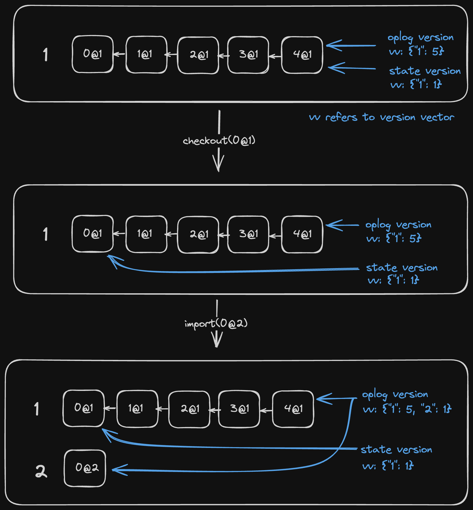

# DocState and OpLog

Although not explicitly exposed in the WASM interface, internally in Loro, we
distinctly differentiate between:

- The current state of the document: DocState
- The edit history of the document: OpLog

During local operations, we update the DocState and record the operations in
OpLog. When merging remote updates, we add the new Ops to OpLog and compute a
Delta. This Delta is applied to DocState and also emitted as an event.

DocState can switch between different versions, similar to Git's checkout. In
this case, we calculate the Delta based on the edit history. The same mechanism
applies: the Delta is emitted as an event and applied to DocState.

Impact on the encoding schema:

- When calling `doc.export({ mode: "update" })` or
  `doc.export({ mode: "update-in-range" })`, we only encode the operations that
  occurred after the specified version.
- When calling `doc.export({ mode: "snapshot" })` or
  `doc.export({ mode: "shallow-snapshot" })`, we encode both OpLog and DocState,
  providing rapid loading speed (as it doesn't require recalculating the state
  of DocState).

## Attached/Detached LoroDoc Status

As we aim to support version control and the ability to load OpLog without
state, the version of DocState and the latest version recorded in OpLog may not
always match. When they align, it is in an _attached_ state; otherwise, it's in
a _detached_ state.

```ts twoslash
import { LoroDoc } from "loro-crdt";
// ---cut---
const doc = new LoroDoc();
doc.setPeerId(1);
doc.getText("text").insert(0, "Hello");
const doc2 = doc.fork(); // create a fork of the doc
console.log(doc.version().toJSON());
// Map(1) { "1" => 5 }
console.log(doc.oplogVersion().toJSON());
// Map(1) { "1" => 5 }

doc.checkout([{ peer: "1", counter: 1 }]);
console.log(doc.version().toJSON());
// Map(1) { "1" => 2 }
console.log(doc.oplogVersion().toJSON());
// Map(1) { "1" => 5 }

doc2.setPeerId(2);
doc2.getText("text").insert(5, "!");
doc.import(doc2.export({ mode: "update" }));
console.log(doc.version().toJSON());
// Map(1) { "1" => 2 }
console.log(doc.oplogVersion().toJSON());
// Map(2) { "1" => 5, "2" => 1 }

console.log(doc.isDetached()); // true
doc.attach();
console.log(doc.version().toJSON());
// Map(2) { "1" => 5, "2" => 1 }
console.log(doc.oplogVersion().toJSON());
// Map(2) { "1" => 5, "2" => 1 }

```



The doc cannot be edited in the detached mode. Users must use `attach()` to
return to the latest version to continue editing.

### Attached/Detached Container Status

This refers to whether a container is associated with a document. If not, it's a
detached container created by methods like `new LoroText()`. The `.isAttached()`
state never changes for an instance of a container.

When you insert a detached container into an attached one, you get a new
attached container that has the same content as the detached one.

> This is different from the LoroDoc's attached/detached status
