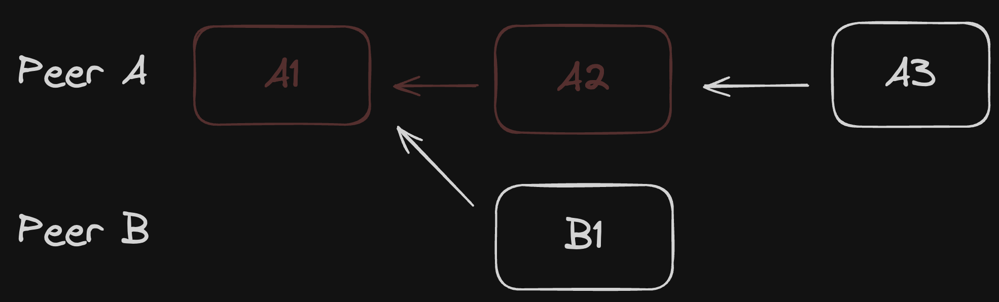

# Shallow Snapshot

By default, Loro stores the complete editing history of the document like Git,
because [the Eg-walker algorithm](https://loro.dev/docs/advanced/event_graph_walker) 
needs to load edits that are parallel to them and to the least common ancestor when 
merging remote edits.  Shallow Snapshot is like Git's 
[shallow clone](https://github.blog/open-source/git/get-up-to-speed-with-partial-clone-and-shallow-clone/), 
which can remove old historical information that users don't need, greatly reducing document 
size and improving document import and export speed. 

This format allows you to cold store historical information that is too old and
speed up initial loading speed for a collaborative session.

Here's an example usage:

```ts twoslash
import { LoroDoc } from "loro-crdt";
// ---cut---
const doc = new LoroDoc();
for (let i = 0; i < 10_000; i++) {
    doc.getText("text").insert(0, "Hello, world!");
}
const snapshotBytes = doc.export({ mode: "snapshot" });
const shallowSnapshotBytes = doc.export({
    mode: "shallow-snapshot",
    frontiers: doc.frontiers(),
});

console.log(snapshotBytes.length); // 5421
console.log(shallowSnapshotBytes.length); // 869
```

## Introduction to Shallow Snapshot Principles

Shallow Snapshot implementation is based on the Eg-walker algorithm. For a
deeper understanding, we recommend reading the
[Eg-walker paper](https://arxiv.org/html/2409.14252v1).

The Eg-walker algorithm can resolve conflicts by accessing only part of the
history, making Shallow Snapshot possible. However, Loro faced several
challenges in implementation:

1. Version Control Support:
   - Loro needs to support document version control and time travel.
   - This involves various data types such as text, Map, List, and Tree.
   - Storing only the latest version and recent operations is insufficient for
     reverting to previous states.

2. Storage Method:
   - Loro stores the initial version and all subsequent operations.
   - This approach may increase computation costs when reading if the initial
     version is far from the latest version.
3. Optimization Strategy:
   - Loro stores snapshots of the initial and latest versions, along with all
     operations in between.
   - For containers with the same state, storage occurs only once in the initial
     version to avoid duplication.

4. Selecting the Starting Version for Shallow Snapshot:
   - The starting version must be a Critical Version.
   - A Critical Version is a point in the version history DAG that all paths
     from the current version to version zero must pass through.
   - This ensures that all operations between the starting version and the
     latest version can be applied successfully, independent of operations
     before the starting version.

5. Handling User-Specified Starting Versions:
   - User-specified starting versions may not be valid Critical Versions.
   - Loro scans forward to find the nearest Critical Version as the actual
     starting version.

Loro needs to retain complete CRDT operation history to ensure correct
synchronization results when older concurrent edits occur. However, after
long-term system use, accumulation of "useless" historical records can slow down
document import/export speeds and occupy more memory and disk space. To maintain
system efficiency and stability, we need shallow snapshot scheme to clean up
unnecessary historical records.

## Shallow Snapshot and Document History Management

Loro CRDTs use the Eg-walker algorithm to synchronize data across multiple endpoints. 
This approach involves backtracking through history and constructing temporary CRDTs 
to resolve conflicts. In Loro, changes form a Directed Acyclic Graph (DAG), where each 
change depends on prerequisite changes.

When importing remote updates, Loro must:
1. (Virtually) switch to the version that satisfies the change's dependencies
2. Calculate the delta update on that state based on the change

Applying a change or operation requires both the state and the state version to be at a point where all dependencies are met.

While Loro can trim parts of the DAG history, this approach has limitations. Consider the following scenario:



PeerA completes operations A1, A2, and A3, then removes the history of A1 and A2. 
PeerB, having received the A1 update, creates a new B1 operation. When PeerA receives 
PeerB's update, it cannot apply B1 because:
- The corresponding historical operation is missing
- It's impossible to backtrack to the A1 version state that B1 depends on

To implement a shallow snapshot in Loro, we must ensure that the starting version has been 
synchronized across all endpoints. This guarantees that no new operations will depend on the 
discarded history.
