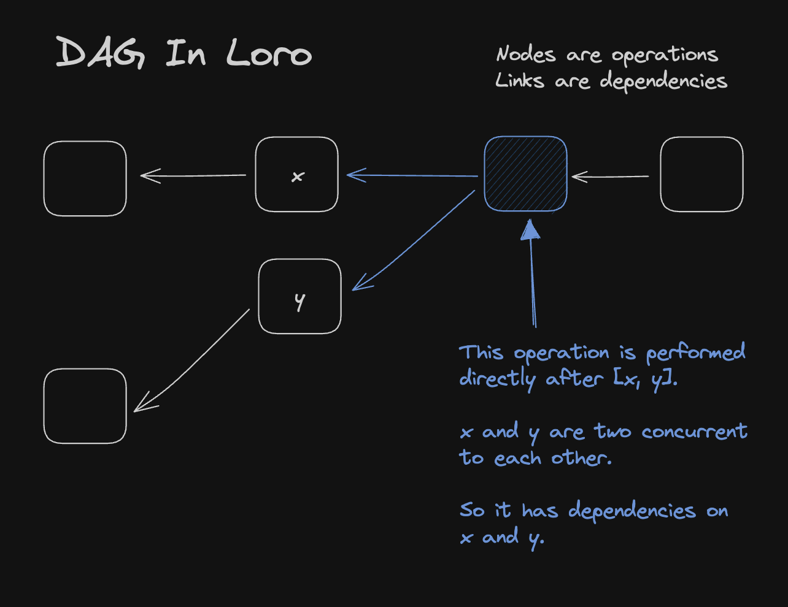
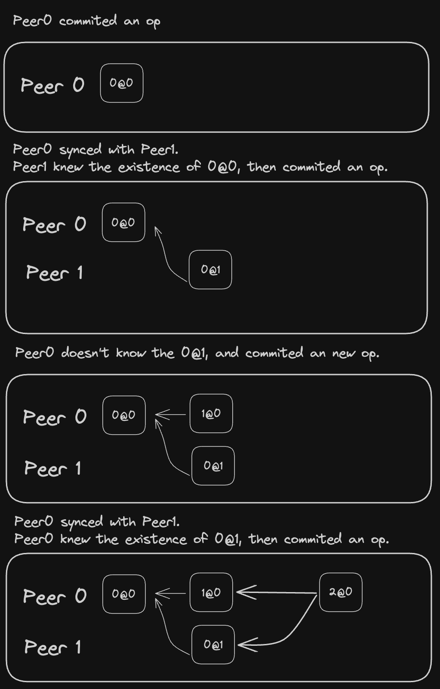
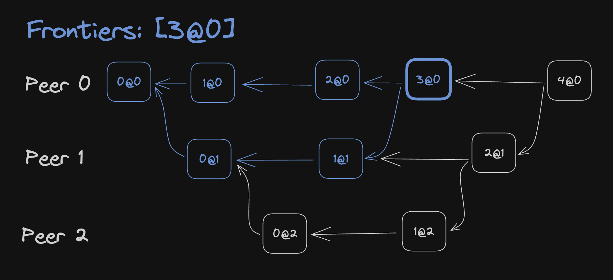

# Loro's Versioning Deep Dive: DAG, Frontiers, and Version Vectors

In centralized environments, we can use linear version numbers to represent a
version, such as incrementing a number each time or using timestamps. However,
CRDTs can be used in decentralized environments, and their version
representation is different.

In Loro, you can express a document's version through a
[Version Vector](https://en.wikipedia.org/wiki/Version_vector) or Frontiers.

```rust
doc.version();        // State Version vector
doc.oplogVersion();   // OpLog Version vector
doc.frontiers();      // State Frontiers
doc.oplogFrontiers(); // OpLog Frontiers
```

In most cases, you might only need the Version Vector, which can be used for
data synchronization and version comparison.

Frontiers are more space-efficient than Version Vectors but come with more
limitations.

The following sections detail these two different ways of version description.

## Background Knowledge

Loro belongs to Operation-Based CRDTs. Two Loro documents are consistent if they
have the same set of activated Operations. Version is a compact way to describe
which ops belong to this set.

Each operation has a unique ID, known as OpId. For example, each user's deletion
or insertion of characters will have a corresponding unique OpId (don't worry
about the overhead here; we've compressed them in memory and Encoding). OpId
consists of PeerId and Counter.

> 💡 Note: To simplify, the specific type descriptions below may not be accurate
> (e.g., the type of peer), but this does not affect the understanding of the
> content.

```tsx
interface OpId {
  // Simplified here
  // PeerId is actually close to uuid type, Loro uses u64
  peerId: number;
  counter: number;
}
```

PeerId represents the unique identifier of the device operating the document,
and Counter is a number that starts from 0 and increments on that device.

## Version Vector

A Version Vector is a vector that describes how many Operations starting from 0
need to be included for each Peer.

```tsx
// In TypeScript
type VersionVector = { [peerId in number]: number };
```

For example, for the following version vector A,

```tsx
const A = {
  0: 2,
  1: 3,
};
```

It includes:

- All operations where PeerId == 0 && Counter < 2
- Or PeerId == 1 && Counter < 3

This expression allows us to easily compare two versions and get the operations
they are missing from each other. For example, in the following case, suppose we
know that the document on the server has reached version B, and the device has
version A. To let the user's device get the Operations it is missing,

```tsx
const A = {
  0: 2,
  1: 3,
};

const B = {
  0: 5,
  1: 3,
  2: 9,
};
```

We can easily calculate the Operations the device is missing:

- All Ops where PeerId == 0 && 2 ≤ Counter < 5
- Or PeerId == 2 && Counter < 9

Version Vectors help us identify a version and allow us to quickly calculate the
differences between two versions (quickly calculating the set of Ops missing in
two documents to be synchronized). For example, currently in Loro, you can use
the following method to synchronize two documents, where they only import the
Ops missing from each other:

```tsx
// doc.version() returns the version vector of the doc
a.import(b.export({ mode: "update", from: a.version( })));
b.import(a.export({ mode: "update", from: b.version( })));
```

## Directed Acyclic Graph (DAG) History

In Loro, we record an operation history similar to Git's Directed Acyclic Graph
(DAG). We represent DAG by recording Dependencies links on each Op. Like
document states, when the Op set is the same, the DAG is consistent across all
endpoints.



When a new Op is added, its Dependencies link points to the current Operations
that are not being pointed to.

> 💡 Note: The order of Ops is a partial order relationship. An Op may be
> before, after, or parallel to another Op. The structure of the DAG allows us
> to compactly express this partial order.

DAG history information helps us design some special CRDT algorithms and
facilitates time-travel implementation. Moreover, when automatic merges don't
meet expectations, DAG allows users a better chance to manually resolve
potential conflicts.

> 💡 We use Counter@PeerId for a more compact description of OpId.

Below is an example of how a DAG is formed:



## Frontiers

Version Vectors increase in size with the number of Peers. Most CRDTs Lib, to
prevent PeerId conflicts, use a random new PeerId each time a document is
opened, which increases the overhead of Version Vectors.

> 📌 If PeerId repeats, there's a high probability of duplicate OpId,
> potentially leading to inconsistent CRDT documents. Automerge has solved this
> problem, ensuring document consistency even with duplicate OpId, but at the
> cost of higher sync complexity.

Based on DAG information, we have a more compact way to describe versions: given
one or multiple OpIds, include all with a Causal Order less than or equal to
them. We call this method Frontiers.

```tsx
type Frontiers = OpId[];
```

> 💡 We use Counter@PeerId for a more compact description of OpId.



`Frontiers = [3@0]` in the above DAG includes 6 operations:

- PeerId == 0 && Counter < 4
- PeerId == 1 && Counter < 2

It is equivalent to the Version Vector:

```tsx
{
    0: 4,
    1: 2,
}
```

Frontiers can also specify multiple parallel operations:


In this example, `Frontiers = [1@1, 1@2]`, corresponding Version Vector is:

```tsx
{
    0: 1,
    1: 2,
    2: 2,
}
```

One great property of Frontiers as a version is that `Frontiers = [A]` actually
represents the document version right after operation A was executed. Thus,
combined with Loro's time machine capability, you can easily return to any
document version corresponding to a specific operation. Here is a complete
example:

```tsx
const doc = new LoroDoc();
doc.setPeerId(0n);
const text = doc.getText("text");
text.insert(0, "H");
doc.commit();
const v = doc.frontiers();
text.insert(1, "i");
expect(doc.toJSON()).toStrictEqual({
  text: "Hi",
});

doc.checkout([{ peer: 0n, counter: 0 }]);
expect(doc.toJSON()).toStrictEqual({
  text: "H",
});
```

You can convert between Version Vectors and Frontiers in Loro if the specified
version is included in the document's history:

```tsx
const vv = doc.vvToFrontiers(f);
const frontiers = doc.frontiersToVV(vv);
```
