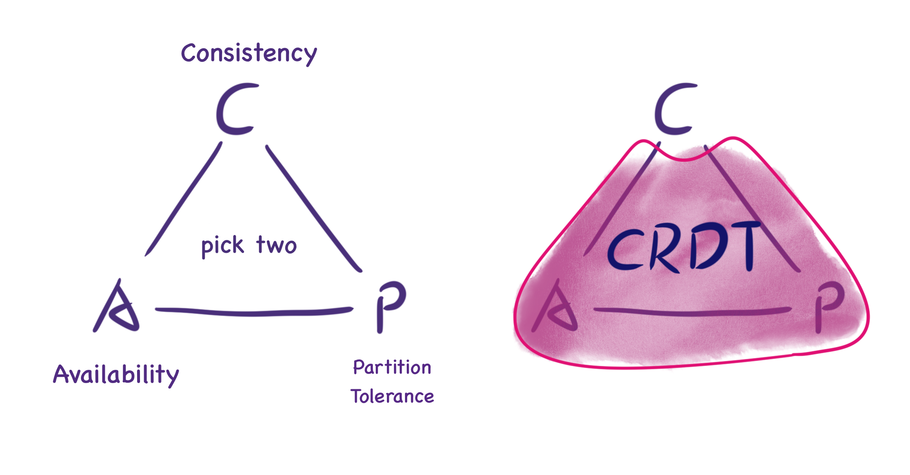

import Image from "next/image";

# What are CRDTs

CRDT (conflict-free replicated data type) is a data structure that can be
replicated across multiple computers in a network, where replicas can be updated
independently and in parallel, without the need for coordination between
replicas, and with a guarantee that no conflicts will occur.

CRDT is often used in collaborative software, such as scenarios where multiple
users need to work together to edit/read a shared document, database, or state.
It can be used in database software, text editing software, chat software, etc.

# What problems does CRDT solve?

For example, a scenario where multiple users edit the same document online at
the same time.

This scenario requires that each user sees the same content, even after
concurrent edits by different users (e.g. two users changing the title at the
same time), which is known as **consistency**. (To be precise, CRDT satisfies
the eventual consistency, see below for more details)

Users can use CRDT even when they are offline. They can be back on sync with
others the network is restored. It also supports collaboratively editing with
other users via P2P. It is known as **partitioning fault tolerance**. This
allows CRDT to support **decentralized** applications very well: synchronization
can be done even without a centralized server.

# The Emergence of CRDTs

The formal concept of Conflict-free Replicated Data Types (CRDTs) was first
introduced in Marc Shapiro's 2011 paper,
[Conflict-Free Replicated Data Types](https://inria.hal.science/hal-00932836/file/CRDTs_SSS-2011.pdf).
However, it can be argued that the groundwork for CRDTs was laid earlier, in the
2006 study [Woot](https://doi.org/10.1145%2F1180875.1180916): An Algorithm for
Collaborative Real-time Editing. The primary motivation behind developing CRDTs
was to address the challenges associated with designing conflict resolution
mechanisms for eventual consistency. Prior to the introduction of CRDTs,
literature on the subject offered limited guidance, and ad hoc solutions were
often prone to errors. Consequently, Shapiro's paper presented a simple,
theoretically sound approach to achieving eventual consistency through the use
of CRDTs.

(PS: Marc Shapiro actually wrote a paper
[Designing a commutative replicated data type](https://hal.inria.fr/inria-00177693v2/document)
in 2007. In 2011, he reworded commutative into conflict-free, expanding
the definition of commutative to include state-based CRDT)

According to [CAP theorem](https://en.wikipedia.org/wiki/CAP_theorem), it is
impossible for a distributed computing system to perfectly satisfy the following
three points at the same time.

- _Consistency_: each read receives the result of the most recent write or
  reports an error; it behaves as if it is accessing the same piece of data
- _Availability_: every request gets a non-error response - but there is no
  guarantee that the data fetched is up-to-date
- _Partition tolerance_: the ability of a distributed system to continue
  functioning properly even when communication between its different components
  is lost or delayed, resulting in a partition or network failure.

If the system cannot achieve data consistency within the time limit, it means
that partitioning has occurred and a choice must be made between C and A for the
current operation, so "perfect consistency" is in conflict with "perfect
availability".

CRDTs do not provide "perfect consistency", but
Strong Eventual Consistency (SEC). This
means that site A may not immediately reflect the state changes from site B, but
when A and B synchronize their messages they both regain consistency and do not
need to resolve potential conflicts (CRDT mathematically prevents conflicts from
occurring). _Strong Eventual Consistency_ does not conflict with _Availability_
and _Partition Tolerance_. CRDTs provide a good CAP tradeoff.

_CRDT satisfies A + P + Eventual Consistency; a good tradeoff under CAP_

(PS: In 2012, Eric Brewer, author of the CAP theorem, wrote an article
[CAP Twelve Years Later: How the "Rules" Have Changed](https://www.infoq.com/articles/cap-twelve-years-later-how-the-rules-have-changed/),
explaining that the description of the "two out of three CAP features" is
actually misleading, and that the CAP actually prohibits perfect availability
and consistency in a very small part of the design space, i.e., in the presence
of partitions; in fact, the design of the tradeoff between C and A is very
flexible. A good example is CRDT.)

# A simple CRDT case

We can use a few simple examples to get a general idea of how CRDTs achieve
**Strong Eventual Consistency**.

> **Grow-only Counter**

How can we count the number of times something happens in a distributed system
without locking?

<Image src="/crdt-G-Counter.gif" alt="G-Counter" width="400" height="400" />

- Let each copy increments only its own counter => no locking synchronization &
  no conflicts
- Each copy keeps the count values of all other copies at the same time
- Number of occurrences = sum of count values of all copies
- Since each copy only updates its own count and does not conflict with other
  counters, this type satisfies consistency after message synchronization

> **Grow-only Set**

<Image src="/crdt-G-Set.gif" alt="G-Set" width="400" height="400" />

- The elements in a Grow-only Set can only be increased and not decreased
- To merge two such states, you only need to do a merge set
- This type satisfies consistency after message synchronization because there
  are no conflicting operations since the elements only grow and do not
  decrease.

Both of these methods are CRDTs, and they both satisfy the following properties

- They can both be updated independently and concurrently, without coordination
  (locking) between replicas
- There is no possibility of conflict between multiple updates
- Final consistency can always be guaranteed

# Introduction to the Principle

There are two types of CRDTs: Op-based CRDTs and State-based CRDTs. This article
focuses on the concept of Op-based CRDTs.

Op-based CRDTs operate on the principle that if two users perform identical
sequences of operations, the final state of the document should also be
identical. To achieve this, each user saves all the operations performed on the
data (Operations) and synchronizes these Operations with other users to ensure a
consistent final state. A critical challenge in this approach is ensuring the
order of Operations remains consistent, especially when parallel modification
operations occur. To address this, Op-based CRDTs require that all possible
parallel Operations be commutative, satisfying the final consistency
requirement.

# Comparison of CRDT and OT

Both CRDT and [Operation Transformation(OT)][ot] can be used in online
collaborative applications, with the following differences

| OT                                                                                                                                                                                                   | CRDT                                                                                  |
| :--------------------------------------------------------------------------------------------------------------------------------------------------------------------------------------------------- | :------------------------------------------------------------------------------------ |
| OT relies on a centralized server for collaboration; [it is extremely difficult to make it work in a distributed environment](https://digitalfreepen.com/2018/01/04/operational-transform-hard.html) | CRDT algorithm can be used to synchronize data through a P2P approach synchronization |
| The earliest paper on OT was presented in 1989                                                                                                                                                       | The earliest paper on CRDT appeared in 2006                                           |
| The OT algorithm is designed with higher complexity to ensure consistency                                                                                                                            | The CRDT algorithm is designed to be simpler to ensure consistency                    |
| It is easier to design OT to preserve user intent                                                                                                                                                    | It is more difficult to design a CRDT algorithm that preserves user intent            |
| OT does not affect document size                                                                                                                                                                     | CRDT documents are larger than the original document data                             |

[a highly-available move operation for replicated trees]:
  https://martin.kleppmann.com/papers/move-op.pdf
[moving elements in list crdts]:
  https://martin.kleppmann.com/papers/list-move-papoc20.pdf
[interleaving anomalies in collaborative text editors]:
  https://martin.kleppmann.com/papers/interleaving-papoc19.pdf
[conflict-free replicated data types]: https://readpaper.com/paper/1516319412
[5000x faster crdts: an adventure in optimization]:
  https://josephg.com/blog/crdts-go-brrr/
[json crdt]: https://arxiv.org/abs/1608.03960
[yata]:
  https://www.researchgate.net/publication/310212186_Near_Real-Time_Peer-to-Peer_Shared_Editing_on_Extensible_Data_Types
[yjs]: https://github.com/yjs/yjs
[loro]: https://loro.dev
[automerge]: https://github.com/automerge/automerge
[half grid]: https://zh.wikipedia.org/wiki/%E5%8D%8A%E6%A0%BC
[ot]: https://en.wikipedia.org/wiki/Operational_transformation
[crdts and the quest for distributed consistency]:
  https://www.infoq.com/presentations/crdt-distributed-consistency/
