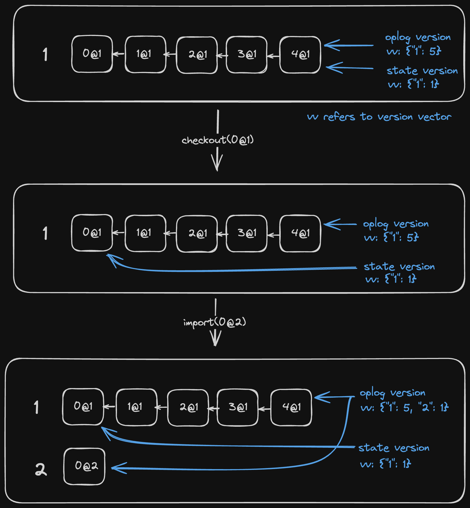

# OpLog and DocState Separation

## The Git Analogy

Think of Loro's architecture like Git: **OpLog** is like your commit history, recording every change that ever happened, while **DocState** is like your working directory, showing the current state of your files. Just as Git lets you `checkout` different commits to see your project at different points in time, Loro lets you navigate through document history while keeping the complete change log intact.

## Core Concepts

### What is OpLog?

The **OpLog** (Operation Log) is the append-only history of all operations that have occurred in your document. It contains:

- Every edit operation performed locally or received from remote peers
- The causal relationships between operations
- Metadata like timestamps and peer IDs
- The complete lineage that enables conflict resolution

Think of it as an immutable ledger that grows over time, preserving the full history of your collaborative document.

### What is DocState?

The **DocState** (Document State) represents the current materialized view of your document. It contains:

- The actual data structures (maps, lists, text, etc.)
- The current values after applying all operations
- Efficient indexing for fast reads
- The working state that your application interacts with

DocState is what you see and manipulate when you work with the document - it's the computed result of applying the OpLog operations.

## Why Separate Them?

### Architecture Benefits

The separation of OpLog and DocState provides several key advantages:

1. **Memory Efficiency**: You can load just the OpLog without materializing the state, useful for servers that only relay changes
2. **Time Travel**: Navigate to any point in history without losing the complete log
3. **Selective Loading**: Load only the state (via snapshots) for quick startup, then fetch history on-demand
4. **Parallel Processing**: OpLog can be processed separately from state updates
5. **Flexible Storage**: Store OpLog and snapshots separately, optimizing for different access patterns

### How They Work Together

During normal operations, OpLog and DocState work in tandem:

```ts twoslash
import { LoroDoc } from "loro-crdt";
// ---cut---
const doc = new LoroDoc();
doc.setPeerId(1);

// When you edit, both are updated
doc.getText("text").insert(0, "Hello World");

// OpLog records the operation
console.log(doc.oplogVersion()); // Shows the latest operation version

// DocState reflects the current state
console.log(doc.getText("text").toString()); // "Hello World"
```

When merging remote changes:

1. New operations are added to the OpLog
2. A Delta (change description) is computed
3. The Delta is applied to DocState
4. Events are emitted for UI updates

## Divergence During Time Travel

One of the most powerful features enabled by this separation is the ability to "checkout" different versions, causing OpLog and DocState to diverge:

```ts twoslash
import { LoroDoc } from "loro-crdt";
// ---cut---
const doc = new LoroDoc();
doc.setPeerId(1);
doc.getText("text").insert(0, "Hello");
const doc2 = doc.fork(); // create a fork

console.log(doc.version().toJSON());       // Map(1) { "1" => 5 }
console.log(doc.oplogVersion().toJSON());  // Map(1) { "1" => 5 }

// Travel back in time - DocState changes, OpLog remains
doc.checkout([{ peer: "1", counter: 1 }]);
console.log(doc.version().toJSON());       // Map(1) { "1" => 2 }
console.log(doc.oplogVersion().toJSON());  // Map(1) { "1" => 5 }

// Even when receiving new operations, DocState stays at checkout point
doc2.setPeerId(2);
doc2.getText("text").insert(5, "!");
doc.import(doc2.export({ mode: "update" }));

console.log(doc.version().toJSON());       // Map(1) { "1" => 2 } - still at old version
console.log(doc.oplogVersion().toJSON());  // Map(2) { "1" => 5, "2" => 1 } - has new ops

console.log(doc.isDetached()); // true
doc.attach(); // Return to latest version
console.log(doc.version().toJSON());       // Map(2) { "1" => 5, "2" => 1 }
```



### Attached vs Detached State

When DocState and OpLog versions match, the document is **attached**. When they differ (e.g., after checkout), it's **detached**.

Key points about detached state:
- **Read-only**: You cannot edit the document while detached
- **History preserved**: New operations are still added to OpLog
- **Explicit return**: Use `attach()` to return to the latest version
- **Version control**: Enables Git-like branching and merging workflows

## Impact on Memory and Performance

### Memory Usage Patterns

The separation allows for different memory optimization strategies:

```ts twoslash
import { LoroDoc } from "loro-crdt";
// ---cut---
// Scenario 1: Full document with history
const fullDoc = new LoroDoc();
fullDoc.import(fullSnapshot); // Both OpLog and DocState loaded

// Scenario 2: State-only for fast startup
const stateOnlyDoc = new LoroDoc();
stateOnlyDoc.import(shallowSnapshot); // Minimal OpLog, full DocState

// Scenario 3: History-only for relay servers
const historyDoc = new LoroDoc();
historyDoc.importUpdateBatch(updates); // OpLog only, no state materialization
```

### Performance Characteristics

| Operation | OpLog Impact | DocState Impact | Performance |
|-----------|--------------|-----------------|-------------|
| Local edit | Append operation | Update structures | O(log n) typical |
| Import updates | Append operations | Compute & apply delta | O(n) for n ops |
| Checkout | None | Rebuild from ops | O(m) for m ops difference |
| Export snapshot | Include recent ops | Serialize state | O(size of state) |
| Export update | Filter ops by version | None | O(ops in range) |

## Encoding Strategies

The separation influences how Loro encodes data:

```ts twoslash
import { LoroDoc } from "loro-crdt";
const doc = new LoroDoc();
// ---cut---
// Update mode: Only OpLog operations
const update = doc.export({ mode: "update" });
// Compact, contains only new operations since last sync

// Snapshot mode: Both OpLog and DocState
const snapshot = doc.export({ mode: "snapshot" });
// Larger but enables instant loading with full state

// Shallow snapshot: Minimal OpLog + full DocState
const shallow = doc.export({ mode: "shallow-snapshot" });
// Best for quick startup when history isn't immediately needed

// Update in range: Selective OpLog export
const rangeUpdate = doc.export({ 
  mode: "update-in-range",
  from: oldVersion,
  to: newVersion
});
// Precise control over what history to share
```

## Common Patterns and Best Practices

### Pattern 1: Optimistic UI with Time Travel

```ts twoslash
import { LoroDoc } from "loro-crdt";
// ---cut---
class CollaborativeEditor {
  private doc: LoroDoc;
  private checkpoints: Map<string, Uint8Array> = new Map();

  saveCheckpoint(name: string) {
    // Save current version for later restoration
    this.checkpoints.set(name, this.doc.export({ mode: "snapshot" }));
  }

  preview(checkpoint: string) {
    // Temporarily view an old version without losing current work
    const version = this.getCheckpointVersion(checkpoint);
    this.doc.checkout(version);
    // UI updates to show historical state
  }

  resumeEditing() {
    // Return to latest version to continue editing
    this.doc.attach();
  }

  private getCheckpointVersion(checkpoint: string): any {
    // Implementation to get version from checkpoint
    return [];
  }
}
```

### Pattern 2: Efficient Server Relay

```ts twoslash
import { LoroDoc } from "loro-crdt";
// ---cut---
class RelayServer {
  private oplogs: Map<string, LoroDoc> = new Map();

  handleIncomingUpdate(roomId: string, update: Uint8Array) {
    let oplog = this.oplogs.get(roomId);
    if (!oplog) {
      oplog = new LoroDoc();
      // Never materialize state - just store operations
      oplog.detach();
      this.oplogs.set(roomId, oplog);
    }
    
    // Import to OpLog only
    oplog.importUpdateBatch([update]);
    
    // Relay to other clients without materializing state
    return oplog.export({ mode: "update", from: previousVersion });
  }
}
```

### Pattern 3: Progressive History Loading

```ts twoslash
import { LoroDoc } from "loro-crdt";
// ---cut---
class DocumentLoader {
  async loadDocument(docId: string): Promise<LoroDoc> {
    const doc = new LoroDoc();
    
    // Step 1: Load shallow snapshot for instant UI
    const shallowSnap = await this.fetchShallowSnapshot(docId);
    doc.import(shallowSnap);
    
    // Step 2: Progressively load history in background
    this.loadHistoryInBackground(doc, docId);
    
    return doc;
  }

  private async loadHistoryInBackground(doc: LoroDoc, docId: string) {
    // Load older history chunks without blocking UI
    const historyChunks = await this.fetchHistoryChunks(docId);
    for (const chunk of historyChunks) {
      doc.import(chunk);
      // UI remains responsive during history loading
    }
  }

  private async fetchShallowSnapshot(docId: string): Promise<Uint8Array> {
    // Implementation
    return new Uint8Array();
  }

  private async fetchHistoryChunks(docId: string): Promise<Uint8Array[]> {
    // Implementation
    return [];
  }
}
```

## Best Practices

1. **Choose the right export mode**: Use updates for incremental sync, snapshots for persistence, and shallow snapshots for quick startup

2. **Handle detached state explicitly**: Always check `isDetached()` before allowing edits, and provide clear UI indicators when viewing historical versions

3. **Optimize for your use case**:
   - Editing apps: Keep both OpLog and DocState in memory
   - Relay servers: Work with OpLog only
   - Read-heavy apps: Use shallow snapshots and load history on-demand

4. **Version management**: Store version vectors when creating checkpoints to enable precise time travel

5. **Memory bounds**: Consider implementing OpLog trimming for long-running documents, exporting old history to cold storage

## Summary

The separation of OpLog and DocState is fundamental to Loro's architecture, enabling:

- Efficient memory usage through selective loading
- Powerful version control with time travel
- Flexible deployment patterns from edge servers to rich clients
- Optimal encoding strategies for different scenarios

Understanding this separation helps you build more efficient and feature-rich collaborative applications, whether you're implementing undo/redo, building a version control system, or optimizing for performance at scale.