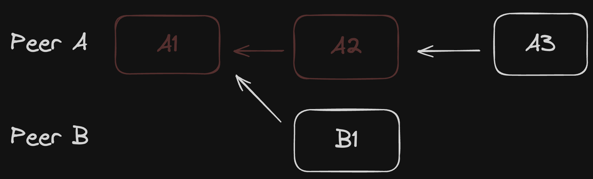

# Shallow Snapshots and Redaction

## Practical Use Cases

Shallow snapshots address critical real-world challenges in collaborative applications:

### Privacy and Compliance
- **GDPR Compliance**: Remove personal data from history while maintaining document integrity
- **Content Redaction**: Permanently delete sensitive information without breaking synchronization
- **User Rights**: Honor "right to be forgotten" requests in collaborative documents

### Storage Optimization
- **Reduced Document Size**: Remove unnecessary historical data to minimize storage costs
- **Faster Loading**: Improve initial document load times by trimming old history
- **Cold Storage**: Archive old history separately while keeping recent changes accessible

### Performance Benefits
- **Memory Efficiency**: Lower memory footprint for long-lived documents
- **Network Optimization**: Smaller payloads for initial synchronization
- **Scalability**: Support documents with years of collaborative history

## What Are Shallow Snapshots?

Shallow snapshots in Loro are like Git's [shallow clone](https://github.blog/open-source/git/get-up-to-speed-with-partial-clone-and-shallow-clone/), allowing you to maintain a functional collaborative document while removing unnecessary historical information. This creates a trimmed version of your document that:

- Preserves the current state completely
- Maintains recent editing history for conflict resolution
- Removes old operations that are no longer needed for synchronization
- Continues to function normally for all future collaborative edits

### How They Differ from Full Snapshots

| Aspect | Full Snapshot | Shallow Snapshot |
|--------|--------------|------------------|
| **History** | Complete editing history | Partial history from a critical version |
| **Size** | Larger, grows over time | Significantly smaller, optimized |
| **Use Case** | Full audit trail needed | Privacy, performance, or storage concerns |
| **Synchronization** | Can sync with any version | Can only sync with versions after the starting point |
| **Time Travel** | Full history navigation | Limited to retained history |

## Core Concepts

### Critical Versions

A critical version is a point in the version history DAG (Directed Acyclic Graph) that all paths from the current version to the beginning must pass through. This ensures:

- All operations between the starting version and latest can be applied successfully
- No dependencies on discarded history
- Synchronization remains correct for all future operations

### The Eg-Walker Algorithm

Loro's shallow snapshots are powered by the [Eg-walker algorithm](https://arxiv.org/html/2409.14252v1), which enables:

- Conflict resolution using only partial history
- Efficient synchronization without complete historical context
- Correct CRDT semantics even with trimmed history

## How It Works

### Creating a Shallow Snapshot

```ts twoslash
import { LoroDoc } from "loro-crdt";
// ---cut---
const doc = new LoroDoc();

// Create a document with extensive history
for (let i = 0; i < 10_000; i++) {
    doc.getText("text").insert(0, "Hello, world!");
}

// Export as regular snapshot
const fullSnapshot = doc.export({ mode: "snapshot" });

// Export as shallow snapshot from current frontiers
const shallowSnapshot = doc.export({
    mode: "shallow-snapshot",
    frontiers: doc.frontiers(),
});

console.log(fullSnapshot.length);     // 5421 bytes
console.log(shallowSnapshot.length);  // 869 bytes (84% smaller!)
```

### Content Redaction Example

```ts twoslash
import { LoroDoc } from "loro-crdt";
// ---cut---
const doc = new LoroDoc();
const text = doc.getText("content");

// User adds sensitive information
text.insert(0, "My SSN is 123-45-6789. ");
text.insert(24, "This is public information.");

// Later, need to redact sensitive data
text.delete(0, 24); // Remove the sensitive part

// Create shallow snapshot that excludes the deleted content from history
const redactedSnapshot = doc.export({
    mode: "shallow-snapshot",
    frontiers: doc.frontiers(),
});

// New document created from shallow snapshot has no trace of sensitive data
const cleanDoc = new LoroDoc();
cleanDoc.import(redactedSnapshot);
// The sensitive information is permanently removed from history
```

## Privacy and Security Implications

### Data Protection

Shallow snapshots provide strong privacy guarantees:

1. **Permanent Deletion**: Removed history cannot be recovered from the shallow snapshot
2. **Selective Redaction**: Choose exactly which version to start from
3. **Audit Control**: Maintain recent history while removing old sensitive data

### Security Considerations

When using shallow snapshots, consider:

- **Coordination Required**: All peers must agree on the starting version
- **No Retroactive Sync**: Cannot sync with peers that only have pre-snapshot versions
- **Backup Strategy**: Consider archiving full history before creating shallow snapshots

## Synchronization with Shallow Snapshots

### How Synchronization Still Works

Despite having partial history, shallow snapshots maintain full synchronization capabilities:

1. **Forward Compatibility**: All future operations can be synchronized normally
2. **Peer Communication**: Peers with the same or newer starting version can sync
3. **Conflict Resolution**: The Eg-walker algorithm handles conflicts using available history

### Synchronization Limitations

Understanding the boundaries is crucial:



In this scenario:
- PeerA creates operations A1, A2, A3
- PeerA creates a shallow snapshot removing A1 and A2
- PeerB (who received A1) creates operation B1
- PeerA cannot apply B1 because the required history is missing

### Best Practices for Synchronization

```ts twoslash
import { LoroDoc } from "loro-crdt";
// ---cut---
// Ensure all peers have synchronized before creating shallow snapshot
async function createSafeShallowSnapshot(doc: LoroDoc, peers: string[]) {
    // 1. Get current frontiers (the version all peers should reach)
    const targetFrontiers = doc.frontiers();
    
    // 2. Wait for confirmation that all peers have this version
    await confirmAllPeersReached(targetFrontiers, peers);
    
    // 3. Create shallow snapshot safely
    const shallowSnapshot = doc.export({
        mode: "shallow-snapshot",
        frontiers: targetFrontiers,
    });
    
    return shallowSnapshot;
}

async function confirmAllPeersReached(frontiers: any, peers: string[]) {
    // Implementation would verify each peer has synchronized
    // to at least the specified frontiers version
}
```

## Advanced Patterns

### Progressive History Trimming

For long-lived documents, implement progressive trimming:

```ts twoslash
import { LoroDoc } from "loro-crdt";
// ---cut---
class DocumentManager {
    private doc: LoroDoc;
    private historyLimit = 1000; // Keep last 1000 operations
    
    async trimHistoryIfNeeded() {
        const opCount = this.getOperationCount();
        
        if (opCount > this.historyLimit * 1.5) {
            // Find a suitable critical version
            const trimPoint = this.findCriticalVersion(
                opCount - this.historyLimit
            );
            
            // Create and save shallow snapshot
            const snapshot = this.doc.export({
                mode: "shallow-snapshot",
                frontiers: trimPoint,
            });
            
            // Reimport to apply the trim
            this.doc = new LoroDoc();
            this.doc.import(snapshot);
        }
    }
    
    private getOperationCount(): number {
        // Implementation to count operations
        return 0;
    }
    
    private findCriticalVersion(targetOp: number): any {
        // Implementation to find suitable critical version
        return null;
    }
}
```

### Archival Strategy

Implement a two-tier storage system:

```ts twoslash
import { LoroDoc } from "loro-crdt";
// ---cut---
class ArchivalSystem {
    async archiveAndTrim(doc: LoroDoc) {
        // 1. Export full history for archival
        const fullHistory = doc.export({ mode: "snapshot" });
        await this.uploadToArchivalStorage(fullHistory);
        
        // 2. Create shallow snapshot for active use
        const shallowSnapshot = doc.export({
            mode: "shallow-snapshot",
            frontiers: doc.frontiers(),
        });
        
        // 3. Store shallow snapshot for quick access
        await this.saveToActiveStorage(shallowSnapshot);
        
        return shallowSnapshot;
    }
    
    async restoreFullHistory(docId: string): Promise<LoroDoc> {
        const fullHistory = await this.downloadFromArchival(docId);
        const doc = new LoroDoc();
        doc.import(fullHistory);
        return doc;
    }
    
    private async uploadToArchivalStorage(data: Uint8Array) {
        // Upload to S3, cold storage, etc.
    }
    
    private async saveToActiveStorage(data: Uint8Array) {
        // Save to fast storage
    }
    
    private async downloadFromArchival(docId: string): Promise<Uint8Array> {
        // Retrieve from archival storage
        return new Uint8Array();
    }
}
```

### Privacy-First Document Design

Design your document structure with privacy in mind:

```ts twoslash
import { LoroDoc } from "loro-crdt";
// ---cut---
class PrivacyAwareDocument {
    private doc: LoroDoc;
    
    constructor() {
        this.doc = new LoroDoc();
    }
    
    // Separate containers for different data retention policies
    getPublicContent() {
        return this.doc.getText("public");
    }
    
    getPrivateContent() {
        return this.doc.getText("private");
    }
    
    getEphemeralContent() {
        return this.doc.getText("ephemeral");
    }
    
    async redactPrivateData() {
        // Clear private content
        this.getPrivateContent().delete(0, this.getPrivateContent().length);
        
        // Create shallow snapshot to permanently remove from history
        const cleanSnapshot = this.doc.export({
            mode: "shallow-snapshot",
            frontiers: this.doc.frontiers(),
        });
        
        // Reimport clean version
        this.doc = new LoroDoc();
        this.doc.import(cleanSnapshot);
    }
}
```

## Performance Characteristics

### Size Reduction

Typical size reductions with shallow snapshots:

- **Text-heavy documents**: 70-90% reduction after removing old edits
- **Structured data**: 50-80% reduction depending on change frequency
- **Mixed content**: 60-85% reduction on average

### Operation Performance

| Operation | Full Document | Shallow Snapshot |
|-----------|--------------|------------------|
| Import | O(n) with full history | O(m) with retained history |
| Export | O(n) all operations | O(m) recent operations |
| Memory | Proportional to full history | Proportional to retained history |
| Sync | Can sync with any version | Limited to post-snapshot versions |

## Summary

Shallow snapshots in Loro provide a powerful mechanism for:

- **Privacy compliance** through permanent history redaction
- **Performance optimization** via reduced document size
- **Storage efficiency** by removing unnecessary historical data

They maintain full CRDT functionality while giving you control over what history to retain. When implementing shallow snapshots, ensure all collaborators are synchronized to prevent conflicts, and consider maintaining archival copies of full history when needed.

The combination of the Eg-walker algorithm and critical version detection makes Loro's shallow snapshots both safe and efficient for production use in privacy-conscious and performance-critical applications.