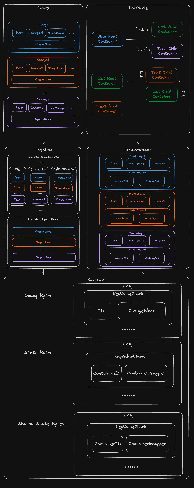

# Export Mode

> Loro 1.0 has stabilized the data format and will not have any breaking
> changes.

Loro introduces three encoding modes to meet the needs for different use cases:

- **Updates Encoding**: Encodes all or a specified range of operations, mainly
  used for delta updates of documents.
- **Snapshot Encoding**: Encodes the entire document, including both all the
  operations and the current document state.
- **Shallow Snapshot Encoding**: Loro 1.0 provides a new encoding format for
  discarding useless historical operations. It is a special snapshot that
  encodes the most recent historical operations, the starting state of the
  remaining history, and the latest state of the document.

Different encoding formats are provided through the unified `doc.export(mode)`,
and all binary encoding formats can be imported via `doc.import(bytes)`.

```ts no_run
export type ExportMode =
  | {
      mode: "update";
      from?: VersionVector;
    }
  | {
      mode: "updates-in-range";
      spans: {
        id: ID;
        len: number;
      }[];
    }
  | {
      mode: "snapshot";
    }
  | {
      mode: "shallow-snapshot";
      frontiers: Frontiers;
    };
```

## Updates Encoding

There are two modes for updates encoding. `update` 和 `updates-in-range`.

- `update` mode will encode all ops from the from version to the latest version
  of the document.
- `updates-in-range` mode will encode all ops within the specified version
  range.

```ts twoslash
import { LoroDoc } from "loro-crdt";
// ---cut---
const doc1 = new LoroDoc();
const doc2 = new LoroDoc();
doc2.setPeerId(2);

doc2.getText("text").insert(0, "hello");
const bytes = doc2.export({ mode: "update", from: doc1.version() }); // Uint8Array
// const bytes = doc2.export({ mode: "updates-in-range", spans: [{id: { peer: 2, counter: 0 }, len: 1}] });
// These bytes can be stored in a database or transmitted over a network.
doc1.import(bytes);
console.log(doc1.toJSON()); // { text: "hello" }
```

Updates Encoding selectively encodes operations from a chosen initial version to
the most recent, enhancing support for real-time collaboration by focusing on
incremental changes rather than the entire document state.

## Snapshot Encoding

```ts twoslash
import { LoroDoc } from "loro-crdt";
// ---cut---
const doc1 = new LoroDoc();
const doc2 = new LoroDoc();

doc2.getText("text").insert(0, "hello");
const bytes = doc2.export({ mode: "snapshot" }); // Uint8Array
// These bytes can be stored in a database or transmitted over a network.
doc1.import(bytes);
console.log(doc1.toJSON()); // { text: "hello" }
```

Snapshot Encoding comprehensively captures a document's current state and its
historical operations. This mode can quickly obtain the latest document state.

## Shallow Snapshot Encoding

Loro will save all editing history to resolve conflicts and history
backtracking. However, for most scenes, most of the older history is useless,
taking up too much extra memory and requires more storage space for saving.

Loro 1.0 provides a shallow snapshot encoding mode. You can specify the starting
historical version to be retained, and Loro will truncate all the history before
this version.

```ts twoslash
import { LoroDoc } from "loro-crdt";
// ---cut---
const doc1 = new LoroDoc();
const doc2 = new LoroDoc();
doc2.setPeerId(2);

const text = doc2.getText("text");
text.insert(0, "hello");
const frontiers = doc2.frontiers();
text.insert(0, "w");
text.insert(0, "o");
text.insert(0, "r");
text.insert(0, "l");
text.insert(0, "d");
const bytes = doc2.export({ mode: "shallow-snapshot", frontiers }); // Uint8Array
// These bytes can be stored in a database or transmitted over a network.
doc1.import(bytes);
console.log(doc1.toJSON()); // { text: "hello" }
```

Note: When using shallow snapshots, you cannot import updates that are
concurrent to the snapshot's start version. For details, see
[shallow snapshot](/docs/advanced/shallow_snapshot).

## Loro's Snapshot File Format

To support lazy loading capabilities, we referenced common storage formats in
databases, introduced a simple LSM engine, and abstracted the encoding results
as simple key bytes and value bytes representations, preparing for future
integration with common key-value databases.

### Encoding Details

In Loro, multiple consecutive Ops of the same Container are merged into one
Change, i.e., one commit record. Each Change has additional metadata, such as
ID, Lamport, Timestamp, etc. In most scenarios, Changes are also consecutive,
and related metadata can be compressed to some extent. Therefore, we combine
multiple consecutive Changes into a ChangeBlock, which is the minimum unit for
encoding Op history. Detailed encoding content can be found in the
[documentation](https://github.com/loro-dev/loro/blob/main/crates/loro-internal/src/oplog/change_store/block_encode.rs).

We use the first Change ID of the ChangeBlock as the query key, and the encoded
ChangeBlock as the value. This allows for quick querying of specified ID Changes
and their Ops without decoding all Changes.

The complete State is composed of the states of all Containers starting from the
Root Container. The key is the bytes representation of the ContainerID, and the
value is composed of each Container's metadata and the bytes encoded according
to its own semantic state expression.

These key-value pairs will be stored in our implemented simple LSM structure.

The final exported encoding will be divided into four parts: encoding header,
oplog bytes, latest state bytes, and shallow state bytes.

The Header consists of a 4-byte magic number, 16-byte checksum, and 2-byte
encode mode.

The oplog bytes, latest state bytes, and shallow state bytes are all exported
using the
[LSM encoding structure](https://github.com/loro-dev/loro/blob/main/crates/kv-store/src/lib.rs).

## Snapshot Encoding Layout


